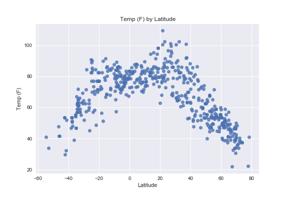
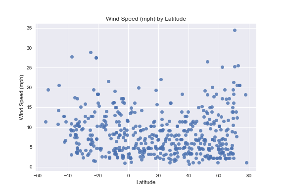

# Weather Analysis
## Overview
### This Python script will visualize the weather of 500 unique cities across the world in random locations selected using Citypy. Citipy is a city-finding python package that was used to find randomly located cities. The OpenWeatherMap API was used to return current weather statistics for those cities.

### A series of scatter plots will be used to showcase the following relationships:
* Temperature (F) vs. Latitude.
* Humidity (%) vs. Latitude.
* Cloudiness (%) vs. Latitude.
* Wind Speed (mph) vs. Latitude.

### The script will:
* Randomly select at least 500 unique (non-repeat) cities based on latitude and longitude.
* Perform a weather check on each of the cities using a series of successive API calls.
* Include a print log of each city as it's being processed with the city number, city name, and requested URL.
* Save both a CSV of all data retrieved and png images for each scatter plot.

# WeatherPy

Observable Trends:
1. Temperature increases as the latitude approaches the equator (latitude 0).
2. Humidity is more concentrated at higher values as the latitude approaches the equator (latitude 0).
3. Wind speeds increase as the latitude goes away from the equator (latitude -90 and 90).


```python
# Dependencies
import json
import requests
import random
import pandas as pd
import numpy as np
import time
from citipy import citipy
import matplotlib.pyplot as plt
import seaborn as sns

# Import Open Weather Map API key.
from owm_api_key import api_key
```

## Data Retrieval


```python
# Declare variables describing the scope of lat/lng search for cities. 
# Lat ranges from -90 to 90. Lng ranges from -180 to 180.
lat = {'min': -90, 'max': 90}
lng = {'min': -180, 'max': 180}

# Create arrays containing increments of lat and long.
lat_values = np.arange(lat['min'], lat['max'], 0.01)
lng_values = np.arange(lng['min'], lng['max'], 0.01)
```


```python
# Create an empty data frame to city and weather data
column_names = ('city_name', 'country_code', 'rand_lat', 'rand_lng', 'Latitude', 'Longitude','Temp (F)',
            'Humidity (%)','Cloudiness (%)','Wind Speed (mph)')
cities_df = pd.DataFrame(columns = column_names)
cities_df
```


<div>
<table border="1" class="dataframe">
  <thead>
    <tr style="text-align: right;">
      <th></th>
      <th>city_name</th>
      <th>country_code</th>
      <th>rand_lat</th>
      <th>rand_lng</th>
      <th>Latitude</th>
      <th>Longitude</th>
      <th>Temp (F)</th>
      <th>Humidity (%)</th>
      <th>Cloudiness (%)</th>
      <th>Wind Speed (mph)</th>
    </tr>
  </thead>
  <tbody>
  </tbody>
</table>
</div>


```python
'''Query Citipy with random lat-long values until we collect our sample, and append weather
data via Open Weather Map API call.''' 

# Set the sample size.
sample_size = 500

target_url = 'http://api.openweathermap.org/data/2.5/weather?q='
units = 'imperial'

record = 0

# Loop through and grab the Temp, Humidity, Cloudiness and Wind Speed using OpenWeatherMapAPI
    
while len(cities_df) < sample_size:
    # Choose a random point within our lat-lng domain.
    rand_lat = random.choice(lat_values)
    rand_lng = random.choice(lng_values)
    # Call citipy's nearest_city() method to get a city object.
    city = citipy.nearest_city(rand_lat, rand_lng)
    city_name = city.city_name
    country_code = city.country_code
    # Call Open Weather Map API to obtain data and append it to df
    url = target_url + city_name + ',' + country_code + '&units=' + units + '&APPID=' + api_key
    weather_response = requests.get(url)
    weather_json = weather_response.json()
    if weather_json["cod"] == 200:
        print('City: %s. %s' % (weather_json['name'], url))
        latitude = weather_json["coord"]["lat"]
        longitude = weather_json["coord"]["lon"]
        temp = weather_json["main"]["temp"]
        humidity = weather_json["main"]["humidity"]
        cloud = weather_json["clouds"]["all"]
        wind = weather_json["wind"]["speed"]
        # Avoid repeating cities
        if city_name not in cities_df.city_name.values:
            print('Status code: %s. DF length is now: %d' % (str(weather_json["cod"]), len(cities_df)+1))
            # Append data to df columns
            cities_df.set_value(record, "city_name", city_name)
            cities_df.set_value(record, "country_code", country_code)
            cities_df.set_value(record, "rand_lat", rand_lat)
            cities_df.set_value(record, "rand_lng", rand_lng)
            cities_df.set_value(record, "Latitude", latitude)
            cities_df.set_value(record, "Longitude", longitude)
            cities_df.set_value(record, "Temp (F)", temp)
            cities_df.set_value(record, "Humidity (%)", humidity)
            cities_df.set_value(record, "Cloudiness (%)", cloud)
            cities_df.set_value(record, "Wind Speed (mph)", wind)

            record += 1
        
            # Wait between 1-4 seconds before next loop
            time.sleep(random.randint(1, 4))
        else:
            pass
    else:
        pass
    
print(
"------------------------------\n"
"Data Retrieval Complete\n"
"------------------------------\n"
)

# Visualize df
cities_df.head()
```

    City: Stavropol. http://api.openweathermap.org/data/2.5/weather?q=krasnoyarsk-66,ru&units=imperial&APPID=b058195e4179dda90e7316cc7ec35d34
    Status code: 200. DF length is now: 1
    City: Lorengau. http://api.openweathermap.org/data/2.5/weather?q=lorengau,pg&units=imperial&APPID=b058195e4179dda90e7316cc7ec35d34
    Status code: 200. DF length is now: 2
    City: Dikson. http://api.openweathermap.org/data/2.5/weather?q=dikson,ru&units=imperial&APPID=b058195e4179dda90e7316cc7ec35d34
    Status code: 200. DF length is now: 3
    City: Pahrump. http://api.openweathermap.org/data/2.5/weather?q=pahrump,us&units=imperial&APPID=b058195e4179dda90e7316cc7ec35d34
    Status code: 200. DF length is now: 4
    City: Jamestown. http://api.openweathermap.org/data/2.5/weather?q=jamestown,sh&units=imperial&APPID=b058195e4179dda90e7316cc7ec35d34
    Status code: 200. DF length is now: 5
    City: Jamestown. http://api.openweathermap.org/data/2.5/weather?q=jamestown,sh&units=imperial&APPID=b058195e4179dda90e7316cc7ec35d34
    City: Yellowknife. http://api.openweathermap.org/data/2.5/weather?q=yellowknife,ca&units=imperial&APPID=b058195e4179dda90e7316cc7ec35d34
    Status code: 200. DF length is now: 6
    City: Buhe. http://api.openweathermap.org/data/2.5/weather?q=buhe,cn&units=imperial&APPID=b058195e4179dda90e7316cc7ec35d34
    Status code: 200. DF length is now: 7
    City: Busselton. http://api.openweathermap.org/data/2.5/weather?q=busselton,au&units=imperial&APPID=b058195e4179dda90e7316cc7ec35d34
    Status code: 200. DF length is now: 8
    City: Busselton. http://api.openweathermap.org/data/2.5/weather?q=busselton,au&units=imperial&APPID=b058195e4179dda90e7316cc7ec35d34
    City: Rikitea. http://api.openweathermap.org/data/2.5/weather?q=rikitea,pf&units=imperial&APPID=b058195e4179dda90e7316cc7ec35d34
    Status code: 200. DF length is now: 9
    City: San Pedro Pochutla. http://api.openweathermap.org/data/2.5/weather?q=pochutla,mx&units=imperial&APPID=b058195e4179dda90e7316cc7ec35d34
    Status code: 200. DF length is now: 10
    City: Busselton. http://api.openweathermap.org/data/2.5/weather?q=busselton,au&units=imperial&APPID=b058195e4179dda90e7316cc7ec35d34
    City: Victoria. http://api.openweathermap.org/data/2.5/weather?q=victoria,sc&units=imperial&APPID=b058195e4179dda90e7316cc7ec35d34
    Status code: 200. DF length is now: 11
    City: Kapaa. http://api.openweathermap.org/data/2.5/weather?q=kapaa,us&units=imperial&APPID=b058195e4179dda90e7316cc7ec35d34
    Status code: 200. DF length is now: 12
    City: Varnek. http://api.openweathermap.org/data/2.5/weather?q=belushya guba,ru&units=imperial&APPID=b058195e4179dda90e7316cc7ec35d34
    Status code: 200. DF length is now: 13
    City: Ixtapa. http://api.openweathermap.org/data/2.5/weather?q=ixtapa,mx&units=imperial&APPID=b058195e4179dda90e7316cc7ec35d34
    Status code: 200. DF length is now: 14
    City: Kawalu. http://api.openweathermap.org/data/2.5/weather?q=kawalu,id&units=imperial&APPID=b058195e4179dda90e7316cc7ec35d34
    Status code: 200. DF length is now: 15
    City: Amparihy. http://api.openweathermap.org/data/2.5/weather?q=taolanaro,mg&units=imperial&APPID=b058195e4179dda90e7316cc7ec35d34
    Status code: 200. DF length is now: 16
    City: Bukavu. http://api.openweathermap.org/data/2.5/weather?q=bukavu,cd&units=imperial&APPID=b058195e4179dda90e7316cc7ec35d34
    Status code: 200. DF length is now: 17
    City: Mayumba. http://api.openweathermap.org/data/2.5/weather?q=mayumba,ga&units=imperial&APPID=b058195e4179dda90e7316cc7ec35d34
    Status code: 200. DF length is now: 18
    City: Mathura. http://api.openweathermap.org/data/2.5/weather?q=mataura,pf&units=imperial&APPID=b058195e4179dda90e7316cc7ec35d34
    Status code: 200. DF length is now: 19
    City: Vaini. http://api.openweathermap.org/data/2.5/weather?q=vaini,to&units=imperial&APPID=b058195e4179dda90e7316cc7ec35d34
    Status code: 200. DF length is now: 20
    City: Butaritari. http://api.openweathermap.org/data/2.5/weather?q=butaritari,ki&units=imperial&APPID=b058195e4179dda90e7316cc7ec35d34
    Status code: 200. DF length is now: 21
    City: Burns Lake. http://api.openweathermap.org/data/2.5/weather?q=burns lake,ca&units=imperial&APPID=b058195e4179dda90e7316cc7ec35d34
    Status code: 200. DF length is now: 22
    City: Port Alfred. http://api.openweathermap.org/data/2.5/weather?q=port alfred,za&units=imperial&APPID=b058195e4179dda90e7316cc7ec35d34
    Status code: 200. DF length is now: 23
    City: Ucluelet. http://api.openweathermap.org/data/2.5/weather?q=ucluelet,ca&units=imperial&APPID=b058195e4179dda90e7316cc7ec35d34
    Status code: 200. DF length is now: 24
    City: Mathura. http://api.openweathermap.org/data/2.5/weather?q=mataura,pf&units=imperial&APPID=b058195e4179dda90e7316cc7ec35d34
    City: Dwarka. http://api.openweathermap.org/data/2.5/weather?q=dwarka,in&units=imperial&APPID=b058195e4179dda90e7316cc7ec35d34
    Status code: 200. DF length is now: 25
    City: Plettenberg Bay. http://api.openweathermap.org/data/2.5/weather?q=plettenberg bay,za&units=imperial&APPID=b058195e4179dda90e7316cc7ec35d34
    Status code: 200. DF length is now: 26
    City: Panganiban. http://api.openweathermap.org/data/2.5/weather?q=payo,ph&units=imperial&APPID=b058195e4179dda90e7316cc7ec35d34
    Status code: 200. DF length is now: 27
    City: Mar del Plata. http://api.openweathermap.org/data/2.5/weather?q=mar del plata,ar&units=imperial&APPID=b058195e4179dda90e7316cc7ec35d34
    Status code: 200. DF length is now: 28
    City: Qaanaaq. http://api.openweathermap.org/data/2.5/weather?q=qaanaaq,gl&units=imperial&APPID=b058195e4179dda90e7316cc7ec35d34
    Status code: 200. DF length is now: 29
    City: Ushuaia. http://api.openweathermap.org/data/2.5/weather?q=ushuaia,ar&units=imperial&APPID=b058195e4179dda90e7316cc7ec35d34
    Status code: 200. DF length is now: 30
    City: Vaini. http://api.openweathermap.org/data/2.5/weather?q=vaini,to&units=imperial&APPID=b058195e4179dda90e7316cc7ec35d34
    City: Funafuti. http://api.openweathermap.org/data/2.5/weather?q=asau,tv&units=imperial&APPID=b058195e4179dda90e7316cc7ec35d34
    Status code: 200. DF length is now: 31
    City: Busselton. http://api.openweathermap.org/data/2.5/weather?q=busselton,au&units=imperial&APPID=b058195e4179dda90e7316cc7ec35d34
    City: Hobart. http://api.openweathermap.org/data/2.5/weather?q=hobart,au&units=imperial&APPID=b058195e4179dda90e7316cc7ec35d34
    Status code: 200. DF length is now: 32
    City: Yellowknife. http://api.openweathermap.org/data/2.5/weather?q=yellowknife,ca&units=imperial&APPID=b058195e4179dda90e7316cc7ec35d34
    City: Cidreira. http://api.openweathermap.org/data/2.5/weather?q=cidreira,br&units=imperial&APPID=b058195e4179dda90e7316cc7ec35d34
    Status code: 200. DF length is now: 33
    City: Chimbote. http://api.openweathermap.org/data/2.5/weather?q=chimbote,pe&units=imperial&APPID=b058195e4179dda90e7316cc7ec35d34
    Status code: 200. DF length is now: 34
    City: Kruisfontein. http://api.openweathermap.org/data/2.5/weather?q=kruisfontein,za&units=imperial&APPID=b058195e4179dda90e7316cc7ec35d34
    Status code: 200. DF length is now: 35
    City: Vaini. http://api.openweathermap.org/data/2.5/weather?q=vaini,to&units=imperial&APPID=b058195e4179dda90e7316cc7ec35d34
    City: Lagos. http://api.openweathermap.org/data/2.5/weather?q=lagos,pt&units=imperial&APPID=b058195e4179dda90e7316cc7ec35d34
    Status code: 200. DF length is now: 36
    City: Praia. http://api.openweathermap.org/data/2.5/weather?q=praia,cv&units=imperial&APPID=b058195e4179dda90e7316cc7ec35d34
    Status code: 200. DF length is now: 37
    City: Varnek. http://api.openweathermap.org/data/2.5/weather?q=belushya guba,ru&units=imperial&APPID=b058195e4179dda90e7316cc7ec35d34
    City: Jamestown. http://api.openweathermap.org/data/2.5/weather?q=jamestown,sh&units=imperial&APPID=b058195e4179dda90e7316cc7ec35d34
    City: Moshi. http://api.openweathermap.org/data/2.5/weather?q=moshi,tz&units=imperial&APPID=b058195e4179dda90e7316cc7ec35d34
    Status code: 200. DF length is now: 38
    City: Phuket. http://api.openweathermap.org/data/2.5/weather?q=phuket,th&units=imperial&APPID=b058195e4179dda90e7316cc7ec35d34
    Status code: 200. DF length is now: 39
    City: Envira. http://api.openweathermap.org/data/2.5/weather?q=envira,br&units=imperial&APPID=b058195e4179dda90e7316cc7ec35d34
    Status code: 200. DF length is now: 40
    City: Cumbum. http://api.openweathermap.org/data/2.5/weather?q=cumbum,in&units=imperial&APPID=b058195e4179dda90e7316cc7ec35d34
    Status code: 200. DF length is now: 41
    City: Kamaishi. http://api.openweathermap.org/data/2.5/weather?q=kamaishi,jp&units=imperial&APPID=b058195e4179dda90e7316cc7ec35d34
    Status code: 200. DF length is now: 42
    City: Minab. http://api.openweathermap.org/data/2.5/weather?q=minab,ir&units=imperial&APPID=b058195e4179dda90e7316cc7ec35d34
    Status code: 200. DF length is now: 43
    City: Tuatapere. http://api.openweathermap.org/data/2.5/weather?q=tuatapere,nz&units=imperial&APPID=b058195e4179dda90e7316cc7ec35d34
    Status code: 200. DF length is now: 44
    City: Vaini. http://api.openweathermap.org/data/2.5/weather?q=vaini,to&units=imperial&APPID=b058195e4179dda90e7316cc7ec35d34
    City: Krasnyy Bor. http://api.openweathermap.org/data/2.5/weather?q=nikolskoye,ru&units=imperial&APPID=b058195e4179dda90e7316cc7ec35d34
    Status code: 200. DF length is now: 45
    City: Klasterec nad Ohri. http://api.openweathermap.org/data/2.5/weather?q=klasterec nad ohri,cz&units=imperial&APPID=b058195e4179dda90e7316cc7ec35d34
    Status code: 200. DF length is now: 46
    City: Farah. http://api.openweathermap.org/data/2.5/weather?q=farah,af&units=imperial&APPID=b058195e4179dda90e7316cc7ec35d34
    Status code: 200. DF length is now: 47
    City: Pontes e Lacerda. http://api.openweathermap.org/data/2.5/weather?q=pontes e lacerda,br&units=imperial&APPID=b058195e4179dda90e7316cc7ec35d34
    Status code: 200. DF length is now: 48
    City: Punta Arenas. http://api.openweathermap.org/data/2.5/weather?q=punta arenas,cl&units=imperial&APPID=b058195e4179dda90e7316cc7ec35d34
    Status code: 200. DF length is now: 49
    City: Ushuaia. http://api.openweathermap.org/data/2.5/weather?q=ushuaia,ar&units=imperial&APPID=b058195e4179dda90e7316cc7ec35d34
    City: Hasaki. http://api.openweathermap.org/data/2.5/weather?q=hasaki,jp&units=imperial&APPID=b058195e4179dda90e7316cc7ec35d34
    Status code: 200. DF length is now: 50
    City: Mahebourg. http://api.openweathermap.org/data/2.5/weather?q=mahebourg,mu&units=imperial&APPID=b058195e4179dda90e7316cc7ec35d34
    Status code: 200. DF length is now: 51
    City: Port Alfred. http://api.openweathermap.org/data/2.5/weather?q=port alfred,za&units=imperial&APPID=b058195e4179dda90e7316cc7ec35d34
    City: Butaritari. http://api.openweathermap.org/data/2.5/weather?q=butaritari,ki&units=imperial&APPID=b058195e4179dda90e7316cc7ec35d34
    City: Mecca. http://api.openweathermap.org/data/2.5/weather?q=mecca,sa&units=imperial&APPID=b058195e4179dda90e7316cc7ec35d34
    Status code: 200. DF length is now: 52
    City: Cidreira. http://api.openweathermap.org/data/2.5/weather?q=cidreira,br&units=imperial&APPID=b058195e4179dda90e7316cc7ec35d34
    City: Kadoma. http://api.openweathermap.org/data/2.5/weather?q=kadoma,zw&units=imperial&APPID=b058195e4179dda90e7316cc7ec35d34
    Status code: 200. DF length is now: 53
    City: Mathura. http://api.openweathermap.org/data/2.5/weather?q=mataura,pf&units=imperial&APPID=b058195e4179dda90e7316cc7ec35d34
    City: Buala. http://api.openweathermap.org/data/2.5/weather?q=buala,sb&units=imperial&APPID=b058195e4179dda90e7316cc7ec35d34
    Status code: 200. DF length is now: 54
    City: Awallan. http://api.openweathermap.org/data/2.5/weather?q=awallan,ph&units=imperial&APPID=b058195e4179dda90e7316cc7ec35d34
    Status code: 200. DF length is now: 55
    City: Severo-Kurilsk. http://api.openweathermap.org/data/2.5/weather?q=severo-kurilsk,ru&units=imperial&APPID=b058195e4179dda90e7316cc7ec35d34
    Status code: 200. DF length is now: 56
    City: Coahuayana. http://api.openweathermap.org/data/2.5/weather?q=coahuayana,mx&units=imperial&APPID=b058195e4179dda90e7316cc7ec35d34
    Status code: 200. DF length is now: 57
    City: Qaanaaq. http://api.openweathermap.org/data/2.5/weather?q=qaanaaq,gl&units=imperial&APPID=b058195e4179dda90e7316cc7ec35d34
    City: Tasiilaq. http://api.openweathermap.org/data/2.5/weather?q=tasiilaq,gl&units=imperial&APPID=b058195e4179dda90e7316cc7ec35d34
    Status code: 200. DF length is now: 58
    City: Antonio Enes. http://api.openweathermap.org/data/2.5/weather?q=angoche,mz&units=imperial&APPID=b058195e4179dda90e7316cc7ec35d34
    Status code: 200. DF length is now: 59
    City: Yan’an. http://api.openweathermap.org/data/2.5/weather?q=yanan,cn&units=imperial&APPID=b058195e4179dda90e7316cc7ec35d34
    Status code: 200. DF length is now: 60
    City: Honiara. http://api.openweathermap.org/data/2.5/weather?q=honiara,sb&units=imperial&APPID=b058195e4179dda90e7316cc7ec35d34
    Status code: 200. DF length is now: 61
    City: Agadir. http://api.openweathermap.org/data/2.5/weather?q=agadir,ma&units=imperial&APPID=b058195e4179dda90e7316cc7ec35d34
    Status code: 200. DF length is now: 62
    City: Ushuaia. http://api.openweathermap.org/data/2.5/weather?q=ushuaia,ar&units=imperial&APPID=b058195e4179dda90e7316cc7ec35d34
    City: Isafjoerdur. http://api.openweathermap.org/data/2.5/weather?q=bolungarvik,is&units=imperial&APPID=b058195e4179dda90e7316cc7ec35d34
    Status code: 200. DF length is now: 63
    City: Uttarkashi. http://api.openweathermap.org/data/2.5/weather?q=gangotri,in&units=imperial&APPID=b058195e4179dda90e7316cc7ec35d34
    Status code: 200. DF length is now: 64
    City: Punta Arenas. http://api.openweathermap.org/data/2.5/weather?q=punta arenas,cl&units=imperial&APPID=b058195e4179dda90e7316cc7ec35d34
    City: Punta Arenas. http://api.openweathermap.org/data/2.5/weather?q=punta arenas,cl&units=imperial&APPID=b058195e4179dda90e7316cc7ec35d34
    City: Bluff. http://api.openweathermap.org/data/2.5/weather?q=bluff,nz&units=imperial&APPID=b058195e4179dda90e7316cc7ec35d34
    Status code: 200. DF length is now: 65
    City: Chokurdakh. http://api.openweathermap.org/data/2.5/weather?q=chokurdakh,ru&units=imperial&APPID=b058195e4179dda90e7316cc7ec35d34
    Status code: 200. DF length is now: 66
    City: Padang. http://api.openweathermap.org/data/2.5/weather?q=padang,id&units=imperial&APPID=b058195e4179dda90e7316cc7ec35d34
    Status code: 200. DF length is now: 67
    City: Mount Isa. http://api.openweathermap.org/data/2.5/weather?q=mount isa,au&units=imperial&APPID=b058195e4179dda90e7316cc7ec35d34
    Status code: 200. DF length is now: 68
    City: Vila da Ribeira Brava. http://api.openweathermap.org/data/2.5/weather?q=ribeira brava,cv&units=imperial&APPID=b058195e4179dda90e7316cc7ec35d34
    Status code: 200. DF length is now: 69
    City: Bluff. http://api.openweathermap.org/data/2.5/weather?q=bluff,nz&units=imperial&APPID=b058195e4179dda90e7316cc7ec35d34
    City: Mar del Plata. http://api.openweathermap.org/data/2.5/weather?q=mar del plata,ar&units=imperial&APPID=b058195e4179dda90e7316cc7ec35d34
    City: Aklavik. http://api.openweathermap.org/data/2.5/weather?q=aklavik,ca&units=imperial&APPID=b058195e4179dda90e7316cc7ec35d34
    Status code: 200. DF length is now: 70
    City: Gamboma. http://api.openweathermap.org/data/2.5/weather?q=gamboma,cg&units=imperial&APPID=b058195e4179dda90e7316cc7ec35d34
    Status code: 200. DF length is now: 71
    City: Upernavik. http://api.openweathermap.org/data/2.5/weather?q=upernavik,gl&units=imperial&APPID=b058195e4179dda90e7316cc7ec35d34
    Status code: 200. DF length is now: 72
    City: Korla. http://api.openweathermap.org/data/2.5/weather?q=korla,cn&units=imperial&APPID=b058195e4179dda90e7316cc7ec35d34
    Status code: 200. DF length is now: 73
    City: Hobart. http://api.openweathermap.org/data/2.5/weather?q=hobart,au&units=imperial&APPID=b058195e4179dda90e7316cc7ec35d34
    City: Sham Churasi. http://api.openweathermap.org/data/2.5/weather?q=saleaula,ws&units=imperial&APPID=b058195e4179dda90e7316cc7ec35d34
    Status code: 200. DF length is now: 74
    City: Tuktoyaktuk. http://api.openweathermap.org/data/2.5/weather?q=tuktoyaktuk,ca&units=imperial&APPID=b058195e4179dda90e7316cc7ec35d34
    Status code: 200. DF length is now: 75
    City: Bluff. http://api.openweathermap.org/data/2.5/weather?q=bluff,nz&units=imperial&APPID=b058195e4179dda90e7316cc7ec35d34
    City: Caucel. http://api.openweathermap.org/data/2.5/weather?q=caucel,mx&units=imperial&APPID=b058195e4179dda90e7316cc7ec35d34
    Status code: 200. DF length is now: 76
    City: Hilo. http://api.openweathermap.org/data/2.5/weather?q=hilo,us&units=imperial&APPID=b058195e4179dda90e7316cc7ec35d34
    Status code: 200. DF length is now: 77
    City: Salalah. http://api.openweathermap.org/data/2.5/weather?q=salalah,om&units=imperial&APPID=b058195e4179dda90e7316cc7ec35d34
    Status code: 200. DF length is now: 78
    City: Rikitea. http://api.openweathermap.org/data/2.5/weather?q=rikitea,pf&units=imperial&APPID=b058195e4179dda90e7316cc7ec35d34
    City: Amparihy. http://api.openweathermap.org/data/2.5/weather?q=taolanaro,mg&units=imperial&APPID=b058195e4179dda90e7316cc7ec35d34
    City: Barrow. http://api.openweathermap.org/data/2.5/weather?q=barrow,us&units=imperial&APPID=b058195e4179dda90e7316cc7ec35d34
    Status code: 200. DF length is now: 79
    City: Hermanus. http://api.openweathermap.org/data/2.5/weather?q=hermanus,za&units=imperial&APPID=b058195e4179dda90e7316cc7ec35d34
    Status code: 200. DF length is now: 80
    City: Ushuaia. http://api.openweathermap.org/data/2.5/weather?q=ushuaia,ar&units=imperial&APPID=b058195e4179dda90e7316cc7ec35d34
    City: Hermanus. http://api.openweathermap.org/data/2.5/weather?q=hermanus,za&units=imperial&APPID=b058195e4179dda90e7316cc7ec35d34
    City: Hermanus. http://api.openweathermap.org/data/2.5/weather?q=hermanus,za&units=imperial&APPID=b058195e4179dda90e7316cc7ec35d34
    City: Necochea. http://api.openweathermap.org/data/2.5/weather?q=necochea,ar&units=imperial&APPID=b058195e4179dda90e7316cc7ec35d34
    Status code: 200. DF length is now: 81
    City: Punta Arenas. http://api.openweathermap.org/data/2.5/weather?q=punta arenas,cl&units=imperial&APPID=b058195e4179dda90e7316cc7ec35d34
    City: Thompson. http://api.openweathermap.org/data/2.5/weather?q=thompson,ca&units=imperial&APPID=b058195e4179dda90e7316cc7ec35d34
    Status code: 200. DF length is now: 82
    City: Ushuaia. http://api.openweathermap.org/data/2.5/weather?q=ushuaia,ar&units=imperial&APPID=b058195e4179dda90e7316cc7ec35d34
    City: Zhob. http://api.openweathermap.org/data/2.5/weather?q=zhob,pk&units=imperial&APPID=b058195e4179dda90e7316cc7ec35d34
    Status code: 200. DF length is now: 83
    City: Humboldt. http://api.openweathermap.org/data/2.5/weather?q=humboldt,ca&units=imperial&APPID=b058195e4179dda90e7316cc7ec35d34
    Status code: 200. DF length is now: 84
    City: Sao Filipe. http://api.openweathermap.org/data/2.5/weather?q=sao filipe,cv&units=imperial&APPID=b058195e4179dda90e7316cc7ec35d34
    Status code: 200. DF length is now: 85
    City: Pingzhuang. http://api.openweathermap.org/data/2.5/weather?q=pingzhuang,cn&units=imperial&APPID=b058195e4179dda90e7316cc7ec35d34
    Status code: 200. DF length is now: 86
    City: Sao Filipe. http://api.openweathermap.org/data/2.5/weather?q=sao filipe,cv&units=imperial&APPID=b058195e4179dda90e7316cc7ec35d34
    City: Kavieng. http://api.openweathermap.org/data/2.5/weather?q=kavieng,pg&units=imperial&APPID=b058195e4179dda90e7316cc7ec35d34
    Status code: 200. DF length is now: 87
    City: Uvira. http://api.openweathermap.org/data/2.5/weather?q=uvira,cd&units=imperial&APPID=b058195e4179dda90e7316cc7ec35d34
    Status code: 200. DF length is now: 88
    City: Busselton. http://api.openweathermap.org/data/2.5/weather?q=busselton,au&units=imperial&APPID=b058195e4179dda90e7316cc7ec35d34
    City: Mogadishu. http://api.openweathermap.org/data/2.5/weather?q=mogadishu,so&units=imperial&APPID=b058195e4179dda90e7316cc7ec35d34
    Status code: 200. DF length is now: 89
    City: Arraial do Cabo. http://api.openweathermap.org/data/2.5/weather?q=arraial do cabo,br&units=imperial&APPID=b058195e4179dda90e7316cc7ec35d34
    Status code: 200. DF length is now: 90
    City: New Norfolk. http://api.openweathermap.org/data/2.5/weather?q=new norfolk,au&units=imperial&APPID=b058195e4179dda90e7316cc7ec35d34
    Status code: 200. DF length is now: 91
    City: Nouadhibou. http://api.openweathermap.org/data/2.5/weather?q=nouadhibou,mr&units=imperial&APPID=b058195e4179dda90e7316cc7ec35d34
    Status code: 200. DF length is now: 92
    City: Yellowknife. http://api.openweathermap.org/data/2.5/weather?q=yellowknife,ca&units=imperial&APPID=b058195e4179dda90e7316cc7ec35d34
    City: Arraial do Cabo. http://api.openweathermap.org/data/2.5/weather?q=arraial do cabo,br&units=imperial&APPID=b058195e4179dda90e7316cc7ec35d34
    City: Kupang. http://api.openweathermap.org/data/2.5/weather?q=kupang,id&units=imperial&APPID=b058195e4179dda90e7316cc7ec35d34
    Status code: 200. DF length is now: 93
    City: Kimpongi. http://api.openweathermap.org/data/2.5/weather?q=loubomo,cg&units=imperial&APPID=b058195e4179dda90e7316cc7ec35d34
    Status code: 200. DF length is now: 94
    City: Ushuaia. http://api.openweathermap.org/data/2.5/weather?q=ushuaia,ar&units=imperial&APPID=b058195e4179dda90e7316cc7ec35d34
    City: Khatanga. http://api.openweathermap.org/data/2.5/weather?q=khatanga,ru&units=imperial&APPID=b058195e4179dda90e7316cc7ec35d34
    Status code: 200. DF length is now: 95
    City: Hermanus. http://api.openweathermap.org/data/2.5/weather?q=hermanus,za&units=imperial&APPID=b058195e4179dda90e7316cc7ec35d34
    City: Kaduna. http://api.openweathermap.org/data/2.5/weather?q=kaduna,ng&units=imperial&APPID=b058195e4179dda90e7316cc7ec35d34
    Status code: 200. DF length is now: 96
    City: Rikitea. http://api.openweathermap.org/data/2.5/weather?q=rikitea,pf&units=imperial&APPID=b058195e4179dda90e7316cc7ec35d34
    City: Fort Nelson. http://api.openweathermap.org/data/2.5/weather?q=fort nelson,ca&units=imperial&APPID=b058195e4179dda90e7316cc7ec35d34
    Status code: 200. DF length is now: 97
    City: Busselton. http://api.openweathermap.org/data/2.5/weather?q=busselton,au&units=imperial&APPID=b058195e4179dda90e7316cc7ec35d34
    City: Jamestown. http://api.openweathermap.org/data/2.5/weather?q=jamestown,sh&units=imperial&APPID=b058195e4179dda90e7316cc7ec35d34
    City: Thompson. http://api.openweathermap.org/data/2.5/weather?q=thompson,ca&units=imperial&APPID=b058195e4179dda90e7316cc7ec35d34
    City: Rikitea. http://api.openweathermap.org/data/2.5/weather?q=rikitea,pf&units=imperial&APPID=b058195e4179dda90e7316cc7ec35d34
    City: East London. http://api.openweathermap.org/data/2.5/weather?q=east london,za&units=imperial&APPID=b058195e4179dda90e7316cc7ec35d34
    Status code: 200. DF length is now: 98
    City: Flinders. http://api.openweathermap.org/data/2.5/weather?q=flinders,au&units=imperial&APPID=b058195e4179dda90e7316cc7ec35d34
    Status code: 200. DF length is now: 99
    City: Ushuaia. http://api.openweathermap.org/data/2.5/weather?q=ushuaia,ar&units=imperial&APPID=b058195e4179dda90e7316cc7ec35d34
    City: Kruisfontein. http://api.openweathermap.org/data/2.5/weather?q=kruisfontein,za&units=imperial&APPID=b058195e4179dda90e7316cc7ec35d34
    City: Dujuuma. http://api.openweathermap.org/data/2.5/weather?q=dujuma,so&units=imperial&APPID=b058195e4179dda90e7316cc7ec35d34
    Status code: 200. DF length is now: 100
    City: Saskylakh. http://api.openweathermap.org/data/2.5/weather?q=saskylakh,ru&units=imperial&APPID=b058195e4179dda90e7316cc7ec35d34
    Status code: 200. DF length is now: 101
    City: Koukkuniemi. http://api.openweathermap.org/data/2.5/weather?q=gat,ly&units=imperial&APPID=b058195e4179dda90e7316cc7ec35d34
    Status code: 200. DF length is now: 102
    City: Nizhnekamsk. http://api.openweathermap.org/data/2.5/weather?q=nizhneyansk,ru&units=imperial&APPID=b058195e4179dda90e7316cc7ec35d34
    Status code: 200. DF length is now: 103
    City: Rikitea. http://api.openweathermap.org/data/2.5/weather?q=rikitea,pf&units=imperial&APPID=b058195e4179dda90e7316cc7ec35d34
    City: Iqaluit. http://api.openweathermap.org/data/2.5/weather?q=iqaluit,ca&units=imperial&APPID=b058195e4179dda90e7316cc7ec35d34
    Status code: 200. DF length is now: 104
    City: Ushuaia. http://api.openweathermap.org/data/2.5/weather?q=ushuaia,ar&units=imperial&APPID=b058195e4179dda90e7316cc7ec35d34
    City: Tsiombe. http://api.openweathermap.org/data/2.5/weather?q=tsihombe,mg&units=imperial&APPID=b058195e4179dda90e7316cc7ec35d34
    Status code: 200. DF length is now: 105
    City: Barrow. http://api.openweathermap.org/data/2.5/weather?q=barrow,us&units=imperial&APPID=b058195e4179dda90e7316cc7ec35d34
    City: Kununurra. http://api.openweathermap.org/data/2.5/weather?q=kununurra,au&units=imperial&APPID=b058195e4179dda90e7316cc7ec35d34
    Status code: 200. DF length is now: 106
    City: Rikitea. http://api.openweathermap.org/data/2.5/weather?q=rikitea,pf&units=imperial&APPID=b058195e4179dda90e7316cc7ec35d34
    City: Husavik. http://api.openweathermap.org/data/2.5/weather?q=husavik,is&units=imperial&APPID=b058195e4179dda90e7316cc7ec35d34
    Status code: 200. DF length is now: 107
    City: Coahuayana. http://api.openweathermap.org/data/2.5/weather?q=coahuayana,mx&units=imperial&APPID=b058195e4179dda90e7316cc7ec35d34
    City: Busselton. http://api.openweathermap.org/data/2.5/weather?q=busselton,au&units=imperial&APPID=b058195e4179dda90e7316cc7ec35d34
    City: Khakhea. http://api.openweathermap.org/data/2.5/weather?q=khakhea,bw&units=imperial&APPID=b058195e4179dda90e7316cc7ec35d34
    Status code: 200. DF length is now: 108
    City: Tuatapere. http://api.openweathermap.org/data/2.5/weather?q=tuatapere,nz&units=imperial&APPID=b058195e4179dda90e7316cc7ec35d34
    City: Tuktoyaktuk. http://api.openweathermap.org/data/2.5/weather?q=tuktoyaktuk,ca&units=imperial&APPID=b058195e4179dda90e7316cc7ec35d34
    City: Trevi. http://api.openweathermap.org/data/2.5/weather?q=illoqqortoormiut,gl&units=imperial&APPID=b058195e4179dda90e7316cc7ec35d34
    Status code: 200. DF length is now: 109
    City: Eureka. http://api.openweathermap.org/data/2.5/weather?q=eureka,us&units=imperial&APPID=b058195e4179dda90e7316cc7ec35d34
    Status code: 200. DF length is now: 110
    City: Saint-Joseph. http://api.openweathermap.org/data/2.5/weather?q=saint-joseph,re&units=imperial&APPID=b058195e4179dda90e7316cc7ec35d34
    Status code: 200. DF length is now: 111
    City: Albany. http://api.openweathermap.org/data/2.5/weather?q=albany,au&units=imperial&APPID=b058195e4179dda90e7316cc7ec35d34
    Status code: 200. DF length is now: 112
    City: Sao Filipe. http://api.openweathermap.org/data/2.5/weather?q=sao filipe,cv&units=imperial&APPID=b058195e4179dda90e7316cc7ec35d34
    City: Mathura. http://api.openweathermap.org/data/2.5/weather?q=mataura,pf&units=imperial&APPID=b058195e4179dda90e7316cc7ec35d34
    City: Hvide Sande. http://api.openweathermap.org/data/2.5/weather?q=hvide sande,dk&units=imperial&APPID=b058195e4179dda90e7316cc7ec35d34
    Status code: 200. DF length is now: 113
    City: Aquiraz. http://api.openweathermap.org/data/2.5/weather?q=aquiraz,br&units=imperial&APPID=b058195e4179dda90e7316cc7ec35d34
    Status code: 200. DF length is now: 114
    City: Butaritari. http://api.openweathermap.org/data/2.5/weather?q=butaritari,ki&units=imperial&APPID=b058195e4179dda90e7316cc7ec35d34
    City: Chibombo. http://api.openweathermap.org/data/2.5/weather?q=chibombo,zm&units=imperial&APPID=b058195e4179dda90e7316cc7ec35d34
    Status code: 200. DF length is now: 115
    City: Ribeira Grande. http://api.openweathermap.org/data/2.5/weather?q=ribeira grande,pt&units=imperial&APPID=b058195e4179dda90e7316cc7ec35d34
    Status code: 200. DF length is now: 116
    City: Puerto Ayora. http://api.openweathermap.org/data/2.5/weather?q=puerto ayora,ec&units=imperial&APPID=b058195e4179dda90e7316cc7ec35d34
    Status code: 200. DF length is now: 117
    City: Jamestown. http://api.openweathermap.org/data/2.5/weather?q=jamestown,sh&units=imperial&APPID=b058195e4179dda90e7316cc7ec35d34
    City: Puerto Ayora. http://api.openweathermap.org/data/2.5/weather?q=puerto ayora,ec&units=imperial&APPID=b058195e4179dda90e7316cc7ec35d34
    City: Rikitea. http://api.openweathermap.org/data/2.5/weather?q=rikitea,pf&units=imperial&APPID=b058195e4179dda90e7316cc7ec35d34
    City: Waipawa. http://api.openweathermap.org/data/2.5/weather?q=waipawa,nz&units=imperial&APPID=b058195e4179dda90e7316cc7ec35d34
    Status code: 200. DF length is now: 118
    City: Mathura. http://api.openweathermap.org/data/2.5/weather?q=mataura,pf&units=imperial&APPID=b058195e4179dda90e7316cc7ec35d34
    City: Isafjoerdur. http://api.openweathermap.org/data/2.5/weather?q=bolungarvik,is&units=imperial&APPID=b058195e4179dda90e7316cc7ec35d34
    City: Diego de Almagro. http://api.openweathermap.org/data/2.5/weather?q=diego de almagro,cl&units=imperial&APPID=b058195e4179dda90e7316cc7ec35d34
    Status code: 200. DF length is now: 119
    City: Sokoto. http://api.openweathermap.org/data/2.5/weather?q=sokoto,ng&units=imperial&APPID=b058195e4179dda90e7316cc7ec35d34
    Status code: 200. DF length is now: 120
    City: Samarskoye. http://api.openweathermap.org/data/2.5/weather?q=samarskoye,ru&units=imperial&APPID=b058195e4179dda90e7316cc7ec35d34
    Status code: 200. DF length is now: 121
    City: Ushuaia. http://api.openweathermap.org/data/2.5/weather?q=ushuaia,ar&units=imperial&APPID=b058195e4179dda90e7316cc7ec35d34
    City: Luderitz. http://api.openweathermap.org/data/2.5/weather?q=luderitz,na&units=imperial&APPID=b058195e4179dda90e7316cc7ec35d34
    Status code: 200. DF length is now: 122
    City: Port Alfred. http://api.openweathermap.org/data/2.5/weather?q=port alfred,za&units=imperial&APPID=b058195e4179dda90e7316cc7ec35d34
    City: Bogorodskoye. http://api.openweathermap.org/data/2.5/weather?q=bogorodskoye,ru&units=imperial&APPID=b058195e4179dda90e7316cc7ec35d34
    Status code: 200. DF length is now: 123
    City: Thompson. http://api.openweathermap.org/data/2.5/weather?q=thompson,ca&units=imperial&APPID=b058195e4179dda90e7316cc7ec35d34
    City: Verkhniy Avzyan. http://api.openweathermap.org/data/2.5/weather?q=verkhniy avzyan,ru&units=imperial&APPID=b058195e4179dda90e7316cc7ec35d34
    Status code: 200. DF length is now: 124
    City: Bambous Virieux. http://api.openweathermap.org/data/2.5/weather?q=bambous virieux,mu&units=imperial&APPID=b058195e4179dda90e7316cc7ec35d34
    Status code: 200. DF length is now: 125
    City: Yellowknife. http://api.openweathermap.org/data/2.5/weather?q=yellowknife,ca&units=imperial&APPID=b058195e4179dda90e7316cc7ec35d34
    City: Rikitea. http://api.openweathermap.org/data/2.5/weather?q=rikitea,pf&units=imperial&APPID=b058195e4179dda90e7316cc7ec35d34
    City: Bethel. http://api.openweathermap.org/data/2.5/weather?q=bethel,us&units=imperial&APPID=b058195e4179dda90e7316cc7ec35d34
    Status code: 200. DF length is now: 126
    City: Longyearbyen. http://api.openweathermap.org/data/2.5/weather?q=longyearbyen,sj&units=imperial&APPID=b058195e4179dda90e7316cc7ec35d34
    Status code: 200. DF length is now: 127
    City: Nanning. http://api.openweathermap.org/data/2.5/weather?q=nanning,cn&units=imperial&APPID=b058195e4179dda90e7316cc7ec35d34
    Status code: 200. DF length is now: 128
    City: Mathura. http://api.openweathermap.org/data/2.5/weather?q=mataura,pf&units=imperial&APPID=b058195e4179dda90e7316cc7ec35d34
    City: Punta Arenas. http://api.openweathermap.org/data/2.5/weather?q=punta arenas,cl&units=imperial&APPID=b058195e4179dda90e7316cc7ec35d34
    City: Mandera. http://api.openweathermap.org/data/2.5/weather?q=mandera,ke&units=imperial&APPID=b058195e4179dda90e7316cc7ec35d34
    Status code: 200. DF length is now: 129
    City: Port-Gentil. http://api.openweathermap.org/data/2.5/weather?q=port-gentil,ga&units=imperial&APPID=b058195e4179dda90e7316cc7ec35d34
    Status code: 200. DF length is now: 130
    City: Agirish. http://api.openweathermap.org/data/2.5/weather?q=agirish,ru&units=imperial&APPID=b058195e4179dda90e7316cc7ec35d34
    Status code: 200. DF length is now: 131
    City: Inuvik. http://api.openweathermap.org/data/2.5/weather?q=inuvik,ca&units=imperial&APPID=b058195e4179dda90e7316cc7ec35d34
    Status code: 200. DF length is now: 132
    City: Lere. http://api.openweathermap.org/data/2.5/weather?q=lere,ng&units=imperial&APPID=b058195e4179dda90e7316cc7ec35d34
    Status code: 200. DF length is now: 133
    City: Port Elizabeth. http://api.openweathermap.org/data/2.5/weather?q=port elizabeth,za&units=imperial&APPID=b058195e4179dda90e7316cc7ec35d34
    Status code: 200. DF length is now: 134
    City: Petropavlovsk-Kamchatskiy. http://api.openweathermap.org/data/2.5/weather?q=petropavlovsk-kamchatskiy,ru&units=imperial&APPID=b058195e4179dda90e7316cc7ec35d34
    Status code: 200. DF length is now: 135
    City: High Level. http://api.openweathermap.org/data/2.5/weather?q=high level,ca&units=imperial&APPID=b058195e4179dda90e7316cc7ec35d34
    Status code: 200. DF length is now: 136
    City: Bambous Virieux. http://api.openweathermap.org/data/2.5/weather?q=bambous virieux,mu&units=imperial&APPID=b058195e4179dda90e7316cc7ec35d34
    City: Kalemie. http://api.openweathermap.org/data/2.5/weather?q=kalemie,cd&units=imperial&APPID=b058195e4179dda90e7316cc7ec35d34
    Status code: 200. DF length is now: 137
    City: Cabo San Lucas. http://api.openweathermap.org/data/2.5/weather?q=cabo san lucas,mx&units=imperial&APPID=b058195e4179dda90e7316cc7ec35d34
    Status code: 200. DF length is now: 138
    City: Busselton. http://api.openweathermap.org/data/2.5/weather?q=busselton,au&units=imperial&APPID=b058195e4179dda90e7316cc7ec35d34
    City: Arraial do Cabo. http://api.openweathermap.org/data/2.5/weather?q=arraial do cabo,br&units=imperial&APPID=b058195e4179dda90e7316cc7ec35d34
    City: Puerto Ayora. http://api.openweathermap.org/data/2.5/weather?q=puerto ayora,ec&units=imperial&APPID=b058195e4179dda90e7316cc7ec35d34
    City: Severo-Kurilsk. http://api.openweathermap.org/data/2.5/weather?q=severo-kurilsk,ru&units=imperial&APPID=b058195e4179dda90e7316cc7ec35d34
    City: Kinablangan. http://api.openweathermap.org/data/2.5/weather?q=kinablangan,ph&units=imperial&APPID=b058195e4179dda90e7316cc7ec35d34
    Status code: 200. DF length is now: 139
    City: Nisia Floresta. http://api.openweathermap.org/data/2.5/weather?q=nisia floresta,br&units=imperial&APPID=b058195e4179dda90e7316cc7ec35d34
    Status code: 200. DF length is now: 140
    City: Talnakh. http://api.openweathermap.org/data/2.5/weather?q=talnakh,ru&units=imperial&APPID=b058195e4179dda90e7316cc7ec35d34
    Status code: 200. DF length is now: 141
    City: Bluff. http://api.openweathermap.org/data/2.5/weather?q=bluff,nz&units=imperial&APPID=b058195e4179dda90e7316cc7ec35d34
    City: Rikitea. http://api.openweathermap.org/data/2.5/weather?q=rikitea,pf&units=imperial&APPID=b058195e4179dda90e7316cc7ec35d34
    City: Rikitea. http://api.openweathermap.org/data/2.5/weather?q=rikitea,pf&units=imperial&APPID=b058195e4179dda90e7316cc7ec35d34
    City: Pevek. http://api.openweathermap.org/data/2.5/weather?q=pevek,ru&units=imperial&APPID=b058195e4179dda90e7316cc7ec35d34
    Status code: 200. DF length is now: 142
    City: Kishorganj. http://api.openweathermap.org/data/2.5/weather?q=kishorganj,bd&units=imperial&APPID=b058195e4179dda90e7316cc7ec35d34
    Status code: 200. DF length is now: 143
    City: Bluff. http://api.openweathermap.org/data/2.5/weather?q=bluff,nz&units=imperial&APPID=b058195e4179dda90e7316cc7ec35d34
    City: Paka. http://api.openweathermap.org/data/2.5/weather?q=paka,my&units=imperial&APPID=b058195e4179dda90e7316cc7ec35d34
    Status code: 200. DF length is now: 144
    City: Saint-Philippe. http://api.openweathermap.org/data/2.5/weather?q=saint-philippe,re&units=imperial&APPID=b058195e4179dda90e7316cc7ec35d34
    Status code: 200. DF length is now: 145
    City: Iqaluit. http://api.openweathermap.org/data/2.5/weather?q=iqaluit,ca&units=imperial&APPID=b058195e4179dda90e7316cc7ec35d34
    City: Busselton. http://api.openweathermap.org/data/2.5/weather?q=busselton,au&units=imperial&APPID=b058195e4179dda90e7316cc7ec35d34
    City: Qasigiannguit. http://api.openweathermap.org/data/2.5/weather?q=qasigiannguit,gl&units=imperial&APPID=b058195e4179dda90e7316cc7ec35d34
    Status code: 200. DF length is now: 146
    City: Ushuaia. http://api.openweathermap.org/data/2.5/weather?q=ushuaia,ar&units=imperial&APPID=b058195e4179dda90e7316cc7ec35d34
    City: Jamestown. http://api.openweathermap.org/data/2.5/weather?q=jamestown,sh&units=imperial&APPID=b058195e4179dda90e7316cc7ec35d34
    City: Flinders. http://api.openweathermap.org/data/2.5/weather?q=flinders,au&units=imperial&APPID=b058195e4179dda90e7316cc7ec35d34
    City: Abakaliki. http://api.openweathermap.org/data/2.5/weather?q=abakaliki,ng&units=imperial&APPID=b058195e4179dda90e7316cc7ec35d34
    Status code: 200. DF length is now: 147
    City: Victor Harbor. http://api.openweathermap.org/data/2.5/weather?q=victor harbor,au&units=imperial&APPID=b058195e4179dda90e7316cc7ec35d34
    Status code: 200. DF length is now: 148
    City: Karwar. http://api.openweathermap.org/data/2.5/weather?q=karwar,in&units=imperial&APPID=b058195e4179dda90e7316cc7ec35d34
    Status code: 200. DF length is now: 149
    City: Bengkulu. http://api.openweathermap.org/data/2.5/weather?q=bengkulu,id&units=imperial&APPID=b058195e4179dda90e7316cc7ec35d34
    Status code: 200. DF length is now: 150
    City: Ambilobe. http://api.openweathermap.org/data/2.5/weather?q=ambilobe,mg&units=imperial&APPID=b058195e4179dda90e7316cc7ec35d34
    Status code: 200. DF length is now: 151
    City: Saskylakh. http://api.openweathermap.org/data/2.5/weather?q=saskylakh,ru&units=imperial&APPID=b058195e4179dda90e7316cc7ec35d34
    City: Lompoc. http://api.openweathermap.org/data/2.5/weather?q=lompoc,us&units=imperial&APPID=b058195e4179dda90e7316cc7ec35d34
    Status code: 200. DF length is now: 152
    City: Rikitea. http://api.openweathermap.org/data/2.5/weather?q=rikitea,pf&units=imperial&APPID=b058195e4179dda90e7316cc7ec35d34
    City: Albany. http://api.openweathermap.org/data/2.5/weather?q=albany,au&units=imperial&APPID=b058195e4179dda90e7316cc7ec35d34
    City: Bonthe. http://api.openweathermap.org/data/2.5/weather?q=bonthe,sl&units=imperial&APPID=b058195e4179dda90e7316cc7ec35d34
    Status code: 200. DF length is now: 153
    City: Rorvik. http://api.openweathermap.org/data/2.5/weather?q=rorvik,no&units=imperial&APPID=b058195e4179dda90e7316cc7ec35d34
    Status code: 200. DF length is now: 154
    City: Hobart. http://api.openweathermap.org/data/2.5/weather?q=hobart,au&units=imperial&APPID=b058195e4179dda90e7316cc7ec35d34
    City: Smolenka. http://api.openweathermap.org/data/2.5/weather?q=smolenka,ru&units=imperial&APPID=b058195e4179dda90e7316cc7ec35d34
    Status code: 200. DF length is now: 155
    City: Rikitea. http://api.openweathermap.org/data/2.5/weather?q=rikitea,pf&units=imperial&APPID=b058195e4179dda90e7316cc7ec35d34
    City: Tiksi. http://api.openweathermap.org/data/2.5/weather?q=tiksi,ru&units=imperial&APPID=b058195e4179dda90e7316cc7ec35d34
    Status code: 200. DF length is now: 156
    City: Rikitea. http://api.openweathermap.org/data/2.5/weather?q=rikitea,pf&units=imperial&APPID=b058195e4179dda90e7316cc7ec35d34
    City: Ribeira Grande. http://api.openweathermap.org/data/2.5/weather?q=ribeira grande,pt&units=imperial&APPID=b058195e4179dda90e7316cc7ec35d34
    City: Hobart. http://api.openweathermap.org/data/2.5/weather?q=hobart,au&units=imperial&APPID=b058195e4179dda90e7316cc7ec35d34
    City: Vaini. http://api.openweathermap.org/data/2.5/weather?q=vaini,to&units=imperial&APPID=b058195e4179dda90e7316cc7ec35d34
    City: Cape Town. http://api.openweathermap.org/data/2.5/weather?q=cape town,za&units=imperial&APPID=b058195e4179dda90e7316cc7ec35d34
    Status code: 200. DF length is now: 157
    City: Provideniya. http://api.openweathermap.org/data/2.5/weather?q=provideniya,ru&units=imperial&APPID=b058195e4179dda90e7316cc7ec35d34
    Status code: 200. DF length is now: 158
    City: Yar-Sale. http://api.openweathermap.org/data/2.5/weather?q=yar-sale,ru&units=imperial&APPID=b058195e4179dda90e7316cc7ec35d34
    Status code: 200. DF length is now: 159
    City: Saint-Pierre. http://api.openweathermap.org/data/2.5/weather?q=saint-pierre,pm&units=imperial&APPID=b058195e4179dda90e7316cc7ec35d34
    Status code: 200. DF length is now: 160
    City: Gobolka Shabeellaha Hoose. http://api.openweathermap.org/data/2.5/weather?q=barawe,so&units=imperial&APPID=b058195e4179dda90e7316cc7ec35d34
    Status code: 200. DF length is now: 161
    City: Kitgum. http://api.openweathermap.org/data/2.5/weather?q=kitgum,ug&units=imperial&APPID=b058195e4179dda90e7316cc7ec35d34
    Status code: 200. DF length is now: 162
    City: Norman Wells. http://api.openweathermap.org/data/2.5/weather?q=norman wells,ca&units=imperial&APPID=b058195e4179dda90e7316cc7ec35d34
    Status code: 200. DF length is now: 163
    City: Bredasdorp. http://api.openweathermap.org/data/2.5/weather?q=bredasdorp,za&units=imperial&APPID=b058195e4179dda90e7316cc7ec35d34
    Status code: 200. DF length is now: 164
    City: Kahului. http://api.openweathermap.org/data/2.5/weather?q=kahului,us&units=imperial&APPID=b058195e4179dda90e7316cc7ec35d34
    Status code: 200. DF length is now: 165
    City: Albany. http://api.openweathermap.org/data/2.5/weather?q=albany,au&units=imperial&APPID=b058195e4179dda90e7316cc7ec35d34
    City: Albany. http://api.openweathermap.org/data/2.5/weather?q=albany,au&units=imperial&APPID=b058195e4179dda90e7316cc7ec35d34
    City: Busselton. http://api.openweathermap.org/data/2.5/weather?q=busselton,au&units=imperial&APPID=b058195e4179dda90e7316cc7ec35d34
    City: Jamestown. http://api.openweathermap.org/data/2.5/weather?q=jamestown,sh&units=imperial&APPID=b058195e4179dda90e7316cc7ec35d34
    City: Carnarvon. http://api.openweathermap.org/data/2.5/weather?q=carnarvon,au&units=imperial&APPID=b058195e4179dda90e7316cc7ec35d34
    Status code: 200. DF length is now: 166
    City: Arraial do Cabo. http://api.openweathermap.org/data/2.5/weather?q=arraial do cabo,br&units=imperial&APPID=b058195e4179dda90e7316cc7ec35d34
    City: Aripuana. http://api.openweathermap.org/data/2.5/weather?q=aripuana,br&units=imperial&APPID=b058195e4179dda90e7316cc7ec35d34
    Status code: 200. DF length is now: 167
    City: Lebu. http://api.openweathermap.org/data/2.5/weather?q=lebu,cl&units=imperial&APPID=b058195e4179dda90e7316cc7ec35d34
    Status code: 200. DF length is now: 168
    City: Ushuaia. http://api.openweathermap.org/data/2.5/weather?q=ushuaia,ar&units=imperial&APPID=b058195e4179dda90e7316cc7ec35d34
    City: Upernavik. http://api.openweathermap.org/data/2.5/weather?q=upernavik,gl&units=imperial&APPID=b058195e4179dda90e7316cc7ec35d34
    City: Salem. http://api.openweathermap.org/data/2.5/weather?q=salem,us&units=imperial&APPID=b058195e4179dda90e7316cc7ec35d34
    Status code: 200. DF length is now: 169
    City: La Ronge. http://api.openweathermap.org/data/2.5/weather?q=la ronge,ca&units=imperial&APPID=b058195e4179dda90e7316cc7ec35d34
    Status code: 200. DF length is now: 170
    City: Half Moon Bay. http://api.openweathermap.org/data/2.5/weather?q=half moon bay,us&units=imperial&APPID=b058195e4179dda90e7316cc7ec35d34
    Status code: 200. DF length is now: 171
    City: Coihueco. http://api.openweathermap.org/data/2.5/weather?q=coihueco,cl&units=imperial&APPID=b058195e4179dda90e7316cc7ec35d34
    Status code: 200. DF length is now: 172
    City: Terney. http://api.openweathermap.org/data/2.5/weather?q=terney,ru&units=imperial&APPID=b058195e4179dda90e7316cc7ec35d34
    Status code: 200. DF length is now: 173
    City: Ibirama. http://api.openweathermap.org/data/2.5/weather?q=ibirama,br&units=imperial&APPID=b058195e4179dda90e7316cc7ec35d34
    Status code: 200. DF length is now: 174
    City: Bengkulu. http://api.openweathermap.org/data/2.5/weather?q=bengkulu,id&units=imperial&APPID=b058195e4179dda90e7316cc7ec35d34
    City: San Angelo. http://api.openweathermap.org/data/2.5/weather?q=san angelo,us&units=imperial&APPID=b058195e4179dda90e7316cc7ec35d34
    Status code: 200. DF length is now: 175
    City: Castro. http://api.openweathermap.org/data/2.5/weather?q=castro,cl&units=imperial&APPID=b058195e4179dda90e7316cc7ec35d34
    Status code: 200. DF length is now: 176
    City: Beringovskiy. http://api.openweathermap.org/data/2.5/weather?q=beringovskiy,ru&units=imperial&APPID=b058195e4179dda90e7316cc7ec35d34
    Status code: 200. DF length is now: 177
    City: Georgetown. http://api.openweathermap.org/data/2.5/weather?q=georgetown,sh&units=imperial&APPID=b058195e4179dda90e7316cc7ec35d34
    Status code: 200. DF length is now: 178
    City: Pyt-Yakh. http://api.openweathermap.org/data/2.5/weather?q=sentyabrskiy,ru&units=imperial&APPID=b058195e4179dda90e7316cc7ec35d34
    Status code: 200. DF length is now: 179
    City: Ola. http://api.openweathermap.org/data/2.5/weather?q=ola,ru&units=imperial&APPID=b058195e4179dda90e7316cc7ec35d34
    Status code: 200. DF length is now: 180
    City: Belaya. http://api.openweathermap.org/data/2.5/weather?q=belaya,ru&units=imperial&APPID=b058195e4179dda90e7316cc7ec35d34
    Status code: 200. DF length is now: 181
    City: Beringovskiy. http://api.openweathermap.org/data/2.5/weather?q=beringovskiy,ru&units=imperial&APPID=b058195e4179dda90e7316cc7ec35d34
    City: Funafuti. http://api.openweathermap.org/data/2.5/weather?q=asau,tv&units=imperial&APPID=b058195e4179dda90e7316cc7ec35d34
    City: Berber. http://api.openweathermap.org/data/2.5/weather?q=barbar,sd&units=imperial&APPID=b058195e4179dda90e7316cc7ec35d34
    Status code: 200. DF length is now: 182
    City: Hobart. http://api.openweathermap.org/data/2.5/weather?q=hobart,au&units=imperial&APPID=b058195e4179dda90e7316cc7ec35d34
    City: Marawi. http://api.openweathermap.org/data/2.5/weather?q=marawi,sd&units=imperial&APPID=b058195e4179dda90e7316cc7ec35d34
    Status code: 200. DF length is now: 183
    City: Ilo. http://api.openweathermap.org/data/2.5/weather?q=ilo,pe&units=imperial&APPID=b058195e4179dda90e7316cc7ec35d34
    Status code: 200. DF length is now: 184
    City: Mathura. http://api.openweathermap.org/data/2.5/weather?q=mataura,pf&units=imperial&APPID=b058195e4179dda90e7316cc7ec35d34
    City: Tsiombe. http://api.openweathermap.org/data/2.5/weather?q=tsihombe,mg&units=imperial&APPID=b058195e4179dda90e7316cc7ec35d34
    City: Cape Town. http://api.openweathermap.org/data/2.5/weather?q=cape town,za&units=imperial&APPID=b058195e4179dda90e7316cc7ec35d34
    City: Atuona. http://api.openweathermap.org/data/2.5/weather?q=atuona,pf&units=imperial&APPID=b058195e4179dda90e7316cc7ec35d34
    Status code: 200. DF length is now: 185
    City: Puerto Ayora. http://api.openweathermap.org/data/2.5/weather?q=puerto ayora,ec&units=imperial&APPID=b058195e4179dda90e7316cc7ec35d34
    City: Hilo. http://api.openweathermap.org/data/2.5/weather?q=hilo,us&units=imperial&APPID=b058195e4179dda90e7316cc7ec35d34
    City: Msanga. http://api.openweathermap.org/data/2.5/weather?q=msanga,tz&units=imperial&APPID=b058195e4179dda90e7316cc7ec35d34
    Status code: 200. DF length is now: 186
    City: Sabha. http://api.openweathermap.org/data/2.5/weather?q=sabha,ly&units=imperial&APPID=b058195e4179dda90e7316cc7ec35d34
    Status code: 200. DF length is now: 187
    City: Bengkulu. http://api.openweathermap.org/data/2.5/weather?q=bengkulu,id&units=imperial&APPID=b058195e4179dda90e7316cc7ec35d34
    City: Vaini. http://api.openweathermap.org/data/2.5/weather?q=vaini,to&units=imperial&APPID=b058195e4179dda90e7316cc7ec35d34
    City: Victoria. http://api.openweathermap.org/data/2.5/weather?q=victoria,sc&units=imperial&APPID=b058195e4179dda90e7316cc7ec35d34
    City: Tagusao. http://api.openweathermap.org/data/2.5/weather?q=tagusao,ph&units=imperial&APPID=b058195e4179dda90e7316cc7ec35d34
    Status code: 200. DF length is now: 188
    City: Ribeira Grande. http://api.openweathermap.org/data/2.5/weather?q=ribeira grande,pt&units=imperial&APPID=b058195e4179dda90e7316cc7ec35d34
    City: Anchorage. http://api.openweathermap.org/data/2.5/weather?q=anchorage,us&units=imperial&APPID=b058195e4179dda90e7316cc7ec35d34
    Status code: 200. DF length is now: 189
    City: Adrar. http://api.openweathermap.org/data/2.5/weather?q=adrar,dz&units=imperial&APPID=b058195e4179dda90e7316cc7ec35d34
    Status code: 200. DF length is now: 190
    City: Muḩāfaz̧at Dahūk. http://api.openweathermap.org/data/2.5/weather?q=bargal,so&units=imperial&APPID=b058195e4179dda90e7316cc7ec35d34
    Status code: 200. DF length is now: 191
    City: Qusmuryn. http://api.openweathermap.org/data/2.5/weather?q=kushmurun,kz&units=imperial&APPID=b058195e4179dda90e7316cc7ec35d34
    Status code: 200. DF length is now: 192
    City: Longyearbyen. http://api.openweathermap.org/data/2.5/weather?q=longyearbyen,sj&units=imperial&APPID=b058195e4179dda90e7316cc7ec35d34
    City: Deputatskiy. http://api.openweathermap.org/data/2.5/weather?q=deputatskiy,ru&units=imperial&APPID=b058195e4179dda90e7316cc7ec35d34
    Status code: 200. DF length is now: 193
    City: Lavrentiya. http://api.openweathermap.org/data/2.5/weather?q=lavrentiya,ru&units=imperial&APPID=b058195e4179dda90e7316cc7ec35d34
    Status code: 200. DF length is now: 194
    City: Daru. http://api.openweathermap.org/data/2.5/weather?q=daru,pg&units=imperial&APPID=b058195e4179dda90e7316cc7ec35d34
    Status code: 200. DF length is now: 195
    City: Cayenne. http://api.openweathermap.org/data/2.5/weather?q=cayenne,gf&units=imperial&APPID=b058195e4179dda90e7316cc7ec35d34
    Status code: 200. DF length is now: 196
    City: Albany. http://api.openweathermap.org/data/2.5/weather?q=albany,au&units=imperial&APPID=b058195e4179dda90e7316cc7ec35d34
    City: Khatanga. http://api.openweathermap.org/data/2.5/weather?q=khatanga,ru&units=imperial&APPID=b058195e4179dda90e7316cc7ec35d34
    City: Lohja. http://api.openweathermap.org/data/2.5/weather?q=rungata,ki&units=imperial&APPID=b058195e4179dda90e7316cc7ec35d34
    Status code: 200. DF length is now: 197
    City: Avarua. http://api.openweathermap.org/data/2.5/weather?q=avarua,ck&units=imperial&APPID=b058195e4179dda90e7316cc7ec35d34
    Status code: 200. DF length is now: 198
    City: Atuona. http://api.openweathermap.org/data/2.5/weather?q=atuona,pf&units=imperial&APPID=b058195e4179dda90e7316cc7ec35d34
    City: Ilha de Mocambique. http://api.openweathermap.org/data/2.5/weather?q=mocambique,mz&units=imperial&APPID=b058195e4179dda90e7316cc7ec35d34
    Status code: 200. DF length is now: 199
    City: Macau. http://api.openweathermap.org/data/2.5/weather?q=macau,br&units=imperial&APPID=b058195e4179dda90e7316cc7ec35d34
    Status code: 200. DF length is now: 200
    City: Hamilton. http://api.openweathermap.org/data/2.5/weather?q=hamilton,bm&units=imperial&APPID=b058195e4179dda90e7316cc7ec35d34
    Status code: 200. DF length is now: 201
    City: Upernavik. http://api.openweathermap.org/data/2.5/weather?q=upernavik,gl&units=imperial&APPID=b058195e4179dda90e7316cc7ec35d34
    City: Namibe. http://api.openweathermap.org/data/2.5/weather?q=namibe,ao&units=imperial&APPID=b058195e4179dda90e7316cc7ec35d34
    Status code: 200. DF length is now: 202
    City: Ushuaia. http://api.openweathermap.org/data/2.5/weather?q=ushuaia,ar&units=imperial&APPID=b058195e4179dda90e7316cc7ec35d34
    City: Mozhga. http://api.openweathermap.org/data/2.5/weather?q=mozhga,ru&units=imperial&APPID=b058195e4179dda90e7316cc7ec35d34
    Status code: 200. DF length is now: 203
    City: Ribeira Grande. http://api.openweathermap.org/data/2.5/weather?q=ribeira grande,pt&units=imperial&APPID=b058195e4179dda90e7316cc7ec35d34
    City: Sterling. http://api.openweathermap.org/data/2.5/weather?q=sterling,us&units=imperial&APPID=b058195e4179dda90e7316cc7ec35d34
    Status code: 200. DF length is now: 204
    City: Talnakh. http://api.openweathermap.org/data/2.5/weather?q=talnakh,ru&units=imperial&APPID=b058195e4179dda90e7316cc7ec35d34
    City: Avarua. http://api.openweathermap.org/data/2.5/weather?q=avarua,ck&units=imperial&APPID=b058195e4179dda90e7316cc7ec35d34
    City: Vestmannaeyjar. http://api.openweathermap.org/data/2.5/weather?q=vestmannaeyjar,is&units=imperial&APPID=b058195e4179dda90e7316cc7ec35d34
    Status code: 200. DF length is now: 205
    City: Upernavik. http://api.openweathermap.org/data/2.5/weather?q=upernavik,gl&units=imperial&APPID=b058195e4179dda90e7316cc7ec35d34
    City: Ushuaia. http://api.openweathermap.org/data/2.5/weather?q=ushuaia,ar&units=imperial&APPID=b058195e4179dda90e7316cc7ec35d34
    City: Hermanus. http://api.openweathermap.org/data/2.5/weather?q=hermanus,za&units=imperial&APPID=b058195e4179dda90e7316cc7ec35d34
    City: Saskylakh. http://api.openweathermap.org/data/2.5/weather?q=saskylakh,ru&units=imperial&APPID=b058195e4179dda90e7316cc7ec35d34
    City: Avarua. http://api.openweathermap.org/data/2.5/weather?q=avarua,ck&units=imperial&APPID=b058195e4179dda90e7316cc7ec35d34
    City: Kotturu. http://api.openweathermap.org/data/2.5/weather?q=kotturu,in&units=imperial&APPID=b058195e4179dda90e7316cc7ec35d34
    Status code: 200. DF length is now: 206
    City: Hobart. http://api.openweathermap.org/data/2.5/weather?q=hobart,au&units=imperial&APPID=b058195e4179dda90e7316cc7ec35d34
    City: Gizo. http://api.openweathermap.org/data/2.5/weather?q=gizo,sb&units=imperial&APPID=b058195e4179dda90e7316cc7ec35d34
    Status code: 200. DF length is now: 207
    City: Rikitea. http://api.openweathermap.org/data/2.5/weather?q=rikitea,pf&units=imperial&APPID=b058195e4179dda90e7316cc7ec35d34
    City: Rikitea. http://api.openweathermap.org/data/2.5/weather?q=rikitea,pf&units=imperial&APPID=b058195e4179dda90e7316cc7ec35d34
    City: Punta Arenas. http://api.openweathermap.org/data/2.5/weather?q=punta arenas,cl&units=imperial&APPID=b058195e4179dda90e7316cc7ec35d34
    City: Tiksi. http://api.openweathermap.org/data/2.5/weather?q=tiksi,ru&units=imperial&APPID=b058195e4179dda90e7316cc7ec35d34
    City: College. http://api.openweathermap.org/data/2.5/weather?q=college,us&units=imperial&APPID=b058195e4179dda90e7316cc7ec35d34
    Status code: 200. DF length is now: 208
    City: Portland. http://api.openweathermap.org/data/2.5/weather?q=portland,au&units=imperial&APPID=b058195e4179dda90e7316cc7ec35d34
    Status code: 200. DF length is now: 209
    City: Krasnyy Bor. http://api.openweathermap.org/data/2.5/weather?q=nikolskoye,ru&units=imperial&APPID=b058195e4179dda90e7316cc7ec35d34
    City: Beloha. http://api.openweathermap.org/data/2.5/weather?q=beloha,mg&units=imperial&APPID=b058195e4179dda90e7316cc7ec35d34
    Status code: 200. DF length is now: 210
    City: Geraldton. http://api.openweathermap.org/data/2.5/weather?q=geraldton,au&units=imperial&APPID=b058195e4179dda90e7316cc7ec35d34
    Status code: 200. DF length is now: 211
    City: Dikson. http://api.openweathermap.org/data/2.5/weather?q=mys shmidta,ru&units=imperial&APPID=b058195e4179dda90e7316cc7ec35d34
    Status code: 200. DF length is now: 212
    City: The Valley. http://api.openweathermap.org/data/2.5/weather?q=the valley,ai&units=imperial&APPID=b058195e4179dda90e7316cc7ec35d34
    Status code: 200. DF length is now: 213
    City: Praya. http://api.openweathermap.org/data/2.5/weather?q=praya,id&units=imperial&APPID=b058195e4179dda90e7316cc7ec35d34
    Status code: 200. DF length is now: 214
    City: Port Hedland. http://api.openweathermap.org/data/2.5/weather?q=port hedland,au&units=imperial&APPID=b058195e4179dda90e7316cc7ec35d34
    Status code: 200. DF length is now: 215
    City: Chokurdakh. http://api.openweathermap.org/data/2.5/weather?q=chokurdakh,ru&units=imperial&APPID=b058195e4179dda90e7316cc7ec35d34
    City: Dongsheng. http://api.openweathermap.org/data/2.5/weather?q=dongsheng,cn&units=imperial&APPID=b058195e4179dda90e7316cc7ec35d34
    Status code: 200. DF length is now: 216
    City: Ushuaia. http://api.openweathermap.org/data/2.5/weather?q=ushuaia,ar&units=imperial&APPID=b058195e4179dda90e7316cc7ec35d34
    City: De Aar. http://api.openweathermap.org/data/2.5/weather?q=de aar,za&units=imperial&APPID=b058195e4179dda90e7316cc7ec35d34
    Status code: 200. DF length is now: 217
    City: Atasu. http://api.openweathermap.org/data/2.5/weather?q=atasu,kz&units=imperial&APPID=b058195e4179dda90e7316cc7ec35d34
    Status code: 200. DF length is now: 218
    City: Chokurdakh. http://api.openweathermap.org/data/2.5/weather?q=chokurdakh,ru&units=imperial&APPID=b058195e4179dda90e7316cc7ec35d34
    City: Nelson Bay. http://api.openweathermap.org/data/2.5/weather?q=nelson bay,au&units=imperial&APPID=b058195e4179dda90e7316cc7ec35d34
    Status code: 200. DF length is now: 219
    City: Trincomalee. http://api.openweathermap.org/data/2.5/weather?q=trincomalee,lk&units=imperial&APPID=b058195e4179dda90e7316cc7ec35d34
    Status code: 200. DF length is now: 220
    City: Kapaa. http://api.openweathermap.org/data/2.5/weather?q=kapaa,us&units=imperial&APPID=b058195e4179dda90e7316cc7ec35d34
    City: Manavalakurichi. http://api.openweathermap.org/data/2.5/weather?q=manavalakurichi,in&units=imperial&APPID=b058195e4179dda90e7316cc7ec35d34
    Status code: 200. DF length is now: 221
    City: Atuona. http://api.openweathermap.org/data/2.5/weather?q=atuona,pf&units=imperial&APPID=b058195e4179dda90e7316cc7ec35d34
    City: Rudnik. http://api.openweathermap.org/data/2.5/weather?q=amderma,ru&units=imperial&APPID=b058195e4179dda90e7316cc7ec35d34
    Status code: 200. DF length is now: 222
    City: Saint George. http://api.openweathermap.org/data/2.5/weather?q=saint george,bm&units=imperial&APPID=b058195e4179dda90e7316cc7ec35d34
    Status code: 200. DF length is now: 223
    City: Puerto Leguizamo. http://api.openweathermap.org/data/2.5/weather?q=puerto leguizamo,co&units=imperial&APPID=b058195e4179dda90e7316cc7ec35d34
    Status code: 200. DF length is now: 224
    City: Kaduna. http://api.openweathermap.org/data/2.5/weather?q=kaduna,ng&units=imperial&APPID=b058195e4179dda90e7316cc7ec35d34
    City: Solvychegodsk. http://api.openweathermap.org/data/2.5/weather?q=solvychegodsk,ru&units=imperial&APPID=b058195e4179dda90e7316cc7ec35d34
    Status code: 200. DF length is now: 225
    City: Ponta do Sol. http://api.openweathermap.org/data/2.5/weather?q=ponta do sol,cv&units=imperial&APPID=b058195e4179dda90e7316cc7ec35d34
    Status code: 200. DF length is now: 226
    City: Trevi. http://api.openweathermap.org/data/2.5/weather?q=illoqqortoormiut,gl&units=imperial&APPID=b058195e4179dda90e7316cc7ec35d34
    City: Mathura. http://api.openweathermap.org/data/2.5/weather?q=mataura,pf&units=imperial&APPID=b058195e4179dda90e7316cc7ec35d34
    City: Cabo San Lucas. http://api.openweathermap.org/data/2.5/weather?q=cabo san lucas,mx&units=imperial&APPID=b058195e4179dda90e7316cc7ec35d34
    City: Mathura. http://api.openweathermap.org/data/2.5/weather?q=mataura,pf&units=imperial&APPID=b058195e4179dda90e7316cc7ec35d34
    City: Husavik. http://api.openweathermap.org/data/2.5/weather?q=husavik,is&units=imperial&APPID=b058195e4179dda90e7316cc7ec35d34
    City: Kolokani. http://api.openweathermap.org/data/2.5/weather?q=kolokani,ml&units=imperial&APPID=b058195e4179dda90e7316cc7ec35d34
    Status code: 200. DF length is now: 227
    City: Geraldton. http://api.openweathermap.org/data/2.5/weather?q=geraldton,au&units=imperial&APPID=b058195e4179dda90e7316cc7ec35d34
    City: Severo-Kurilsk. http://api.openweathermap.org/data/2.5/weather?q=severo-kurilsk,ru&units=imperial&APPID=b058195e4179dda90e7316cc7ec35d34
    City: Kalmar. http://api.openweathermap.org/data/2.5/weather?q=kalmar,se&units=imperial&APPID=b058195e4179dda90e7316cc7ec35d34
    Status code: 200. DF length is now: 228
    City: Espoo. http://api.openweathermap.org/data/2.5/weather?q=halalo,wf&units=imperial&APPID=b058195e4179dda90e7316cc7ec35d34
    Status code: 200. DF length is now: 229
    City: Faanui. http://api.openweathermap.org/data/2.5/weather?q=faanui,pf&units=imperial&APPID=b058195e4179dda90e7316cc7ec35d34
    Status code: 200. DF length is now: 230
    City: Roper Gulf. http://api.openweathermap.org/data/2.5/weather?q=ngukurr,au&units=imperial&APPID=b058195e4179dda90e7316cc7ec35d34
    Status code: 200. DF length is now: 231
    City: Stornoway. http://api.openweathermap.org/data/2.5/weather?q=stornoway,gb&units=imperial&APPID=b058195e4179dda90e7316cc7ec35d34
    Status code: 200. DF length is now: 232
    City: Hermanus. http://api.openweathermap.org/data/2.5/weather?q=hermanus,za&units=imperial&APPID=b058195e4179dda90e7316cc7ec35d34
    City: New Norfolk. http://api.openweathermap.org/data/2.5/weather?q=new norfolk,au&units=imperial&APPID=b058195e4179dda90e7316cc7ec35d34
    City: Stephenville. http://api.openweathermap.org/data/2.5/weather?q=stephenville,ca&units=imperial&APPID=b058195e4179dda90e7316cc7ec35d34
    Status code: 200. DF length is now: 233
    City: Lavrentiya. http://api.openweathermap.org/data/2.5/weather?q=lavrentiya,ru&units=imperial&APPID=b058195e4179dda90e7316cc7ec35d34
    City: Bluff. http://api.openweathermap.org/data/2.5/weather?q=bluff,nz&units=imperial&APPID=b058195e4179dda90e7316cc7ec35d34
    City: Srednekolymsk. http://api.openweathermap.org/data/2.5/weather?q=srednekolymsk,ru&units=imperial&APPID=b058195e4179dda90e7316cc7ec35d34
    Status code: 200. DF length is now: 234
    City: Nizwa. http://api.openweathermap.org/data/2.5/weather?q=nizwa,om&units=imperial&APPID=b058195e4179dda90e7316cc7ec35d34
    Status code: 200. DF length is now: 235
    City: Bluff. http://api.openweathermap.org/data/2.5/weather?q=bluff,nz&units=imperial&APPID=b058195e4179dda90e7316cc7ec35d34
    City: Hofn. http://api.openweathermap.org/data/2.5/weather?q=hofn,is&units=imperial&APPID=b058195e4179dda90e7316cc7ec35d34
    Status code: 200. DF length is now: 236
    City: Aripuana. http://api.openweathermap.org/data/2.5/weather?q=aripuana,br&units=imperial&APPID=b058195e4179dda90e7316cc7ec35d34
    City: Victoria. http://api.openweathermap.org/data/2.5/weather?q=victoria,sc&units=imperial&APPID=b058195e4179dda90e7316cc7ec35d34
    City: North Bend. http://api.openweathermap.org/data/2.5/weather?q=north bend,us&units=imperial&APPID=b058195e4179dda90e7316cc7ec35d34
    Status code: 200. DF length is now: 237
    City: Dandong. http://api.openweathermap.org/data/2.5/weather?q=dandong,cn&units=imperial&APPID=b058195e4179dda90e7316cc7ec35d34
    Status code: 200. DF length is now: 238
    City: Iquitos. http://api.openweathermap.org/data/2.5/weather?q=iquitos,pe&units=imperial&APPID=b058195e4179dda90e7316cc7ec35d34
    Status code: 200. DF length is now: 239
    City: Mathura. http://api.openweathermap.org/data/2.5/weather?q=mataura,pf&units=imperial&APPID=b058195e4179dda90e7316cc7ec35d34
    City: Libreville. http://api.openweathermap.org/data/2.5/weather?q=libreville,ga&units=imperial&APPID=b058195e4179dda90e7316cc7ec35d34
    Status code: 200. DF length is now: 240
    City: Dudinka. http://api.openweathermap.org/data/2.5/weather?q=dudinka,ru&units=imperial&APPID=b058195e4179dda90e7316cc7ec35d34
    Status code: 200. DF length is now: 241
    City: Koror State. http://api.openweathermap.org/data/2.5/weather?q=meyungs,pw&units=imperial&APPID=b058195e4179dda90e7316cc7ec35d34
    Status code: 200. DF length is now: 242
    City: Albany. http://api.openweathermap.org/data/2.5/weather?q=albany,au&units=imperial&APPID=b058195e4179dda90e7316cc7ec35d34
    City: Kajiki. http://api.openweathermap.org/data/2.5/weather?q=airai,pw&units=imperial&APPID=b058195e4179dda90e7316cc7ec35d34
    Status code: 200. DF length is now: 243
    City: Coihueco. http://api.openweathermap.org/data/2.5/weather?q=coihueco,cl&units=imperial&APPID=b058195e4179dda90e7316cc7ec35d34
    City: El Tigre. http://api.openweathermap.org/data/2.5/weather?q=el tigre,ve&units=imperial&APPID=b058195e4179dda90e7316cc7ec35d34
    Status code: 200. DF length is now: 244
    City: Bluff. http://api.openweathermap.org/data/2.5/weather?q=bluff,nz&units=imperial&APPID=b058195e4179dda90e7316cc7ec35d34
    City: Jamestown. http://api.openweathermap.org/data/2.5/weather?q=jamestown,sh&units=imperial&APPID=b058195e4179dda90e7316cc7ec35d34
    City: Whitecourt. http://api.openweathermap.org/data/2.5/weather?q=whitecourt,ca&units=imperial&APPID=b058195e4179dda90e7316cc7ec35d34
    Status code: 200. DF length is now: 245
    City: Yellowknife. http://api.openweathermap.org/data/2.5/weather?q=yellowknife,ca&units=imperial&APPID=b058195e4179dda90e7316cc7ec35d34
    City: Koungou. http://api.openweathermap.org/data/2.5/weather?q=koungou,yt&units=imperial&APPID=b058195e4179dda90e7316cc7ec35d34
    Status code: 200. DF length is now: 246
    City: Port Alfred. http://api.openweathermap.org/data/2.5/weather?q=port alfred,za&units=imperial&APPID=b058195e4179dda90e7316cc7ec35d34
    City: Jasper. http://api.openweathermap.org/data/2.5/weather?q=jasper,ca&units=imperial&APPID=b058195e4179dda90e7316cc7ec35d34
    Status code: 200. DF length is now: 247
    City: Cape Town. http://api.openweathermap.org/data/2.5/weather?q=cape town,za&units=imperial&APPID=b058195e4179dda90e7316cc7ec35d34
    City: Qaanaaq. http://api.openweathermap.org/data/2.5/weather?q=qaanaaq,gl&units=imperial&APPID=b058195e4179dda90e7316cc7ec35d34
    City: Punta Arenas. http://api.openweathermap.org/data/2.5/weather?q=punta arenas,cl&units=imperial&APPID=b058195e4179dda90e7316cc7ec35d34
    City: Xicheng. http://api.openweathermap.org/data/2.5/weather?q=gejiu,cn&units=imperial&APPID=b058195e4179dda90e7316cc7ec35d34
    Status code: 200. DF length is now: 248
    City: San Lorenzo. http://api.openweathermap.org/data/2.5/weather?q=doctor pedro p. pena,py&units=imperial&APPID=b058195e4179dda90e7316cc7ec35d34
    Status code: 200. DF length is now: 249
    City: Ponta do Sol. http://api.openweathermap.org/data/2.5/weather?q=ponta do sol,cv&units=imperial&APPID=b058195e4179dda90e7316cc7ec35d34
    City: Hobart. http://api.openweathermap.org/data/2.5/weather?q=hobart,au&units=imperial&APPID=b058195e4179dda90e7316cc7ec35d34
    City: Tiksi. http://api.openweathermap.org/data/2.5/weather?q=tiksi,ru&units=imperial&APPID=b058195e4179dda90e7316cc7ec35d34
    City: Iqaluit. http://api.openweathermap.org/data/2.5/weather?q=iqaluit,ca&units=imperial&APPID=b058195e4179dda90e7316cc7ec35d34
    City: Fort-Shevchenko. http://api.openweathermap.org/data/2.5/weather?q=fort-shevchenko,kz&units=imperial&APPID=b058195e4179dda90e7316cc7ec35d34
    Status code: 200. DF length is now: 250
    City: Bambous Virieux. http://api.openweathermap.org/data/2.5/weather?q=bambous virieux,mu&units=imperial&APPID=b058195e4179dda90e7316cc7ec35d34
    City: Kapaa. http://api.openweathermap.org/data/2.5/weather?q=kapaa,us&units=imperial&APPID=b058195e4179dda90e7316cc7ec35d34
    City: Provideniya. http://api.openweathermap.org/data/2.5/weather?q=provideniya,ru&units=imperial&APPID=b058195e4179dda90e7316cc7ec35d34
    City: Albany. http://api.openweathermap.org/data/2.5/weather?q=albany,au&units=imperial&APPID=b058195e4179dda90e7316cc7ec35d34
    City: Bluff. http://api.openweathermap.org/data/2.5/weather?q=bluff,nz&units=imperial&APPID=b058195e4179dda90e7316cc7ec35d34
    City: Chumikan. http://api.openweathermap.org/data/2.5/weather?q=chumikan,ru&units=imperial&APPID=b058195e4179dda90e7316cc7ec35d34
    Status code: 200. DF length is now: 251
    City: Jamestown. http://api.openweathermap.org/data/2.5/weather?q=jamestown,sh&units=imperial&APPID=b058195e4179dda90e7316cc7ec35d34
    City: Punta Arenas. http://api.openweathermap.org/data/2.5/weather?q=punta arenas,cl&units=imperial&APPID=b058195e4179dda90e7316cc7ec35d34
    City: Mount Gambier. http://api.openweathermap.org/data/2.5/weather?q=mount gambier,au&units=imperial&APPID=b058195e4179dda90e7316cc7ec35d34
    Status code: 200. DF length is now: 252
    City: Haines Junction. http://api.openweathermap.org/data/2.5/weather?q=haines junction,ca&units=imperial&APPID=b058195e4179dda90e7316cc7ec35d34
    Status code: 200. DF length is now: 253
    City: Bambanglipuro. http://api.openweathermap.org/data/2.5/weather?q=bambanglipuro,id&units=imperial&APPID=b058195e4179dda90e7316cc7ec35d34
    Status code: 200. DF length is now: 254
    City: Ribeira Grande. http://api.openweathermap.org/data/2.5/weather?q=ribeira grande,pt&units=imperial&APPID=b058195e4179dda90e7316cc7ec35d34
    City: Hasaki. http://api.openweathermap.org/data/2.5/weather?q=hasaki,jp&units=imperial&APPID=b058195e4179dda90e7316cc7ec35d34
    City: Paulo Afonso. http://api.openweathermap.org/data/2.5/weather?q=paulo afonso,br&units=imperial&APPID=b058195e4179dda90e7316cc7ec35d34
    Status code: 200. DF length is now: 255
    City: Hermanus. http://api.openweathermap.org/data/2.5/weather?q=hermanus,za&units=imperial&APPID=b058195e4179dda90e7316cc7ec35d34
    City: Rikitea. http://api.openweathermap.org/data/2.5/weather?q=rikitea,pf&units=imperial&APPID=b058195e4179dda90e7316cc7ec35d34
    City: Port Alfred. http://api.openweathermap.org/data/2.5/weather?q=port alfred,za&units=imperial&APPID=b058195e4179dda90e7316cc7ec35d34
    City: Puerto Ayora. http://api.openweathermap.org/data/2.5/weather?q=puerto ayora,ec&units=imperial&APPID=b058195e4179dda90e7316cc7ec35d34
    City: Brodick. http://api.openweathermap.org/data/2.5/weather?q=brodick,gb&units=imperial&APPID=b058195e4179dda90e7316cc7ec35d34
    Status code: 200. DF length is now: 256
    City: Saldanha. http://api.openweathermap.org/data/2.5/weather?q=saldanha,za&units=imperial&APPID=b058195e4179dda90e7316cc7ec35d34
    Status code: 200. DF length is now: 257
    City: Rikitea. http://api.openweathermap.org/data/2.5/weather?q=rikitea,pf&units=imperial&APPID=b058195e4179dda90e7316cc7ec35d34
    City: Rikitea. http://api.openweathermap.org/data/2.5/weather?q=rikitea,pf&units=imperial&APPID=b058195e4179dda90e7316cc7ec35d34
    City: Acopiara. http://api.openweathermap.org/data/2.5/weather?q=acopiara,br&units=imperial&APPID=b058195e4179dda90e7316cc7ec35d34
    Status code: 200. DF length is now: 258
    City: Gizo. http://api.openweathermap.org/data/2.5/weather?q=gizo,sb&units=imperial&APPID=b058195e4179dda90e7316cc7ec35d34
    City: Carnarvon. http://api.openweathermap.org/data/2.5/weather?q=carnarvon,au&units=imperial&APPID=b058195e4179dda90e7316cc7ec35d34
    City: Souillac. http://api.openweathermap.org/data/2.5/weather?q=souillac,mu&units=imperial&APPID=b058195e4179dda90e7316cc7ec35d34
    Status code: 200. DF length is now: 259
    City: Bakhoristan. http://api.openweathermap.org/data/2.5/weather?q=kuybyshevo,uz&units=imperial&APPID=b058195e4179dda90e7316cc7ec35d34
    Status code: 200. DF length is now: 260
    City: Chokurdakh. http://api.openweathermap.org/data/2.5/weather?q=chokurdakh,ru&units=imperial&APPID=b058195e4179dda90e7316cc7ec35d34
    City: Ribeira Grande. http://api.openweathermap.org/data/2.5/weather?q=ribeira grande,pt&units=imperial&APPID=b058195e4179dda90e7316cc7ec35d34
    City: Rikitea. http://api.openweathermap.org/data/2.5/weather?q=rikitea,pf&units=imperial&APPID=b058195e4179dda90e7316cc7ec35d34
    City: Ushuaia. http://api.openweathermap.org/data/2.5/weather?q=ushuaia,ar&units=imperial&APPID=b058195e4179dda90e7316cc7ec35d34
    City: Mazatlan. http://api.openweathermap.org/data/2.5/weather?q=mazatlan,mx&units=imperial&APPID=b058195e4179dda90e7316cc7ec35d34
    Status code: 200. DF length is now: 261
    City: Faanui. http://api.openweathermap.org/data/2.5/weather?q=faanui,pf&units=imperial&APPID=b058195e4179dda90e7316cc7ec35d34
    City: Vaini. http://api.openweathermap.org/data/2.5/weather?q=vaini,to&units=imperial&APPID=b058195e4179dda90e7316cc7ec35d34
    City: Punta Arenas. http://api.openweathermap.org/data/2.5/weather?q=punta arenas,cl&units=imperial&APPID=b058195e4179dda90e7316cc7ec35d34
    City: Umm Lajj. http://api.openweathermap.org/data/2.5/weather?q=umm lajj,sa&units=imperial&APPID=b058195e4179dda90e7316cc7ec35d34
    Status code: 200. DF length is now: 262
    City: Kruisfontein. http://api.openweathermap.org/data/2.5/weather?q=kruisfontein,za&units=imperial&APPID=b058195e4179dda90e7316cc7ec35d34
    City: Jiaocheng. http://api.openweathermap.org/data/2.5/weather?q=jiaocheng,cn&units=imperial&APPID=b058195e4179dda90e7316cc7ec35d34
    Status code: 200. DF length is now: 263
    City: Balkanabat. http://api.openweathermap.org/data/2.5/weather?q=balkanabat,tm&units=imperial&APPID=b058195e4179dda90e7316cc7ec35d34
    Status code: 200. DF length is now: 264
    City: Salym. http://api.openweathermap.org/data/2.5/weather?q=salym,ru&units=imperial&APPID=b058195e4179dda90e7316cc7ec35d34
    Status code: 200. DF length is now: 265
    City: Varnek. http://api.openweathermap.org/data/2.5/weather?q=belushya guba,ru&units=imperial&APPID=b058195e4179dda90e7316cc7ec35d34
    City: Ushuaia. http://api.openweathermap.org/data/2.5/weather?q=ushuaia,ar&units=imperial&APPID=b058195e4179dda90e7316cc7ec35d34
    City: Lebu. http://api.openweathermap.org/data/2.5/weather?q=lebu,cl&units=imperial&APPID=b058195e4179dda90e7316cc7ec35d34
    City: South Gloucestershire. http://api.openweathermap.org/data/2.5/weather?q=codrington,ag&units=imperial&APPID=b058195e4179dda90e7316cc7ec35d34
    Status code: 200. DF length is now: 266
    City: Chuy. http://api.openweathermap.org/data/2.5/weather?q=chuy,uy&units=imperial&APPID=b058195e4179dda90e7316cc7ec35d34
    Status code: 200. DF length is now: 267
    City: Dauriya. http://api.openweathermap.org/data/2.5/weather?q=dauriya,ru&units=imperial&APPID=b058195e4179dda90e7316cc7ec35d34
    Status code: 200. DF length is now: 268
    City: Chaplino. http://api.openweathermap.org/data/2.5/weather?q=vydrino,ru&units=imperial&APPID=b058195e4179dda90e7316cc7ec35d34
    Status code: 200. DF length is now: 269
    City: Ushuaia. http://api.openweathermap.org/data/2.5/weather?q=ushuaia,ar&units=imperial&APPID=b058195e4179dda90e7316cc7ec35d34
    City: Vaini. http://api.openweathermap.org/data/2.5/weather?q=vaini,to&units=imperial&APPID=b058195e4179dda90e7316cc7ec35d34
    City: Busselton. http://api.openweathermap.org/data/2.5/weather?q=busselton,au&units=imperial&APPID=b058195e4179dda90e7316cc7ec35d34
    City: Esperance. http://api.openweathermap.org/data/2.5/weather?q=esperance,au&units=imperial&APPID=b058195e4179dda90e7316cc7ec35d34
    Status code: 200. DF length is now: 270
    City: Mathura. http://api.openweathermap.org/data/2.5/weather?q=mataura,pf&units=imperial&APPID=b058195e4179dda90e7316cc7ec35d34
    City: Provideniya. http://api.openweathermap.org/data/2.5/weather?q=provideniya,ru&units=imperial&APPID=b058195e4179dda90e7316cc7ec35d34
    City: Lebu. http://api.openweathermap.org/data/2.5/weather?q=lebu,cl&units=imperial&APPID=b058195e4179dda90e7316cc7ec35d34
    City: Namibe. http://api.openweathermap.org/data/2.5/weather?q=namibe,ao&units=imperial&APPID=b058195e4179dda90e7316cc7ec35d34
    City: Smolenka. http://api.openweathermap.org/data/2.5/weather?q=smolenka,ru&units=imperial&APPID=b058195e4179dda90e7316cc7ec35d34
    City: Teriberka. http://api.openweathermap.org/data/2.5/weather?q=tumannyy,ru&units=imperial&APPID=b058195e4179dda90e7316cc7ec35d34
    Status code: 200. DF length is now: 271
    City: Along. http://api.openweathermap.org/data/2.5/weather?q=along,in&units=imperial&APPID=b058195e4179dda90e7316cc7ec35d34
    Status code: 200. DF length is now: 272
    City: Lexington. http://api.openweathermap.org/data/2.5/weather?q=lexington,us&units=imperial&APPID=b058195e4179dda90e7316cc7ec35d34
    Status code: 200. DF length is now: 273
    City: Eureka. http://api.openweathermap.org/data/2.5/weather?q=eureka,us&units=imperial&APPID=b058195e4179dda90e7316cc7ec35d34
    City: Busselton. http://api.openweathermap.org/data/2.5/weather?q=busselton,au&units=imperial&APPID=b058195e4179dda90e7316cc7ec35d34
    City: Sibolga. http://api.openweathermap.org/data/2.5/weather?q=sibolga,id&units=imperial&APPID=b058195e4179dda90e7316cc7ec35d34
    Status code: 200. DF length is now: 274
    City: Tuktoyaktuk. http://api.openweathermap.org/data/2.5/weather?q=tuktoyaktuk,ca&units=imperial&APPID=b058195e4179dda90e7316cc7ec35d34
    City: Rikitea. http://api.openweathermap.org/data/2.5/weather?q=rikitea,pf&units=imperial&APPID=b058195e4179dda90e7316cc7ec35d34
    City: Mar del Plata. http://api.openweathermap.org/data/2.5/weather?q=mar del plata,ar&units=imperial&APPID=b058195e4179dda90e7316cc7ec35d34
    City: Busselton. http://api.openweathermap.org/data/2.5/weather?q=busselton,au&units=imperial&APPID=b058195e4179dda90e7316cc7ec35d34
    City: Longyearbyen. http://api.openweathermap.org/data/2.5/weather?q=longyearbyen,sj&units=imperial&APPID=b058195e4179dda90e7316cc7ec35d34
    City: Havelock. http://api.openweathermap.org/data/2.5/weather?q=havelock,us&units=imperial&APPID=b058195e4179dda90e7316cc7ec35d34
    Status code: 200. DF length is now: 275
    City: Rikitea. http://api.openweathermap.org/data/2.5/weather?q=rikitea,pf&units=imperial&APPID=b058195e4179dda90e7316cc7ec35d34
    City: Khatanga. http://api.openweathermap.org/data/2.5/weather?q=khatanga,ru&units=imperial&APPID=b058195e4179dda90e7316cc7ec35d34
    City: Chuy. http://api.openweathermap.org/data/2.5/weather?q=chuy,uy&units=imperial&APPID=b058195e4179dda90e7316cc7ec35d34
    City: Hobart. http://api.openweathermap.org/data/2.5/weather?q=hobart,au&units=imperial&APPID=b058195e4179dda90e7316cc7ec35d34
    City: Mar del Plata. http://api.openweathermap.org/data/2.5/weather?q=mar del plata,ar&units=imperial&APPID=b058195e4179dda90e7316cc7ec35d34
    City: Hobart. http://api.openweathermap.org/data/2.5/weather?q=hobart,au&units=imperial&APPID=b058195e4179dda90e7316cc7ec35d34
    City: Sisimiut. http://api.openweathermap.org/data/2.5/weather?q=sisimiut,gl&units=imperial&APPID=b058195e4179dda90e7316cc7ec35d34
    Status code: 200. DF length is now: 276
    City: Busselton. http://api.openweathermap.org/data/2.5/weather?q=busselton,au&units=imperial&APPID=b058195e4179dda90e7316cc7ec35d34
    City: Aldeia. http://api.openweathermap.org/data/2.5/weather?q=sento se,br&units=imperial&APPID=b058195e4179dda90e7316cc7ec35d34
    Status code: 200. DF length is now: 277
    City: Bom Jesus. http://api.openweathermap.org/data/2.5/weather?q=bom jesus,br&units=imperial&APPID=b058195e4179dda90e7316cc7ec35d34
    Status code: 200. DF length is now: 278
    City: New Norfolk. http://api.openweathermap.org/data/2.5/weather?q=new norfolk,au&units=imperial&APPID=b058195e4179dda90e7316cc7ec35d34
    City: Punta Arenas. http://api.openweathermap.org/data/2.5/weather?q=punta arenas,cl&units=imperial&APPID=b058195e4179dda90e7316cc7ec35d34
    City: Mahebourg. http://api.openweathermap.org/data/2.5/weather?q=mahebourg,mu&units=imperial&APPID=b058195e4179dda90e7316cc7ec35d34
    City: Kulhudhuffushi. http://api.openweathermap.org/data/2.5/weather?q=kulhudhuffushi,mv&units=imperial&APPID=b058195e4179dda90e7316cc7ec35d34
    Status code: 200. DF length is now: 279
    City: Mezen. http://api.openweathermap.org/data/2.5/weather?q=mezen,ru&units=imperial&APPID=b058195e4179dda90e7316cc7ec35d34
    Status code: 200. DF length is now: 280
    City: Avarua. http://api.openweathermap.org/data/2.5/weather?q=avarua,ck&units=imperial&APPID=b058195e4179dda90e7316cc7ec35d34
    City: Saint George. http://api.openweathermap.org/data/2.5/weather?q=saint george,bm&units=imperial&APPID=b058195e4179dda90e7316cc7ec35d34
    City: Nuuk. http://api.openweathermap.org/data/2.5/weather?q=nuuk,gl&units=imperial&APPID=b058195e4179dda90e7316cc7ec35d34
    Status code: 200. DF length is now: 281
    City: New Norfolk. http://api.openweathermap.org/data/2.5/weather?q=new norfolk,au&units=imperial&APPID=b058195e4179dda90e7316cc7ec35d34
    City: Albany. http://api.openweathermap.org/data/2.5/weather?q=albany,au&units=imperial&APPID=b058195e4179dda90e7316cc7ec35d34
    City: Mathura. http://api.openweathermap.org/data/2.5/weather?q=mataura,pf&units=imperial&APPID=b058195e4179dda90e7316cc7ec35d34
    City: Anahuac. http://api.openweathermap.org/data/2.5/weather?q=anahuac,mx&units=imperial&APPID=b058195e4179dda90e7316cc7ec35d34
    Status code: 200. DF length is now: 282
    City: Busselton. http://api.openweathermap.org/data/2.5/weather?q=busselton,au&units=imperial&APPID=b058195e4179dda90e7316cc7ec35d34
    City: Butaritari. http://api.openweathermap.org/data/2.5/weather?q=butaritari,ki&units=imperial&APPID=b058195e4179dda90e7316cc7ec35d34
    City: Tiksi. http://api.openweathermap.org/data/2.5/weather?q=tiksi,ru&units=imperial&APPID=b058195e4179dda90e7316cc7ec35d34
    City: Trevi. http://api.openweathermap.org/data/2.5/weather?q=illoqqortoormiut,gl&units=imperial&APPID=b058195e4179dda90e7316cc7ec35d34
    City: Isangel. http://api.openweathermap.org/data/2.5/weather?q=isangel,vu&units=imperial&APPID=b058195e4179dda90e7316cc7ec35d34
    Status code: 200. DF length is now: 283
    City: Balclutha. http://api.openweathermap.org/data/2.5/weather?q=kaitangata,nz&units=imperial&APPID=b058195e4179dda90e7316cc7ec35d34
    Status code: 200. DF length is now: 284
    City: Bethel. http://api.openweathermap.org/data/2.5/weather?q=bethel,us&units=imperial&APPID=b058195e4179dda90e7316cc7ec35d34
    City: Paracuru. http://api.openweathermap.org/data/2.5/weather?q=paracuru,br&units=imperial&APPID=b058195e4179dda90e7316cc7ec35d34
    Status code: 200. DF length is now: 285
    City: Albany. http://api.openweathermap.org/data/2.5/weather?q=albany,au&units=imperial&APPID=b058195e4179dda90e7316cc7ec35d34
    City: Yellowknife. http://api.openweathermap.org/data/2.5/weather?q=yellowknife,ca&units=imperial&APPID=b058195e4179dda90e7316cc7ec35d34
    City: Hithadhoo. http://api.openweathermap.org/data/2.5/weather?q=hithadhoo,mv&units=imperial&APPID=b058195e4179dda90e7316cc7ec35d34
    Status code: 200. DF length is now: 286
    City: Cherskiy. http://api.openweathermap.org/data/2.5/weather?q=cherskiy,ru&units=imperial&APPID=b058195e4179dda90e7316cc7ec35d34
    Status code: 200. DF length is now: 287
    City: Hithadhoo. http://api.openweathermap.org/data/2.5/weather?q=hithadhoo,mv&units=imperial&APPID=b058195e4179dda90e7316cc7ec35d34
    City: Cape Town. http://api.openweathermap.org/data/2.5/weather?q=cape town,za&units=imperial&APPID=b058195e4179dda90e7316cc7ec35d34
    City: Tambopata. http://api.openweathermap.org/data/2.5/weather?q=tambopata,pe&units=imperial&APPID=b058195e4179dda90e7316cc7ec35d34
    Status code: 200. DF length is now: 288
    City: Qaanaaq. http://api.openweathermap.org/data/2.5/weather?q=qaanaaq,gl&units=imperial&APPID=b058195e4179dda90e7316cc7ec35d34
    City: Vilhena. http://api.openweathermap.org/data/2.5/weather?q=vilhena,br&units=imperial&APPID=b058195e4179dda90e7316cc7ec35d34
    Status code: 200. DF length is now: 289
    City: Funafuti. http://api.openweathermap.org/data/2.5/weather?q=asau,tv&units=imperial&APPID=b058195e4179dda90e7316cc7ec35d34
    City: Atuona. http://api.openweathermap.org/data/2.5/weather?q=atuona,pf&units=imperial&APPID=b058195e4179dda90e7316cc7ec35d34
    City: Muḩāfaz̧at Dahūk. http://api.openweathermap.org/data/2.5/weather?q=bargal,so&units=imperial&APPID=b058195e4179dda90e7316cc7ec35d34
    City: Iqaluit. http://api.openweathermap.org/data/2.5/weather?q=iqaluit,ca&units=imperial&APPID=b058195e4179dda90e7316cc7ec35d34
    City: Andrews. http://api.openweathermap.org/data/2.5/weather?q=andrews,us&units=imperial&APPID=b058195e4179dda90e7316cc7ec35d34
    Status code: 200. DF length is now: 290
    City: Ushuaia. http://api.openweathermap.org/data/2.5/weather?q=ushuaia,ar&units=imperial&APPID=b058195e4179dda90e7316cc7ec35d34
    City: Albany. http://api.openweathermap.org/data/2.5/weather?q=albany,au&units=imperial&APPID=b058195e4179dda90e7316cc7ec35d34
    City: Mahebourg. http://api.openweathermap.org/data/2.5/weather?q=mahebourg,mu&units=imperial&APPID=b058195e4179dda90e7316cc7ec35d34
    City: Atuona. http://api.openweathermap.org/data/2.5/weather?q=atuona,pf&units=imperial&APPID=b058195e4179dda90e7316cc7ec35d34
    City: Zaysan. http://api.openweathermap.org/data/2.5/weather?q=zaysan,kz&units=imperial&APPID=b058195e4179dda90e7316cc7ec35d34
    Status code: 200. DF length is now: 291
    City: Punta Arenas. http://api.openweathermap.org/data/2.5/weather?q=punta arenas,cl&units=imperial&APPID=b058195e4179dda90e7316cc7ec35d34
    City: Rikitea. http://api.openweathermap.org/data/2.5/weather?q=rikitea,pf&units=imperial&APPID=b058195e4179dda90e7316cc7ec35d34
    City: Esperance. http://api.openweathermap.org/data/2.5/weather?q=esperance,au&units=imperial&APPID=b058195e4179dda90e7316cc7ec35d34
    City: Mathura. http://api.openweathermap.org/data/2.5/weather?q=mataura,pf&units=imperial&APPID=b058195e4179dda90e7316cc7ec35d34
    City: Port Elizabeth. http://api.openweathermap.org/data/2.5/weather?q=port elizabeth,za&units=imperial&APPID=b058195e4179dda90e7316cc7ec35d34
    City: Banff. http://api.openweathermap.org/data/2.5/weather?q=banff,ca&units=imperial&APPID=b058195e4179dda90e7316cc7ec35d34
    Status code: 200. DF length is now: 292
    City: Margate. http://api.openweathermap.org/data/2.5/weather?q=margate,za&units=imperial&APPID=b058195e4179dda90e7316cc7ec35d34
    Status code: 200. DF length is now: 293
    City: Maniwaki. http://api.openweathermap.org/data/2.5/weather?q=maniwaki,ca&units=imperial&APPID=b058195e4179dda90e7316cc7ec35d34
    Status code: 200. DF length is now: 294
    City: Hermanus. http://api.openweathermap.org/data/2.5/weather?q=hermanus,za&units=imperial&APPID=b058195e4179dda90e7316cc7ec35d34
    City: Saint George. http://api.openweathermap.org/data/2.5/weather?q=saint george,bm&units=imperial&APPID=b058195e4179dda90e7316cc7ec35d34
    City: Kapaa. http://api.openweathermap.org/data/2.5/weather?q=kapaa,us&units=imperial&APPID=b058195e4179dda90e7316cc7ec35d34
    City: Rocha. http://api.openweathermap.org/data/2.5/weather?q=rocha,uy&units=imperial&APPID=b058195e4179dda90e7316cc7ec35d34
    Status code: 200. DF length is now: 295
    City: Tuktoyaktuk. http://api.openweathermap.org/data/2.5/weather?q=tuktoyaktuk,ca&units=imperial&APPID=b058195e4179dda90e7316cc7ec35d34
    City: Mahebourg. http://api.openweathermap.org/data/2.5/weather?q=mahebourg,mu&units=imperial&APPID=b058195e4179dda90e7316cc7ec35d34
    City: Banjar. http://api.openweathermap.org/data/2.5/weather?q=banjar,id&units=imperial&APPID=b058195e4179dda90e7316cc7ec35d34
    Status code: 200. DF length is now: 296
    City: Skelleftea. http://api.openweathermap.org/data/2.5/weather?q=skelleftea,se&units=imperial&APPID=b058195e4179dda90e7316cc7ec35d34
    Status code: 200. DF length is now: 297
    City: East London. http://api.openweathermap.org/data/2.5/weather?q=east london,za&units=imperial&APPID=b058195e4179dda90e7316cc7ec35d34
    City: Dahuk. http://api.openweathermap.org/data/2.5/weather?q=dahuk,iq&units=imperial&APPID=b058195e4179dda90e7316cc7ec35d34
    Status code: 200. DF length is now: 298
    City: Kashechewan. http://api.openweathermap.org/data/2.5/weather?q=attawapiskat,ca&units=imperial&APPID=b058195e4179dda90e7316cc7ec35d34
    Status code: 200. DF length is now: 299
    City: Lebu. http://api.openweathermap.org/data/2.5/weather?q=lebu,cl&units=imperial&APPID=b058195e4179dda90e7316cc7ec35d34
    City: San Miguel de Tucuman. http://api.openweathermap.org/data/2.5/weather?q=tucuman,ar&units=imperial&APPID=b058195e4179dda90e7316cc7ec35d34
    Status code: 200. DF length is now: 300
    City: Adrar. http://api.openweathermap.org/data/2.5/weather?q=adrar,dz&units=imperial&APPID=b058195e4179dda90e7316cc7ec35d34
    City: Khandyga. http://api.openweathermap.org/data/2.5/weather?q=khandyga,ru&units=imperial&APPID=b058195e4179dda90e7316cc7ec35d34
    Status code: 200. DF length is now: 301
    City: Harper. http://api.openweathermap.org/data/2.5/weather?q=harper,lr&units=imperial&APPID=b058195e4179dda90e7316cc7ec35d34
    Status code: 200. DF length is now: 302
    City: Rikitea. http://api.openweathermap.org/data/2.5/weather?q=rikitea,pf&units=imperial&APPID=b058195e4179dda90e7316cc7ec35d34
    City: Kodiak. http://api.openweathermap.org/data/2.5/weather?q=kodiak,us&units=imperial&APPID=b058195e4179dda90e7316cc7ec35d34
    Status code: 200. DF length is now: 303
    City: Albany. http://api.openweathermap.org/data/2.5/weather?q=albany,au&units=imperial&APPID=b058195e4179dda90e7316cc7ec35d34
    City: Avarua. http://api.openweathermap.org/data/2.5/weather?q=avarua,ck&units=imperial&APPID=b058195e4179dda90e7316cc7ec35d34
    City: Albany. http://api.openweathermap.org/data/2.5/weather?q=albany,au&units=imperial&APPID=b058195e4179dda90e7316cc7ec35d34
    City: Kodiak. http://api.openweathermap.org/data/2.5/weather?q=kodiak,us&units=imperial&APPID=b058195e4179dda90e7316cc7ec35d34
    City: Busselton. http://api.openweathermap.org/data/2.5/weather?q=busselton,au&units=imperial&APPID=b058195e4179dda90e7316cc7ec35d34
    City: Busselton. http://api.openweathermap.org/data/2.5/weather?q=busselton,au&units=imperial&APPID=b058195e4179dda90e7316cc7ec35d34
    City: Kirishi. http://api.openweathermap.org/data/2.5/weather?q=kirishi,ru&units=imperial&APPID=b058195e4179dda90e7316cc7ec35d34
    Status code: 200. DF length is now: 304
    City: Victoria. http://api.openweathermap.org/data/2.5/weather?q=victoria,sc&units=imperial&APPID=b058195e4179dda90e7316cc7ec35d34
    City: Albany. http://api.openweathermap.org/data/2.5/weather?q=albany,au&units=imperial&APPID=b058195e4179dda90e7316cc7ec35d34
    City: Senekal. http://api.openweathermap.org/data/2.5/weather?q=senekal,za&units=imperial&APPID=b058195e4179dda90e7316cc7ec35d34
    Status code: 200. DF length is now: 305
    City: Mpanda. http://api.openweathermap.org/data/2.5/weather?q=mpanda,tz&units=imperial&APPID=b058195e4179dda90e7316cc7ec35d34
    Status code: 200. DF length is now: 306
    City: Kande. http://api.openweathermap.org/data/2.5/weather?q=kande,tg&units=imperial&APPID=b058195e4179dda90e7316cc7ec35d34
    Status code: 200. DF length is now: 307
    City: Mathura. http://api.openweathermap.org/data/2.5/weather?q=mataura,pf&units=imperial&APPID=b058195e4179dda90e7316cc7ec35d34
    City: Georgetown. http://api.openweathermap.org/data/2.5/weather?q=georgetown,sh&units=imperial&APPID=b058195e4179dda90e7316cc7ec35d34
    City: Bluff. http://api.openweathermap.org/data/2.5/weather?q=bluff,nz&units=imperial&APPID=b058195e4179dda90e7316cc7ec35d34
    City: Bredasdorp. http://api.openweathermap.org/data/2.5/weather?q=bredasdorp,za&units=imperial&APPID=b058195e4179dda90e7316cc7ec35d34
    City: New Norfolk. http://api.openweathermap.org/data/2.5/weather?q=new norfolk,au&units=imperial&APPID=b058195e4179dda90e7316cc7ec35d34
    City: Kaeo. http://api.openweathermap.org/data/2.5/weather?q=kaeo,nz&units=imperial&APPID=b058195e4179dda90e7316cc7ec35d34
    Status code: 200. DF length is now: 308
    City: Varnek. http://api.openweathermap.org/data/2.5/weather?q=belushya guba,ru&units=imperial&APPID=b058195e4179dda90e7316cc7ec35d34
    City: Peniche. http://api.openweathermap.org/data/2.5/weather?q=peniche,pt&units=imperial&APPID=b058195e4179dda90e7316cc7ec35d34
    Status code: 200. DF length is now: 309
    City: Avarua. http://api.openweathermap.org/data/2.5/weather?q=avarua,ck&units=imperial&APPID=b058195e4179dda90e7316cc7ec35d34
    City: Kaohsiung. http://api.openweathermap.org/data/2.5/weather?q=kaohsiung,tw&units=imperial&APPID=b058195e4179dda90e7316cc7ec35d34
    Status code: 200. DF length is now: 310
    City: Acapulco de Juarez. http://api.openweathermap.org/data/2.5/weather?q=acapulco,mx&units=imperial&APPID=b058195e4179dda90e7316cc7ec35d34
    Status code: 200. DF length is now: 311
    City: Kibakwe. http://api.openweathermap.org/data/2.5/weather?q=kibakwe,tz&units=imperial&APPID=b058195e4179dda90e7316cc7ec35d34
    Status code: 200. DF length is now: 312
    City: Rayevskiy. http://api.openweathermap.org/data/2.5/weather?q=rayevskiy,ru&units=imperial&APPID=b058195e4179dda90e7316cc7ec35d34
    Status code: 200. DF length is now: 313
    City: Zeya. http://api.openweathermap.org/data/2.5/weather?q=zeya,ru&units=imperial&APPID=b058195e4179dda90e7316cc7ec35d34
    Status code: 200. DF length is now: 314
    City: Barrow. http://api.openweathermap.org/data/2.5/weather?q=barrow,us&units=imperial&APPID=b058195e4179dda90e7316cc7ec35d34
    City: Punta Arenas. http://api.openweathermap.org/data/2.5/weather?q=punta arenas,cl&units=imperial&APPID=b058195e4179dda90e7316cc7ec35d34
    City: Guerrero Negro. http://api.openweathermap.org/data/2.5/weather?q=guerrero negro,mx&units=imperial&APPID=b058195e4179dda90e7316cc7ec35d34
    Status code: 200. DF length is now: 315
    City: Cape Town. http://api.openweathermap.org/data/2.5/weather?q=cape town,za&units=imperial&APPID=b058195e4179dda90e7316cc7ec35d34
    City: Longonjo. http://api.openweathermap.org/data/2.5/weather?q=longonjo,ao&units=imperial&APPID=b058195e4179dda90e7316cc7ec35d34
    Status code: 200. DF length is now: 316
    City: Isangel. http://api.openweathermap.org/data/2.5/weather?q=isangel,vu&units=imperial&APPID=b058195e4179dda90e7316cc7ec35d34
    City: Labuhan. http://api.openweathermap.org/data/2.5/weather?q=labuhan,id&units=imperial&APPID=b058195e4179dda90e7316cc7ec35d34
    Status code: 200. DF length is now: 317
    City: Dikson. http://api.openweathermap.org/data/2.5/weather?q=dikson,ru&units=imperial&APPID=b058195e4179dda90e7316cc7ec35d34
    City: Port Augusta. http://api.openweathermap.org/data/2.5/weather?q=port augusta,au&units=imperial&APPID=b058195e4179dda90e7316cc7ec35d34
    Status code: 200. DF length is now: 318
    City: Abalak. http://api.openweathermap.org/data/2.5/weather?q=abalak,ne&units=imperial&APPID=b058195e4179dda90e7316cc7ec35d34
    Status code: 200. DF length is now: 319
    City: Avarua. http://api.openweathermap.org/data/2.5/weather?q=avarua,ck&units=imperial&APPID=b058195e4179dda90e7316cc7ec35d34
    City: Rikitea. http://api.openweathermap.org/data/2.5/weather?q=rikitea,pf&units=imperial&APPID=b058195e4179dda90e7316cc7ec35d34
    City: Balclutha. http://api.openweathermap.org/data/2.5/weather?q=kaitangata,nz&units=imperial&APPID=b058195e4179dda90e7316cc7ec35d34
    City: Mathura. http://api.openweathermap.org/data/2.5/weather?q=mataura,pf&units=imperial&APPID=b058195e4179dda90e7316cc7ec35d34
    City: Butaritari. http://api.openweathermap.org/data/2.5/weather?q=butaritari,ki&units=imperial&APPID=b058195e4179dda90e7316cc7ec35d34
    City: Yellowknife. http://api.openweathermap.org/data/2.5/weather?q=yellowknife,ca&units=imperial&APPID=b058195e4179dda90e7316cc7ec35d34
    City: Tasiilaq. http://api.openweathermap.org/data/2.5/weather?q=tasiilaq,gl&units=imperial&APPID=b058195e4179dda90e7316cc7ec35d34
    City: Nagram. http://api.openweathermap.org/data/2.5/weather?q=nagram,in&units=imperial&APPID=b058195e4179dda90e7316cc7ec35d34
    Status code: 200. DF length is now: 320
    City: Kapaa. http://api.openweathermap.org/data/2.5/weather?q=kapaa,us&units=imperial&APPID=b058195e4179dda90e7316cc7ec35d34
    City: Hailar. http://api.openweathermap.org/data/2.5/weather?q=hailar,cn&units=imperial&APPID=b058195e4179dda90e7316cc7ec35d34
    Status code: 200. DF length is now: 321
    City: Albany. http://api.openweathermap.org/data/2.5/weather?q=albany,au&units=imperial&APPID=b058195e4179dda90e7316cc7ec35d34
    City: Sur. http://api.openweathermap.org/data/2.5/weather?q=sur,om&units=imperial&APPID=b058195e4179dda90e7316cc7ec35d34
    Status code: 200. DF length is now: 322
    City: Kieta. http://api.openweathermap.org/data/2.5/weather?q=kieta,pg&units=imperial&APPID=b058195e4179dda90e7316cc7ec35d34
    Status code: 200. DF length is now: 323
    City: Boende. http://api.openweathermap.org/data/2.5/weather?q=boende,cd&units=imperial&APPID=b058195e4179dda90e7316cc7ec35d34
    Status code: 200. DF length is now: 324
    City: Soc Trang. http://api.openweathermap.org/data/2.5/weather?q=soc trang,vn&units=imperial&APPID=b058195e4179dda90e7316cc7ec35d34
    Status code: 200. DF length is now: 325
    City: Jamestown. http://api.openweathermap.org/data/2.5/weather?q=jamestown,sh&units=imperial&APPID=b058195e4179dda90e7316cc7ec35d34
    City: Quatre Cocos. http://api.openweathermap.org/data/2.5/weather?q=quatre cocos,mu&units=imperial&APPID=b058195e4179dda90e7316cc7ec35d34
    Status code: 200. DF length is now: 326
    City: Minas. http://api.openweathermap.org/data/2.5/weather?q=minas,uy&units=imperial&APPID=b058195e4179dda90e7316cc7ec35d34
    Status code: 200. DF length is now: 327
    City: Mandiana. http://api.openweathermap.org/data/2.5/weather?q=mandiana,gn&units=imperial&APPID=b058195e4179dda90e7316cc7ec35d34
    Status code: 200. DF length is now: 328
    City: Barrow. http://api.openweathermap.org/data/2.5/weather?q=barrow,us&units=imperial&APPID=b058195e4179dda90e7316cc7ec35d34
    City: Port Elizabeth. http://api.openweathermap.org/data/2.5/weather?q=port elizabeth,za&units=imperial&APPID=b058195e4179dda90e7316cc7ec35d34
    City: Mathura. http://api.openweathermap.org/data/2.5/weather?q=mataura,pf&units=imperial&APPID=b058195e4179dda90e7316cc7ec35d34
    City: Male. http://api.openweathermap.org/data/2.5/weather?q=male,mv&units=imperial&APPID=b058195e4179dda90e7316cc7ec35d34
    Status code: 200. DF length is now: 329
    City: Albany. http://api.openweathermap.org/data/2.5/weather?q=albany,au&units=imperial&APPID=b058195e4179dda90e7316cc7ec35d34
    City: Nizhnekamsk. http://api.openweathermap.org/data/2.5/weather?q=nizhneyansk,ru&units=imperial&APPID=b058195e4179dda90e7316cc7ec35d34
    City: Kodiak. http://api.openweathermap.org/data/2.5/weather?q=kodiak,us&units=imperial&APPID=b058195e4179dda90e7316cc7ec35d34
    City: Bluff. http://api.openweathermap.org/data/2.5/weather?q=bluff,nz&units=imperial&APPID=b058195e4179dda90e7316cc7ec35d34
    City: Norman Wells. http://api.openweathermap.org/data/2.5/weather?q=norman wells,ca&units=imperial&APPID=b058195e4179dda90e7316cc7ec35d34
    City: Mathura. http://api.openweathermap.org/data/2.5/weather?q=mataura,pf&units=imperial&APPID=b058195e4179dda90e7316cc7ec35d34
    City: Ishigaki. http://api.openweathermap.org/data/2.5/weather?q=ishigaki,jp&units=imperial&APPID=b058195e4179dda90e7316cc7ec35d34
    Status code: 200. DF length is now: 330
    City: Vathy. http://api.openweathermap.org/data/2.5/weather?q=samusu,ws&units=imperial&APPID=b058195e4179dda90e7316cc7ec35d34
    Status code: 200. DF length is now: 331
    City: Port Alfred. http://api.openweathermap.org/data/2.5/weather?q=port alfred,za&units=imperial&APPID=b058195e4179dda90e7316cc7ec35d34
    City: East London. http://api.openweathermap.org/data/2.5/weather?q=east london,za&units=imperial&APPID=b058195e4179dda90e7316cc7ec35d34
    City: Walvis Bay. http://api.openweathermap.org/data/2.5/weather?q=walvis bay,na&units=imperial&APPID=b058195e4179dda90e7316cc7ec35d34
    Status code: 200. DF length is now: 332
    City: Half Moon Bay. http://api.openweathermap.org/data/2.5/weather?q=half moon bay,us&units=imperial&APPID=b058195e4179dda90e7316cc7ec35d34
    City: Saint George. http://api.openweathermap.org/data/2.5/weather?q=saint george,bm&units=imperial&APPID=b058195e4179dda90e7316cc7ec35d34
    City: Rudnik. http://api.openweathermap.org/data/2.5/weather?q=amderma,ru&units=imperial&APPID=b058195e4179dda90e7316cc7ec35d34
    City: Odessa. http://api.openweathermap.org/data/2.5/weather?q=odessa,us&units=imperial&APPID=b058195e4179dda90e7316cc7ec35d34
    Status code: 200. DF length is now: 333
    City: Kununurra. http://api.openweathermap.org/data/2.5/weather?q=kununurra,au&units=imperial&APPID=b058195e4179dda90e7316cc7ec35d34
    City: Fukue. http://api.openweathermap.org/data/2.5/weather?q=fukue,jp&units=imperial&APPID=b058195e4179dda90e7316cc7ec35d34
    Status code: 200. DF length is now: 334
    City: Haines Junction. http://api.openweathermap.org/data/2.5/weather?q=haines junction,ca&units=imperial&APPID=b058195e4179dda90e7316cc7ec35d34
    City: Aguimes. http://api.openweathermap.org/data/2.5/weather?q=aguimes,es&units=imperial&APPID=b058195e4179dda90e7316cc7ec35d34
    Status code: 200. DF length is now: 335
    City: Sechenovo. http://api.openweathermap.org/data/2.5/weather?q=sechenovo,ru&units=imperial&APPID=b058195e4179dda90e7316cc7ec35d34
    Status code: 200. DF length is now: 336
    City: Chuy. http://api.openweathermap.org/data/2.5/weather?q=chuy,uy&units=imperial&APPID=b058195e4179dda90e7316cc7ec35d34
    City: Bulungu. http://api.openweathermap.org/data/2.5/weather?q=bulungu,cd&units=imperial&APPID=b058195e4179dda90e7316cc7ec35d34
    Status code: 200. DF length is now: 337
    City: Do Gonbadan. http://api.openweathermap.org/data/2.5/weather?q=do gonbadan,ir&units=imperial&APPID=b058195e4179dda90e7316cc7ec35d34
    Status code: 200. DF length is now: 338
    City: Den Helder. http://api.openweathermap.org/data/2.5/weather?q=den helder,nl&units=imperial&APPID=b058195e4179dda90e7316cc7ec35d34
    Status code: 200. DF length is now: 339
    City: Ataka-shimmachi. http://api.openweathermap.org/data/2.5/weather?q=kaga,jp&units=imperial&APPID=b058195e4179dda90e7316cc7ec35d34
    Status code: 200. DF length is now: 340
    City: Qaanaaq. http://api.openweathermap.org/data/2.5/weather?q=qaanaaq,gl&units=imperial&APPID=b058195e4179dda90e7316cc7ec35d34
    City: Norman Wells. http://api.openweathermap.org/data/2.5/weather?q=norman wells,ca&units=imperial&APPID=b058195e4179dda90e7316cc7ec35d34
    City: Carutapera. http://api.openweathermap.org/data/2.5/weather?q=carutapera,br&units=imperial&APPID=b058195e4179dda90e7316cc7ec35d34
    Status code: 200. DF length is now: 341
    City: Coquimbo. http://api.openweathermap.org/data/2.5/weather?q=coquimbo,cl&units=imperial&APPID=b058195e4179dda90e7316cc7ec35d34
    Status code: 200. DF length is now: 342
    City: Saskylakh. http://api.openweathermap.org/data/2.5/weather?q=saskylakh,ru&units=imperial&APPID=b058195e4179dda90e7316cc7ec35d34
    City: Chimbote. http://api.openweathermap.org/data/2.5/weather?q=chimbote,pe&units=imperial&APPID=b058195e4179dda90e7316cc7ec35d34
    City: Busselton. http://api.openweathermap.org/data/2.5/weather?q=busselton,au&units=imperial&APPID=b058195e4179dda90e7316cc7ec35d34
    City: Rikitea. http://api.openweathermap.org/data/2.5/weather?q=rikitea,pf&units=imperial&APPID=b058195e4179dda90e7316cc7ec35d34
    City: Albany. http://api.openweathermap.org/data/2.5/weather?q=albany,au&units=imperial&APPID=b058195e4179dda90e7316cc7ec35d34
    City: Isangel. http://api.openweathermap.org/data/2.5/weather?q=isangel,vu&units=imperial&APPID=b058195e4179dda90e7316cc7ec35d34
    City: Punta Arenas. http://api.openweathermap.org/data/2.5/weather?q=punta arenas,cl&units=imperial&APPID=b058195e4179dda90e7316cc7ec35d34
    City: Harboore. http://api.openweathermap.org/data/2.5/weather?q=harboore,dk&units=imperial&APPID=b058195e4179dda90e7316cc7ec35d34
    Status code: 200. DF length is now: 343
    City: Souillac. http://api.openweathermap.org/data/2.5/weather?q=souillac,mu&units=imperial&APPID=b058195e4179dda90e7316cc7ec35d34
    City: Lebu. http://api.openweathermap.org/data/2.5/weather?q=lebu,cl&units=imperial&APPID=b058195e4179dda90e7316cc7ec35d34
    City: Saint-Philippe. http://api.openweathermap.org/data/2.5/weather?q=saint-philippe,re&units=imperial&APPID=b058195e4179dda90e7316cc7ec35d34
    City: Genhe. http://api.openweathermap.org/data/2.5/weather?q=genhe,cn&units=imperial&APPID=b058195e4179dda90e7316cc7ec35d34
    Status code: 200. DF length is now: 344
    City: Ribeira Grande. http://api.openweathermap.org/data/2.5/weather?q=ribeira grande,pt&units=imperial&APPID=b058195e4179dda90e7316cc7ec35d34
    City: Cape Town. http://api.openweathermap.org/data/2.5/weather?q=cape town,za&units=imperial&APPID=b058195e4179dda90e7316cc7ec35d34
    City: Castro. http://api.openweathermap.org/data/2.5/weather?q=castro,cl&units=imperial&APPID=b058195e4179dda90e7316cc7ec35d34
    City: Provideniya. http://api.openweathermap.org/data/2.5/weather?q=provideniya,ru&units=imperial&APPID=b058195e4179dda90e7316cc7ec35d34
    City: Tsiombe. http://api.openweathermap.org/data/2.5/weather?q=tsihombe,mg&units=imperial&APPID=b058195e4179dda90e7316cc7ec35d34
    City: Cidreira. http://api.openweathermap.org/data/2.5/weather?q=cidreira,br&units=imperial&APPID=b058195e4179dda90e7316cc7ec35d34
    City: Albany. http://api.openweathermap.org/data/2.5/weather?q=albany,au&units=imperial&APPID=b058195e4179dda90e7316cc7ec35d34
    City: Gibson. http://api.openweathermap.org/data/2.5/weather?q=avera,pf&units=imperial&APPID=b058195e4179dda90e7316cc7ec35d34
    Status code: 200. DF length is now: 345
    City: Lebu. http://api.openweathermap.org/data/2.5/weather?q=lebu,cl&units=imperial&APPID=b058195e4179dda90e7316cc7ec35d34
    City: Nador. http://api.openweathermap.org/data/2.5/weather?q=nador,ma&units=imperial&APPID=b058195e4179dda90e7316cc7ec35d34
    Status code: 200. DF length is now: 346
    City: Ngama. http://api.openweathermap.org/data/2.5/weather?q=ngama,td&units=imperial&APPID=b058195e4179dda90e7316cc7ec35d34
    Status code: 200. DF length is now: 347
    City: Tacuarembo. http://api.openweathermap.org/data/2.5/weather?q=tacuarembo,uy&units=imperial&APPID=b058195e4179dda90e7316cc7ec35d34
    Status code: 200. DF length is now: 348
    City: Susehri. http://api.openweathermap.org/data/2.5/weather?q=susehri,tr&units=imperial&APPID=b058195e4179dda90e7316cc7ec35d34
    Status code: 200. DF length is now: 349
    City: Atuona. http://api.openweathermap.org/data/2.5/weather?q=atuona,pf&units=imperial&APPID=b058195e4179dda90e7316cc7ec35d34
    City: Punta Arenas. http://api.openweathermap.org/data/2.5/weather?q=punta arenas,cl&units=imperial&APPID=b058195e4179dda90e7316cc7ec35d34
    City: Talavera de la Reina. http://api.openweathermap.org/data/2.5/weather?q=talavera de la reina,es&units=imperial&APPID=b058195e4179dda90e7316cc7ec35d34
    Status code: 200. DF length is now: 350
    City: Yan’an. http://api.openweathermap.org/data/2.5/weather?q=yanan,cn&units=imperial&APPID=b058195e4179dda90e7316cc7ec35d34
    City: Nanakuli. http://api.openweathermap.org/data/2.5/weather?q=nanakuli,us&units=imperial&APPID=b058195e4179dda90e7316cc7ec35d34
    Status code: 200. DF length is now: 351
    City: Trevi. http://api.openweathermap.org/data/2.5/weather?q=illoqqortoormiut,gl&units=imperial&APPID=b058195e4179dda90e7316cc7ec35d34
    City: Dikson. http://api.openweathermap.org/data/2.5/weather?q=dikson,ru&units=imperial&APPID=b058195e4179dda90e7316cc7ec35d34
    City: Ushuaia. http://api.openweathermap.org/data/2.5/weather?q=ushuaia,ar&units=imperial&APPID=b058195e4179dda90e7316cc7ec35d34
    City: Kupang. http://api.openweathermap.org/data/2.5/weather?q=kupang,id&units=imperial&APPID=b058195e4179dda90e7316cc7ec35d34
    City: Hobart. http://api.openweathermap.org/data/2.5/weather?q=hobart,au&units=imperial&APPID=b058195e4179dda90e7316cc7ec35d34
    City: Ballina. http://api.openweathermap.org/data/2.5/weather?q=ballina,au&units=imperial&APPID=b058195e4179dda90e7316cc7ec35d34
    Status code: 200. DF length is now: 352
    City: Inhambane. http://api.openweathermap.org/data/2.5/weather?q=inhambane,mz&units=imperial&APPID=b058195e4179dda90e7316cc7ec35d34
    Status code: 200. DF length is now: 353
    City: Kapaa. http://api.openweathermap.org/data/2.5/weather?q=kapaa,us&units=imperial&APPID=b058195e4179dda90e7316cc7ec35d34
    City: Ribeira Grande. http://api.openweathermap.org/data/2.5/weather?q=ribeira grande,pt&units=imperial&APPID=b058195e4179dda90e7316cc7ec35d34
    City: Nador. http://api.openweathermap.org/data/2.5/weather?q=nador,ma&units=imperial&APPID=b058195e4179dda90e7316cc7ec35d34
    City: Nizhniy Tsasuchey. http://api.openweathermap.org/data/2.5/weather?q=nizhniy tsasuchey,ru&units=imperial&APPID=b058195e4179dda90e7316cc7ec35d34
    Status code: 200. DF length is now: 354
    City: Atuona. http://api.openweathermap.org/data/2.5/weather?q=atuona,pf&units=imperial&APPID=b058195e4179dda90e7316cc7ec35d34
    City: Serro. http://api.openweathermap.org/data/2.5/weather?q=serro,br&units=imperial&APPID=b058195e4179dda90e7316cc7ec35d34
    Status code: 200. DF length is now: 355
    City: Arawa. http://api.openweathermap.org/data/2.5/weather?q=arawa,pg&units=imperial&APPID=b058195e4179dda90e7316cc7ec35d34
    Status code: 200. DF length is now: 356
    City: Bilma. http://api.openweathermap.org/data/2.5/weather?q=bilma,ne&units=imperial&APPID=b058195e4179dda90e7316cc7ec35d34
    Status code: 200. DF length is now: 357
    City: Mar del Plata. http://api.openweathermap.org/data/2.5/weather?q=mar del plata,ar&units=imperial&APPID=b058195e4179dda90e7316cc7ec35d34
    City: Cape Town. http://api.openweathermap.org/data/2.5/weather?q=cape town,za&units=imperial&APPID=b058195e4179dda90e7316cc7ec35d34
    City: Atuona. http://api.openweathermap.org/data/2.5/weather?q=atuona,pf&units=imperial&APPID=b058195e4179dda90e7316cc7ec35d34
    City: Khatanga. http://api.openweathermap.org/data/2.5/weather?q=khatanga,ru&units=imperial&APPID=b058195e4179dda90e7316cc7ec35d34
    City: Lavrentiya. http://api.openweathermap.org/data/2.5/weather?q=lavrentiya,ru&units=imperial&APPID=b058195e4179dda90e7316cc7ec35d34
    City: Belaya Gora. http://api.openweathermap.org/data/2.5/weather?q=belaya gora,ru&units=imperial&APPID=b058195e4179dda90e7316cc7ec35d34
    Status code: 200. DF length is now: 358
    City: Oranjemund. http://api.openweathermap.org/data/2.5/weather?q=oranjemund,na&units=imperial&APPID=b058195e4179dda90e7316cc7ec35d34
    Status code: 200. DF length is now: 359
    City: Batagay-Alyta. http://api.openweathermap.org/data/2.5/weather?q=batagay-alyta,ru&units=imperial&APPID=b058195e4179dda90e7316cc7ec35d34
    Status code: 200. DF length is now: 360
    City: Salalah. http://api.openweathermap.org/data/2.5/weather?q=salalah,om&units=imperial&APPID=b058195e4179dda90e7316cc7ec35d34
    City: Punta Arenas. http://api.openweathermap.org/data/2.5/weather?q=punta arenas,cl&units=imperial&APPID=b058195e4179dda90e7316cc7ec35d34
    City: Thompson. http://api.openweathermap.org/data/2.5/weather?q=thompson,ca&units=imperial&APPID=b058195e4179dda90e7316cc7ec35d34
    City: Bambous Virieux. http://api.openweathermap.org/data/2.5/weather?q=bambous virieux,mu&units=imperial&APPID=b058195e4179dda90e7316cc7ec35d34
    City: Barrow. http://api.openweathermap.org/data/2.5/weather?q=barrow,us&units=imperial&APPID=b058195e4179dda90e7316cc7ec35d34
    City: Faanui. http://api.openweathermap.org/data/2.5/weather?q=faanui,pf&units=imperial&APPID=b058195e4179dda90e7316cc7ec35d34
    City: Rikitea. http://api.openweathermap.org/data/2.5/weather?q=rikitea,pf&units=imperial&APPID=b058195e4179dda90e7316cc7ec35d34
    City: Helsinki. http://api.openweathermap.org/data/2.5/weather?q=pousat,kh&units=imperial&APPID=b058195e4179dda90e7316cc7ec35d34
    Status code: 200. DF length is now: 361
    City: Dzhebariki-Khaya. http://api.openweathermap.org/data/2.5/weather?q=dzhebariki-khaya,ru&units=imperial&APPID=b058195e4179dda90e7316cc7ec35d34
    Status code: 200. DF length is now: 362
    City: Busselton. http://api.openweathermap.org/data/2.5/weather?q=busselton,au&units=imperial&APPID=b058195e4179dda90e7316cc7ec35d34
    City: Georgetown. http://api.openweathermap.org/data/2.5/weather?q=georgetown,sh&units=imperial&APPID=b058195e4179dda90e7316cc7ec35d34
    City: Atuona. http://api.openweathermap.org/data/2.5/weather?q=atuona,pf&units=imperial&APPID=b058195e4179dda90e7316cc7ec35d34
    City: Srandakan. http://api.openweathermap.org/data/2.5/weather?q=srandakan,id&units=imperial&APPID=b058195e4179dda90e7316cc7ec35d34
    Status code: 200. DF length is now: 363
    City: Dingle. http://api.openweathermap.org/data/2.5/weather?q=dingle,ie&units=imperial&APPID=b058195e4179dda90e7316cc7ec35d34
    Status code: 200. DF length is now: 364
    City: Dukat. http://api.openweathermap.org/data/2.5/weather?q=dukat,ru&units=imperial&APPID=b058195e4179dda90e7316cc7ec35d34
    Status code: 200. DF length is now: 365
    City: Bay Roberts. http://api.openweathermap.org/data/2.5/weather?q=bay roberts,ca&units=imperial&APPID=b058195e4179dda90e7316cc7ec35d34
    Status code: 200. DF length is now: 366
    City: Hermagor. http://api.openweathermap.org/data/2.5/weather?q=hermagor,at&units=imperial&APPID=b058195e4179dda90e7316cc7ec35d34
    Status code: 200. DF length is now: 367
    City: Teguldet. http://api.openweathermap.org/data/2.5/weather?q=teguldet,ru&units=imperial&APPID=b058195e4179dda90e7316cc7ec35d34
    Status code: 200. DF length is now: 368
    City: Port Alfred. http://api.openweathermap.org/data/2.5/weather?q=port alfred,za&units=imperial&APPID=b058195e4179dda90e7316cc7ec35d34
    City: Kerema. http://api.openweathermap.org/data/2.5/weather?q=kerema,pg&units=imperial&APPID=b058195e4179dda90e7316cc7ec35d34
    Status code: 200. DF length is now: 369
    City: Castro. http://api.openweathermap.org/data/2.5/weather?q=castro,cl&units=imperial&APPID=b058195e4179dda90e7316cc7ec35d34
    City: Teya. http://api.openweathermap.org/data/2.5/weather?q=teya,ru&units=imperial&APPID=b058195e4179dda90e7316cc7ec35d34
    Status code: 200. DF length is now: 370
    City: Mathura. http://api.openweathermap.org/data/2.5/weather?q=mataura,pf&units=imperial&APPID=b058195e4179dda90e7316cc7ec35d34
    City: Pevek. http://api.openweathermap.org/data/2.5/weather?q=pevek,ru&units=imperial&APPID=b058195e4179dda90e7316cc7ec35d34
    City: Kamaishi. http://api.openweathermap.org/data/2.5/weather?q=kamaishi,jp&units=imperial&APPID=b058195e4179dda90e7316cc7ec35d34
    City: Havelu. http://api.openweathermap.org/data/2.5/weather?q=hihifo,to&units=imperial&APPID=b058195e4179dda90e7316cc7ec35d34
    Status code: 200. DF length is now: 371
    City: San Salvador de Jujuy. http://api.openweathermap.org/data/2.5/weather?q=jujuy,ar&units=imperial&APPID=b058195e4179dda90e7316cc7ec35d34
    Status code: 200. DF length is now: 372
    City: Busselton. http://api.openweathermap.org/data/2.5/weather?q=busselton,au&units=imperial&APPID=b058195e4179dda90e7316cc7ec35d34
    City: Pasni. http://api.openweathermap.org/data/2.5/weather?q=pasni,pk&units=imperial&APPID=b058195e4179dda90e7316cc7ec35d34
    Status code: 200. DF length is now: 373
    City: Agadir. http://api.openweathermap.org/data/2.5/weather?q=agadir,ma&units=imperial&APPID=b058195e4179dda90e7316cc7ec35d34
    City: Bohodukhiv. http://api.openweathermap.org/data/2.5/weather?q=bohodukhiv,ua&units=imperial&APPID=b058195e4179dda90e7316cc7ec35d34
    Status code: 200. DF length is now: 374
    City: Muroto. http://api.openweathermap.org/data/2.5/weather?q=muroto,jp&units=imperial&APPID=b058195e4179dda90e7316cc7ec35d34
    Status code: 200. DF length is now: 375
    City: Hobart. http://api.openweathermap.org/data/2.5/weather?q=hobart,au&units=imperial&APPID=b058195e4179dda90e7316cc7ec35d34
    City: Hinton. http://api.openweathermap.org/data/2.5/weather?q=hinton,ca&units=imperial&APPID=b058195e4179dda90e7316cc7ec35d34
    Status code: 200. DF length is now: 376
    City: Loukhi. http://api.openweathermap.org/data/2.5/weather?q=loukhi,ru&units=imperial&APPID=b058195e4179dda90e7316cc7ec35d34
    Status code: 200. DF length is now: 377
    City: Alofi. http://api.openweathermap.org/data/2.5/weather?q=alofi,nu&units=imperial&APPID=b058195e4179dda90e7316cc7ec35d34
    Status code: 200. DF length is now: 378
    City: Rikitea. http://api.openweathermap.org/data/2.5/weather?q=rikitea,pf&units=imperial&APPID=b058195e4179dda90e7316cc7ec35d34
    City: Rikitea. http://api.openweathermap.org/data/2.5/weather?q=rikitea,pf&units=imperial&APPID=b058195e4179dda90e7316cc7ec35d34
    City: Kenai. http://api.openweathermap.org/data/2.5/weather?q=kenai,us&units=imperial&APPID=b058195e4179dda90e7316cc7ec35d34
    Status code: 200. DF length is now: 379
    City: Lebu. http://api.openweathermap.org/data/2.5/weather?q=lebu,cl&units=imperial&APPID=b058195e4179dda90e7316cc7ec35d34
    City: Mar del Plata. http://api.openweathermap.org/data/2.5/weather?q=mar del plata,ar&units=imperial&APPID=b058195e4179dda90e7316cc7ec35d34
    City: Lebu. http://api.openweathermap.org/data/2.5/weather?q=lebu,cl&units=imperial&APPID=b058195e4179dda90e7316cc7ec35d34
    City: Biharamulo. http://api.openweathermap.org/data/2.5/weather?q=biharamulo,tz&units=imperial&APPID=b058195e4179dda90e7316cc7ec35d34
    Status code: 200. DF length is now: 380
    City: Hermanus. http://api.openweathermap.org/data/2.5/weather?q=hermanus,za&units=imperial&APPID=b058195e4179dda90e7316cc7ec35d34
    City: Salalah. http://api.openweathermap.org/data/2.5/weather?q=salalah,om&units=imperial&APPID=b058195e4179dda90e7316cc7ec35d34
    City: Hermanus. http://api.openweathermap.org/data/2.5/weather?q=hermanus,za&units=imperial&APPID=b058195e4179dda90e7316cc7ec35d34
    City: Rikitea. http://api.openweathermap.org/data/2.5/weather?q=rikitea,pf&units=imperial&APPID=b058195e4179dda90e7316cc7ec35d34
    City: Cape Town. http://api.openweathermap.org/data/2.5/weather?q=cape town,za&units=imperial&APPID=b058195e4179dda90e7316cc7ec35d34
    City: Cidreira. http://api.openweathermap.org/data/2.5/weather?q=cidreira,br&units=imperial&APPID=b058195e4179dda90e7316cc7ec35d34
    City: Skoghall. http://api.openweathermap.org/data/2.5/weather?q=skoghall,se&units=imperial&APPID=b058195e4179dda90e7316cc7ec35d34
    Status code: 200. DF length is now: 381
    City: Red Wing. http://api.openweathermap.org/data/2.5/weather?q=red wing,us&units=imperial&APPID=b058195e4179dda90e7316cc7ec35d34
    Status code: 200. DF length is now: 382
    City: Mathura. http://api.openweathermap.org/data/2.5/weather?q=mataura,pf&units=imperial&APPID=b058195e4179dda90e7316cc7ec35d34
    City: Rikitea. http://api.openweathermap.org/data/2.5/weather?q=rikitea,pf&units=imperial&APPID=b058195e4179dda90e7316cc7ec35d34
    City: Kassala. http://api.openweathermap.org/data/2.5/weather?q=kassala,sd&units=imperial&APPID=b058195e4179dda90e7316cc7ec35d34
    Status code: 200. DF length is now: 383
    City: Sinegorye. http://api.openweathermap.org/data/2.5/weather?q=sinegorye,ru&units=imperial&APPID=b058195e4179dda90e7316cc7ec35d34
    Status code: 200. DF length is now: 384
    City: Seybaplaya. http://api.openweathermap.org/data/2.5/weather?q=seybaplaya,mx&units=imperial&APPID=b058195e4179dda90e7316cc7ec35d34
    Status code: 200. DF length is now: 385
    City: Esperance. http://api.openweathermap.org/data/2.5/weather?q=esperance,au&units=imperial&APPID=b058195e4179dda90e7316cc7ec35d34
    City: Tuktoyaktuk. http://api.openweathermap.org/data/2.5/weather?q=tuktoyaktuk,ca&units=imperial&APPID=b058195e4179dda90e7316cc7ec35d34
    City: Port Alfred. http://api.openweathermap.org/data/2.5/weather?q=port alfred,za&units=imperial&APPID=b058195e4179dda90e7316cc7ec35d34
    City: Kapaa. http://api.openweathermap.org/data/2.5/weather?q=kapaa,us&units=imperial&APPID=b058195e4179dda90e7316cc7ec35d34
    City: Kapaa. http://api.openweathermap.org/data/2.5/weather?q=kapaa,us&units=imperial&APPID=b058195e4179dda90e7316cc7ec35d34
    City: Kamina. http://api.openweathermap.org/data/2.5/weather?q=kamina,cd&units=imperial&APPID=b058195e4179dda90e7316cc7ec35d34
    Status code: 200. DF length is now: 386
    City: Cabo San Lucas. http://api.openweathermap.org/data/2.5/weather?q=cabo san lucas,mx&units=imperial&APPID=b058195e4179dda90e7316cc7ec35d34
    City: Georgetown. http://api.openweathermap.org/data/2.5/weather?q=georgetown,sh&units=imperial&APPID=b058195e4179dda90e7316cc7ec35d34
    City: Paihia. http://api.openweathermap.org/data/2.5/weather?q=russell,nz&units=imperial&APPID=b058195e4179dda90e7316cc7ec35d34
    Status code: 200. DF length is now: 387
    City: Amparihy. http://api.openweathermap.org/data/2.5/weather?q=taolanaro,mg&units=imperial&APPID=b058195e4179dda90e7316cc7ec35d34
    City: Port Elizabeth. http://api.openweathermap.org/data/2.5/weather?q=port elizabeth,za&units=imperial&APPID=b058195e4179dda90e7316cc7ec35d34
    City: Hermanus. http://api.openweathermap.org/data/2.5/weather?q=hermanus,za&units=imperial&APPID=b058195e4179dda90e7316cc7ec35d34
    City: Mathura. http://api.openweathermap.org/data/2.5/weather?q=mataura,pf&units=imperial&APPID=b058195e4179dda90e7316cc7ec35d34
    City: Lebu. http://api.openweathermap.org/data/2.5/weather?q=lebu,cl&units=imperial&APPID=b058195e4179dda90e7316cc7ec35d34
    City: Ust-Omchug. http://api.openweathermap.org/data/2.5/weather?q=ust-omchug,ru&units=imperial&APPID=b058195e4179dda90e7316cc7ec35d34
    Status code: 200. DF length is now: 388
    City: Kodinsk. http://api.openweathermap.org/data/2.5/weather?q=kodinsk,ru&units=imperial&APPID=b058195e4179dda90e7316cc7ec35d34
    Status code: 200. DF length is now: 389
    City: Rikitea. http://api.openweathermap.org/data/2.5/weather?q=rikitea,pf&units=imperial&APPID=b058195e4179dda90e7316cc7ec35d34
    City: Yellowknife. http://api.openweathermap.org/data/2.5/weather?q=yellowknife,ca&units=imperial&APPID=b058195e4179dda90e7316cc7ec35d34
    City: Ushuaia. http://api.openweathermap.org/data/2.5/weather?q=ushuaia,ar&units=imperial&APPID=b058195e4179dda90e7316cc7ec35d34
    City: Chuy. http://api.openweathermap.org/data/2.5/weather?q=chuy,uy&units=imperial&APPID=b058195e4179dda90e7316cc7ec35d34
    City: Tarariras. http://api.openweathermap.org/data/2.5/weather?q=colonia,uy&units=imperial&APPID=b058195e4179dda90e7316cc7ec35d34
    Status code: 200. DF length is now: 390
    City: Barabinsk. http://api.openweathermap.org/data/2.5/weather?q=barabinsk,ru&units=imperial&APPID=b058195e4179dda90e7316cc7ec35d34
    Status code: 200. DF length is now: 391
    City: Port Lincoln. http://api.openweathermap.org/data/2.5/weather?q=port lincoln,au&units=imperial&APPID=b058195e4179dda90e7316cc7ec35d34
    Status code: 200. DF length is now: 392
    City: San Pedro. http://api.openweathermap.org/data/2.5/weather?q=san pedro,bz&units=imperial&APPID=b058195e4179dda90e7316cc7ec35d34
    Status code: 200. DF length is now: 393
    City: Ingham. http://api.openweathermap.org/data/2.5/weather?q=ingham,au&units=imperial&APPID=b058195e4179dda90e7316cc7ec35d34
    Status code: 200. DF length is now: 394
    City: Severo-Kurilsk. http://api.openweathermap.org/data/2.5/weather?q=severo-kurilsk,ru&units=imperial&APPID=b058195e4179dda90e7316cc7ec35d34
    City: Ribeira Grande. http://api.openweathermap.org/data/2.5/weather?q=ribeira grande,pt&units=imperial&APPID=b058195e4179dda90e7316cc7ec35d34
    City: Georgetown. http://api.openweathermap.org/data/2.5/weather?q=georgetown,sh&units=imperial&APPID=b058195e4179dda90e7316cc7ec35d34
    City: Funafuti. http://api.openweathermap.org/data/2.5/weather?q=asau,tv&units=imperial&APPID=b058195e4179dda90e7316cc7ec35d34
    City: Albany. http://api.openweathermap.org/data/2.5/weather?q=albany,au&units=imperial&APPID=b058195e4179dda90e7316cc7ec35d34
    City: Hilo. http://api.openweathermap.org/data/2.5/weather?q=hilo,us&units=imperial&APPID=b058195e4179dda90e7316cc7ec35d34
    City: Busselton. http://api.openweathermap.org/data/2.5/weather?q=busselton,au&units=imperial&APPID=b058195e4179dda90e7316cc7ec35d34
    City: Avarua. http://api.openweathermap.org/data/2.5/weather?q=avarua,ck&units=imperial&APPID=b058195e4179dda90e7316cc7ec35d34
    City: Broken Hill. http://api.openweathermap.org/data/2.5/weather?q=broken hill,au&units=imperial&APPID=b058195e4179dda90e7316cc7ec35d34
    Status code: 200. DF length is now: 395
    City: Butaritari. http://api.openweathermap.org/data/2.5/weather?q=butaritari,ki&units=imperial&APPID=b058195e4179dda90e7316cc7ec35d34
    City: Freetown. http://api.openweathermap.org/data/2.5/weather?q=goderich,sl&units=imperial&APPID=b058195e4179dda90e7316cc7ec35d34
    Status code: 200. DF length is now: 396
    City: Saint-Philippe. http://api.openweathermap.org/data/2.5/weather?q=saint-philippe,re&units=imperial&APPID=b058195e4179dda90e7316cc7ec35d34
    City: Albany. http://api.openweathermap.org/data/2.5/weather?q=albany,au&units=imperial&APPID=b058195e4179dda90e7316cc7ec35d34
    City: Rudnik. http://api.openweathermap.org/data/2.5/weather?q=amderma,ru&units=imperial&APPID=b058195e4179dda90e7316cc7ec35d34
    City: Mar del Plata. http://api.openweathermap.org/data/2.5/weather?q=mar del plata,ar&units=imperial&APPID=b058195e4179dda90e7316cc7ec35d34
    City: Bredasdorp. http://api.openweathermap.org/data/2.5/weather?q=bredasdorp,za&units=imperial&APPID=b058195e4179dda90e7316cc7ec35d34
    City: El Bagre. http://api.openweathermap.org/data/2.5/weather?q=el bagre,co&units=imperial&APPID=b058195e4179dda90e7316cc7ec35d34
    Status code: 200. DF length is now: 397
    City: Vága Sýsla. http://api.openweathermap.org/data/2.5/weather?q=sorvag,fo&units=imperial&APPID=b058195e4179dda90e7316cc7ec35d34
    Status code: 200. DF length is now: 398
    City: Tasiilaq. http://api.openweathermap.org/data/2.5/weather?q=tasiilaq,gl&units=imperial&APPID=b058195e4179dda90e7316cc7ec35d34
    City: Khatanga. http://api.openweathermap.org/data/2.5/weather?q=khatanga,ru&units=imperial&APPID=b058195e4179dda90e7316cc7ec35d34
    City: Kapaa. http://api.openweathermap.org/data/2.5/weather?q=kapaa,us&units=imperial&APPID=b058195e4179dda90e7316cc7ec35d34
    City: Upernavik. http://api.openweathermap.org/data/2.5/weather?q=upernavik,gl&units=imperial&APPID=b058195e4179dda90e7316cc7ec35d34
    City: Victoria. http://api.openweathermap.org/data/2.5/weather?q=victoria,sc&units=imperial&APPID=b058195e4179dda90e7316cc7ec35d34
    City: Mathura. http://api.openweathermap.org/data/2.5/weather?q=mataura,pf&units=imperial&APPID=b058195e4179dda90e7316cc7ec35d34
    City: Tromso. http://api.openweathermap.org/data/2.5/weather?q=tromso,no&units=imperial&APPID=b058195e4179dda90e7316cc7ec35d34
    Status code: 200. DF length is now: 399
    City: Punta Arenas. http://api.openweathermap.org/data/2.5/weather?q=punta arenas,cl&units=imperial&APPID=b058195e4179dda90e7316cc7ec35d34
    City: Ampanihy. http://api.openweathermap.org/data/2.5/weather?q=ampanihy,mg&units=imperial&APPID=b058195e4179dda90e7316cc7ec35d34
    Status code: 200. DF length is now: 400
    City: Avon Lake. http://api.openweathermap.org/data/2.5/weather?q=avon lake,us&units=imperial&APPID=b058195e4179dda90e7316cc7ec35d34
    Status code: 200. DF length is now: 401
    City: Ilulissat. http://api.openweathermap.org/data/2.5/weather?q=ilulissat,gl&units=imperial&APPID=b058195e4179dda90e7316cc7ec35d34
    Status code: 200. DF length is now: 402
    City: Avarua. http://api.openweathermap.org/data/2.5/weather?q=avarua,ck&units=imperial&APPID=b058195e4179dda90e7316cc7ec35d34
    City: Saint George. http://api.openweathermap.org/data/2.5/weather?q=saint george,bm&units=imperial&APPID=b058195e4179dda90e7316cc7ec35d34
    City: Mathura. http://api.openweathermap.org/data/2.5/weather?q=mataura,pf&units=imperial&APPID=b058195e4179dda90e7316cc7ec35d34
    City: Sitka. http://api.openweathermap.org/data/2.5/weather?q=sitka,us&units=imperial&APPID=b058195e4179dda90e7316cc7ec35d34
    Status code: 200. DF length is now: 403
    City: Kirakira. http://api.openweathermap.org/data/2.5/weather?q=kirakira,sb&units=imperial&APPID=b058195e4179dda90e7316cc7ec35d34
    Status code: 200. DF length is now: 404
    City: Lumeje. http://api.openweathermap.org/data/2.5/weather?q=lumeje,ao&units=imperial&APPID=b058195e4179dda90e7316cc7ec35d34
    Status code: 200. DF length is now: 405
    City: Dikson. http://api.openweathermap.org/data/2.5/weather?q=mys shmidta,ru&units=imperial&APPID=b058195e4179dda90e7316cc7ec35d34
    City: Kieta. http://api.openweathermap.org/data/2.5/weather?q=kieta,pg&units=imperial&APPID=b058195e4179dda90e7316cc7ec35d34
    City: Norman Wells. http://api.openweathermap.org/data/2.5/weather?q=norman wells,ca&units=imperial&APPID=b058195e4179dda90e7316cc7ec35d34
    City: Tiksi. http://api.openweathermap.org/data/2.5/weather?q=tiksi,ru&units=imperial&APPID=b058195e4179dda90e7316cc7ec35d34
    City: Clyde River. http://api.openweathermap.org/data/2.5/weather?q=clyde river,ca&units=imperial&APPID=b058195e4179dda90e7316cc7ec35d34
    Status code: 200. DF length is now: 406
    City: Punta Arenas. http://api.openweathermap.org/data/2.5/weather?q=punta arenas,cl&units=imperial&APPID=b058195e4179dda90e7316cc7ec35d34
    City: Havre-Saint-Pierre. http://api.openweathermap.org/data/2.5/weather?q=havre-saint-pierre,ca&units=imperial&APPID=b058195e4179dda90e7316cc7ec35d34
    Status code: 200. DF length is now: 407
    City: Cape Town. http://api.openweathermap.org/data/2.5/weather?q=cape town,za&units=imperial&APPID=b058195e4179dda90e7316cc7ec35d34
    City: Qaanaaq. http://api.openweathermap.org/data/2.5/weather?q=qaanaaq,gl&units=imperial&APPID=b058195e4179dda90e7316cc7ec35d34
    City: Deyang. http://api.openweathermap.org/data/2.5/weather?q=deyang,cn&units=imperial&APPID=b058195e4179dda90e7316cc7ec35d34
    Status code: 200. DF length is now: 408
    City: Khatanga. http://api.openweathermap.org/data/2.5/weather?q=khatanga,ru&units=imperial&APPID=b058195e4179dda90e7316cc7ec35d34
    City: Dikson. http://api.openweathermap.org/data/2.5/weather?q=dikson,ru&units=imperial&APPID=b058195e4179dda90e7316cc7ec35d34
    City: Touros. http://api.openweathermap.org/data/2.5/weather?q=touros,br&units=imperial&APPID=b058195e4179dda90e7316cc7ec35d34
    Status code: 200. DF length is now: 409
    City: Vostok. http://api.openweathermap.org/data/2.5/weather?q=vostok,ru&units=imperial&APPID=b058195e4179dda90e7316cc7ec35d34
    Status code: 200. DF length is now: 410
    City: Kurayoshi. http://api.openweathermap.org/data/2.5/weather?q=kurayoshi,jp&units=imperial&APPID=b058195e4179dda90e7316cc7ec35d34
    Status code: 200. DF length is now: 411
    City: Amparihy. http://api.openweathermap.org/data/2.5/weather?q=taolanaro,mg&units=imperial&APPID=b058195e4179dda90e7316cc7ec35d34
    City: Jiujiang. http://api.openweathermap.org/data/2.5/weather?q=jiujiang,cn&units=imperial&APPID=b058195e4179dda90e7316cc7ec35d34
    Status code: 200. DF length is now: 412
    City: Gandhinagar. http://api.openweathermap.org/data/2.5/weather?q=gandhinagar,in&units=imperial&APPID=b058195e4179dda90e7316cc7ec35d34
    Status code: 200. DF length is now: 413
    City: Gobabis. http://api.openweathermap.org/data/2.5/weather?q=gobabis,na&units=imperial&APPID=b058195e4179dda90e7316cc7ec35d34
    Status code: 200. DF length is now: 414
    City: Barrow. http://api.openweathermap.org/data/2.5/weather?q=barrow,us&units=imperial&APPID=b058195e4179dda90e7316cc7ec35d34
    City: Chokurdakh. http://api.openweathermap.org/data/2.5/weather?q=chokurdakh,ru&units=imperial&APPID=b058195e4179dda90e7316cc7ec35d34
    City: Port Alfred. http://api.openweathermap.org/data/2.5/weather?q=port alfred,za&units=imperial&APPID=b058195e4179dda90e7316cc7ec35d34
    City: Punta Arenas. http://api.openweathermap.org/data/2.5/weather?q=punta arenas,cl&units=imperial&APPID=b058195e4179dda90e7316cc7ec35d34
    City: Weichanglu. http://api.openweathermap.org/data/2.5/weather?q=laizhou,cn&units=imperial&APPID=b058195e4179dda90e7316cc7ec35d34
    Status code: 200. DF length is now: 415
    City: Kapaa. http://api.openweathermap.org/data/2.5/weather?q=kapaa,us&units=imperial&APPID=b058195e4179dda90e7316cc7ec35d34
    City: Hermanus. http://api.openweathermap.org/data/2.5/weather?q=hermanus,za&units=imperial&APPID=b058195e4179dda90e7316cc7ec35d34
    City: Albany. http://api.openweathermap.org/data/2.5/weather?q=albany,au&units=imperial&APPID=b058195e4179dda90e7316cc7ec35d34
    City: Torbay. http://api.openweathermap.org/data/2.5/weather?q=torbay,ca&units=imperial&APPID=b058195e4179dda90e7316cc7ec35d34
    Status code: 200. DF length is now: 416
    City: Rikitea. http://api.openweathermap.org/data/2.5/weather?q=rikitea,pf&units=imperial&APPID=b058195e4179dda90e7316cc7ec35d34
    City: Tuktoyaktuk. http://api.openweathermap.org/data/2.5/weather?q=tuktoyaktuk,ca&units=imperial&APPID=b058195e4179dda90e7316cc7ec35d34
    City: Castro. http://api.openweathermap.org/data/2.5/weather?q=castro,cl&units=imperial&APPID=b058195e4179dda90e7316cc7ec35d34
    City: Albany. http://api.openweathermap.org/data/2.5/weather?q=albany,au&units=imperial&APPID=b058195e4179dda90e7316cc7ec35d34
    City: Mae Ramat. http://api.openweathermap.org/data/2.5/weather?q=mae ramat,th&units=imperial&APPID=b058195e4179dda90e7316cc7ec35d34
    Status code: 200. DF length is now: 417
    City: Alice Springs. http://api.openweathermap.org/data/2.5/weather?q=alice springs,au&units=imperial&APPID=b058195e4179dda90e7316cc7ec35d34
    Status code: 200. DF length is now: 418
    City: Miguel Alves. http://api.openweathermap.org/data/2.5/weather?q=miguel alves,br&units=imperial&APPID=b058195e4179dda90e7316cc7ec35d34
    Status code: 200. DF length is now: 419
    City: Touros. http://api.openweathermap.org/data/2.5/weather?q=touros,br&units=imperial&APPID=b058195e4179dda90e7316cc7ec35d34
    City: Ponta do Sol. http://api.openweathermap.org/data/2.5/weather?q=ponta do sol,cv&units=imperial&APPID=b058195e4179dda90e7316cc7ec35d34
    City: Melfi. http://api.openweathermap.org/data/2.5/weather?q=melfi,td&units=imperial&APPID=b058195e4179dda90e7316cc7ec35d34
    Status code: 200. DF length is now: 420
    City: Cherskiy. http://api.openweathermap.org/data/2.5/weather?q=cherskiy,ru&units=imperial&APPID=b058195e4179dda90e7316cc7ec35d34
    City: Jeddah. http://api.openweathermap.org/data/2.5/weather?q=jiddah,sa&units=imperial&APPID=b058195e4179dda90e7316cc7ec35d34
    Status code: 200. DF length is now: 421
    City: Balclutha. http://api.openweathermap.org/data/2.5/weather?q=kaitangata,nz&units=imperial&APPID=b058195e4179dda90e7316cc7ec35d34
    City: Yenagoa. http://api.openweathermap.org/data/2.5/weather?q=yenagoa,ng&units=imperial&APPID=b058195e4179dda90e7316cc7ec35d34
    Status code: 200. DF length is now: 422
    City: Arraial do Cabo. http://api.openweathermap.org/data/2.5/weather?q=arraial do cabo,br&units=imperial&APPID=b058195e4179dda90e7316cc7ec35d34
    City: Qaanaaq. http://api.openweathermap.org/data/2.5/weather?q=qaanaaq,gl&units=imperial&APPID=b058195e4179dda90e7316cc7ec35d34
    City: Yellowknife. http://api.openweathermap.org/data/2.5/weather?q=yellowknife,ca&units=imperial&APPID=b058195e4179dda90e7316cc7ec35d34
    City: Avarua. http://api.openweathermap.org/data/2.5/weather?q=avarua,ck&units=imperial&APPID=b058195e4179dda90e7316cc7ec35d34
    City: Rummin-dei. http://api.openweathermap.org/data/2.5/weather?q=ginda,er&units=imperial&APPID=b058195e4179dda90e7316cc7ec35d34
    Status code: 200. DF length is now: 423
    City: Norman Wells. http://api.openweathermap.org/data/2.5/weather?q=norman wells,ca&units=imperial&APPID=b058195e4179dda90e7316cc7ec35d34
    City: Hofn. http://api.openweathermap.org/data/2.5/weather?q=hofn,is&units=imperial&APPID=b058195e4179dda90e7316cc7ec35d34
    City: Tibu. http://api.openweathermap.org/data/2.5/weather?q=tibu,co&units=imperial&APPID=b058195e4179dda90e7316cc7ec35d34
    Status code: 200. DF length is now: 424
    City: Rudnik. http://api.openweathermap.org/data/2.5/weather?q=amderma,ru&units=imperial&APPID=b058195e4179dda90e7316cc7ec35d34
    City: Carnarvon. http://api.openweathermap.org/data/2.5/weather?q=carnarvon,au&units=imperial&APPID=b058195e4179dda90e7316cc7ec35d34
    City: Yugorsk. http://api.openweathermap.org/data/2.5/weather?q=yugorsk,ru&units=imperial&APPID=b058195e4179dda90e7316cc7ec35d34
    Status code: 200. DF length is now: 425
    City: Rikitea. http://api.openweathermap.org/data/2.5/weather?q=rikitea,pf&units=imperial&APPID=b058195e4179dda90e7316cc7ec35d34
    City: Bintulu. http://api.openweathermap.org/data/2.5/weather?q=bintulu,my&units=imperial&APPID=b058195e4179dda90e7316cc7ec35d34
    Status code: 200. DF length is now: 426
    City: Alofi. http://api.openweathermap.org/data/2.5/weather?q=alofi,nu&units=imperial&APPID=b058195e4179dda90e7316cc7ec35d34
    City: Umm Kaddadah. http://api.openweathermap.org/data/2.5/weather?q=umm kaddadah,sd&units=imperial&APPID=b058195e4179dda90e7316cc7ec35d34
    Status code: 200. DF length is now: 427
    City: Adrian. http://api.openweathermap.org/data/2.5/weather?q=adrian,us&units=imperial&APPID=b058195e4179dda90e7316cc7ec35d34
    Status code: 200. DF length is now: 428
    City: Punta Arenas. http://api.openweathermap.org/data/2.5/weather?q=punta arenas,cl&units=imperial&APPID=b058195e4179dda90e7316cc7ec35d34
    City: Victoria. http://api.openweathermap.org/data/2.5/weather?q=victoria,sc&units=imperial&APPID=b058195e4179dda90e7316cc7ec35d34
    City: Ushuaia. http://api.openweathermap.org/data/2.5/weather?q=ushuaia,ar&units=imperial&APPID=b058195e4179dda90e7316cc7ec35d34
    City: Kalmunai. http://api.openweathermap.org/data/2.5/weather?q=kalmunai,lk&units=imperial&APPID=b058195e4179dda90e7316cc7ec35d34
    Status code: 200. DF length is now: 429
    City: Redlands. http://api.openweathermap.org/data/2.5/weather?q=redlands,us&units=imperial&APPID=b058195e4179dda90e7316cc7ec35d34
    Status code: 200. DF length is now: 430
    City: Zahle. http://api.openweathermap.org/data/2.5/weather?q=riyaq,lb&units=imperial&APPID=b058195e4179dda90e7316cc7ec35d34
    Status code: 200. DF length is now: 431
    City: Annau. http://api.openweathermap.org/data/2.5/weather?q=annau,tm&units=imperial&APPID=b058195e4179dda90e7316cc7ec35d34
    Status code: 200. DF length is now: 432
    City: Praia. http://api.openweathermap.org/data/2.5/weather?q=praia,cv&units=imperial&APPID=b058195e4179dda90e7316cc7ec35d34
    City: Ushuaia. http://api.openweathermap.org/data/2.5/weather?q=ushuaia,ar&units=imperial&APPID=b058195e4179dda90e7316cc7ec35d34
    City: Wanning. http://api.openweathermap.org/data/2.5/weather?q=wanning,cn&units=imperial&APPID=b058195e4179dda90e7316cc7ec35d34
    Status code: 200. DF length is now: 433
    City: Natal. http://api.openweathermap.org/data/2.5/weather?q=natal,br&units=imperial&APPID=b058195e4179dda90e7316cc7ec35d34
    Status code: 200. DF length is now: 434
    City: Mathura. http://api.openweathermap.org/data/2.5/weather?q=mataura,pf&units=imperial&APPID=b058195e4179dda90e7316cc7ec35d34
    City: Barreirinhas. http://api.openweathermap.org/data/2.5/weather?q=barreirinhas,br&units=imperial&APPID=b058195e4179dda90e7316cc7ec35d34
    Status code: 200. DF length is now: 435
    City: Maicao. http://api.openweathermap.org/data/2.5/weather?q=maicao,co&units=imperial&APPID=b058195e4179dda90e7316cc7ec35d34
    Status code: 200. DF length is now: 436
    City: Hilo. http://api.openweathermap.org/data/2.5/weather?q=hilo,us&units=imperial&APPID=b058195e4179dda90e7316cc7ec35d34
    City: Weyburn. http://api.openweathermap.org/data/2.5/weather?q=weyburn,ca&units=imperial&APPID=b058195e4179dda90e7316cc7ec35d34
    Status code: 200. DF length is now: 437
    City: Oshikango. http://api.openweathermap.org/data/2.5/weather?q=oshikango,na&units=imperial&APPID=b058195e4179dda90e7316cc7ec35d34
    Status code: 200. DF length is now: 438
    City: Geraldton. http://api.openweathermap.org/data/2.5/weather?q=geraldton,au&units=imperial&APPID=b058195e4179dda90e7316cc7ec35d34
    City: Cape Town. http://api.openweathermap.org/data/2.5/weather?q=cape town,za&units=imperial&APPID=b058195e4179dda90e7316cc7ec35d34
    City: Rikitea. http://api.openweathermap.org/data/2.5/weather?q=rikitea,pf&units=imperial&APPID=b058195e4179dda90e7316cc7ec35d34
    City: Katsuura. http://api.openweathermap.org/data/2.5/weather?q=katsuura,jp&units=imperial&APPID=b058195e4179dda90e7316cc7ec35d34
    Status code: 200. DF length is now: 439
    City: Ust-Nera. http://api.openweathermap.org/data/2.5/weather?q=khonuu,ru&units=imperial&APPID=b058195e4179dda90e7316cc7ec35d34
    Status code: 200. DF length is now: 440
    City: Turan. http://api.openweathermap.org/data/2.5/weather?q=turan,ru&units=imperial&APPID=b058195e4179dda90e7316cc7ec35d34
    Status code: 200. DF length is now: 441
    City: Albany. http://api.openweathermap.org/data/2.5/weather?q=albany,au&units=imperial&APPID=b058195e4179dda90e7316cc7ec35d34
    City: Qaanaaq. http://api.openweathermap.org/data/2.5/weather?q=qaanaaq,gl&units=imperial&APPID=b058195e4179dda90e7316cc7ec35d34
    City: Amparihy. http://api.openweathermap.org/data/2.5/weather?q=taolanaro,mg&units=imperial&APPID=b058195e4179dda90e7316cc7ec35d34
    City: Arraial do Cabo. http://api.openweathermap.org/data/2.5/weather?q=arraial do cabo,br&units=imperial&APPID=b058195e4179dda90e7316cc7ec35d34
    City: Oistins. http://api.openweathermap.org/data/2.5/weather?q=oistins,bb&units=imperial&APPID=b058195e4179dda90e7316cc7ec35d34
    Status code: 200. DF length is now: 442
    City: Mathura. http://api.openweathermap.org/data/2.5/weather?q=mataura,pf&units=imperial&APPID=b058195e4179dda90e7316cc7ec35d34
    City: East London. http://api.openweathermap.org/data/2.5/weather?q=east london,za&units=imperial&APPID=b058195e4179dda90e7316cc7ec35d34
    City: Saint-Max. http://api.openweathermap.org/data/2.5/weather?q=saint-max,fr&units=imperial&APPID=b058195e4179dda90e7316cc7ec35d34
    Status code: 200. DF length is now: 443
    City: Lagos. http://api.openweathermap.org/data/2.5/weather?q=lagos,pt&units=imperial&APPID=b058195e4179dda90e7316cc7ec35d34
    City: San Patricio. http://api.openweathermap.org/data/2.5/weather?q=san patricio,mx&units=imperial&APPID=b058195e4179dda90e7316cc7ec35d34
    Status code: 200. DF length is now: 444
    City: Dudinka. http://api.openweathermap.org/data/2.5/weather?q=dudinka,ru&units=imperial&APPID=b058195e4179dda90e7316cc7ec35d34
    City: Yichun. http://api.openweathermap.org/data/2.5/weather?q=cuiluan,cn&units=imperial&APPID=b058195e4179dda90e7316cc7ec35d34
    Status code: 200. DF length is now: 445
    City: Kurumkan. http://api.openweathermap.org/data/2.5/weather?q=kurumkan,ru&units=imperial&APPID=b058195e4179dda90e7316cc7ec35d34
    Status code: 200. DF length is now: 446
    City: Iqaluit. http://api.openweathermap.org/data/2.5/weather?q=iqaluit,ca&units=imperial&APPID=b058195e4179dda90e7316cc7ec35d34
    City: Vestmannaeyjar. http://api.openweathermap.org/data/2.5/weather?q=vestmannaeyjar,is&units=imperial&APPID=b058195e4179dda90e7316cc7ec35d34
    City: Kampung Pasir Gudang Baru. http://api.openweathermap.org/data/2.5/weather?q=pasir gudang,my&units=imperial&APPID=b058195e4179dda90e7316cc7ec35d34
    Status code: 200. DF length is now: 447
    City: Cabo San Lucas. http://api.openweathermap.org/data/2.5/weather?q=cabo san lucas,mx&units=imperial&APPID=b058195e4179dda90e7316cc7ec35d34
    City: Muros. http://api.openweathermap.org/data/2.5/weather?q=muros,es&units=imperial&APPID=b058195e4179dda90e7316cc7ec35d34
    Status code: 200. DF length is now: 448
    City: Kotelnich. http://api.openweathermap.org/data/2.5/weather?q=karaul,ru&units=imperial&APPID=b058195e4179dda90e7316cc7ec35d34
    Status code: 200. DF length is now: 449
    City: Bluff. http://api.openweathermap.org/data/2.5/weather?q=bluff,nz&units=imperial&APPID=b058195e4179dda90e7316cc7ec35d34
    City: Amparihy. http://api.openweathermap.org/data/2.5/weather?q=taolanaro,mg&units=imperial&APPID=b058195e4179dda90e7316cc7ec35d34
    City: Wewak. http://api.openweathermap.org/data/2.5/weather?q=wewak,pg&units=imperial&APPID=b058195e4179dda90e7316cc7ec35d34
    Status code: 200. DF length is now: 450
    City: Aleksandrovskoye. http://api.openweathermap.org/data/2.5/weather?q=aleksandrovskoye,ru&units=imperial&APPID=b058195e4179dda90e7316cc7ec35d34
    Status code: 200. DF length is now: 451
    City: Carnarvon. http://api.openweathermap.org/data/2.5/weather?q=carnarvon,au&units=imperial&APPID=b058195e4179dda90e7316cc7ec35d34
    City: Safwa. http://api.openweathermap.org/data/2.5/weather?q=safwah,sa&units=imperial&APPID=b058195e4179dda90e7316cc7ec35d34
    Status code: 200. DF length is now: 452
    City: Mitu. http://api.openweathermap.org/data/2.5/weather?q=mitu,co&units=imperial&APPID=b058195e4179dda90e7316cc7ec35d34
    Status code: 200. DF length is now: 453
    City: Cape Town. http://api.openweathermap.org/data/2.5/weather?q=cape town,za&units=imperial&APPID=b058195e4179dda90e7316cc7ec35d34
    City: Ancud. http://api.openweathermap.org/data/2.5/weather?q=ancud,cl&units=imperial&APPID=b058195e4179dda90e7316cc7ec35d34
    Status code: 200. DF length is now: 454
    City: Lompoc. http://api.openweathermap.org/data/2.5/weather?q=lompoc,us&units=imperial&APPID=b058195e4179dda90e7316cc7ec35d34
    City: Yulara. http://api.openweathermap.org/data/2.5/weather?q=yulara,au&units=imperial&APPID=b058195e4179dda90e7316cc7ec35d34
    Status code: 200. DF length is now: 455
    City: Cape Town. http://api.openweathermap.org/data/2.5/weather?q=cape town,za&units=imperial&APPID=b058195e4179dda90e7316cc7ec35d34
    City: Ushuaia. http://api.openweathermap.org/data/2.5/weather?q=ushuaia,ar&units=imperial&APPID=b058195e4179dda90e7316cc7ec35d34
    City: Rikitea. http://api.openweathermap.org/data/2.5/weather?q=rikitea,pf&units=imperial&APPID=b058195e4179dda90e7316cc7ec35d34
    City: Kajiki. http://api.openweathermap.org/data/2.5/weather?q=airai,pw&units=imperial&APPID=b058195e4179dda90e7316cc7ec35d34
    City: Rikitea. http://api.openweathermap.org/data/2.5/weather?q=rikitea,pf&units=imperial&APPID=b058195e4179dda90e7316cc7ec35d34
    City: Balclutha. http://api.openweathermap.org/data/2.5/weather?q=kaitangata,nz&units=imperial&APPID=b058195e4179dda90e7316cc7ec35d34
    City: Kapaa. http://api.openweathermap.org/data/2.5/weather?q=kapaa,us&units=imperial&APPID=b058195e4179dda90e7316cc7ec35d34
    City: Varnek. http://api.openweathermap.org/data/2.5/weather?q=belushya guba,ru&units=imperial&APPID=b058195e4179dda90e7316cc7ec35d34
    City: Rikitea. http://api.openweathermap.org/data/2.5/weather?q=rikitea,pf&units=imperial&APPID=b058195e4179dda90e7316cc7ec35d34
    City: Saint-Philippe. http://api.openweathermap.org/data/2.5/weather?q=saint-philippe,re&units=imperial&APPID=b058195e4179dda90e7316cc7ec35d34
    City: Krasnyy Bor. http://api.openweathermap.org/data/2.5/weather?q=nikolskoye,ru&units=imperial&APPID=b058195e4179dda90e7316cc7ec35d34
    City: Albany. http://api.openweathermap.org/data/2.5/weather?q=albany,au&units=imperial&APPID=b058195e4179dda90e7316cc7ec35d34
    City: Bethel. http://api.openweathermap.org/data/2.5/weather?q=bethel,us&units=imperial&APPID=b058195e4179dda90e7316cc7ec35d34
    City: Cockburn Town. http://api.openweathermap.org/data/2.5/weather?q=cockburn town,tc&units=imperial&APPID=b058195e4179dda90e7316cc7ec35d34
    Status code: 200. DF length is now: 456
    City: Ushuaia. http://api.openweathermap.org/data/2.5/weather?q=ushuaia,ar&units=imperial&APPID=b058195e4179dda90e7316cc7ec35d34
    City: Tasiilaq. http://api.openweathermap.org/data/2.5/weather?q=tasiilaq,gl&units=imperial&APPID=b058195e4179dda90e7316cc7ec35d34
    City: Cape Town. http://api.openweathermap.org/data/2.5/weather?q=cape town,za&units=imperial&APPID=b058195e4179dda90e7316cc7ec35d34
    City: Ushuaia. http://api.openweathermap.org/data/2.5/weather?q=ushuaia,ar&units=imperial&APPID=b058195e4179dda90e7316cc7ec35d34
    City: Puerto Ayora. http://api.openweathermap.org/data/2.5/weather?q=puerto ayora,ec&units=imperial&APPID=b058195e4179dda90e7316cc7ec35d34
    City: Provideniya. http://api.openweathermap.org/data/2.5/weather?q=provideniya,ru&units=imperial&APPID=b058195e4179dda90e7316cc7ec35d34
    City: Kaeo. http://api.openweathermap.org/data/2.5/weather?q=kaeo,nz&units=imperial&APPID=b058195e4179dda90e7316cc7ec35d34
    City: Paamiut. http://api.openweathermap.org/data/2.5/weather?q=paamiut,gl&units=imperial&APPID=b058195e4179dda90e7316cc7ec35d34
    Status code: 200. DF length is now: 457
    City: Gizo. http://api.openweathermap.org/data/2.5/weather?q=gizo,sb&units=imperial&APPID=b058195e4179dda90e7316cc7ec35d34
    City: Sitka. http://api.openweathermap.org/data/2.5/weather?q=sitka,us&units=imperial&APPID=b058195e4179dda90e7316cc7ec35d34
    City: Amparihy. http://api.openweathermap.org/data/2.5/weather?q=taolanaro,mg&units=imperial&APPID=b058195e4179dda90e7316cc7ec35d34
    City: Ribeira Grande. http://api.openweathermap.org/data/2.5/weather?q=ribeira grande,pt&units=imperial&APPID=b058195e4179dda90e7316cc7ec35d34
    City: Chokwe. http://api.openweathermap.org/data/2.5/weather?q=chokwe,mz&units=imperial&APPID=b058195e4179dda90e7316cc7ec35d34
    Status code: 200. DF length is now: 458
    City: Port Alfred. http://api.openweathermap.org/data/2.5/weather?q=port alfred,za&units=imperial&APPID=b058195e4179dda90e7316cc7ec35d34
    City: Balclutha. http://api.openweathermap.org/data/2.5/weather?q=kaitangata,nz&units=imperial&APPID=b058195e4179dda90e7316cc7ec35d34
    City: Pucallpa. http://api.openweathermap.org/data/2.5/weather?q=pucallpa,pe&units=imperial&APPID=b058195e4179dda90e7316cc7ec35d34
    Status code: 200. DF length is now: 459
    City: Upernavik. http://api.openweathermap.org/data/2.5/weather?q=upernavik,gl&units=imperial&APPID=b058195e4179dda90e7316cc7ec35d34
    City: Payakumbuh. http://api.openweathermap.org/data/2.5/weather?q=payakumbuh,id&units=imperial&APPID=b058195e4179dda90e7316cc7ec35d34
    Status code: 200. DF length is now: 460
    City: Castro. http://api.openweathermap.org/data/2.5/weather?q=castro,cl&units=imperial&APPID=b058195e4179dda90e7316cc7ec35d34
    City: Amparihy. http://api.openweathermap.org/data/2.5/weather?q=taolanaro,mg&units=imperial&APPID=b058195e4179dda90e7316cc7ec35d34
    City: Kodiak. http://api.openweathermap.org/data/2.5/weather?q=kodiak,us&units=imperial&APPID=b058195e4179dda90e7316cc7ec35d34
    City: Butaritari. http://api.openweathermap.org/data/2.5/weather?q=butaritari,ki&units=imperial&APPID=b058195e4179dda90e7316cc7ec35d34
    City: Punta Arenas. http://api.openweathermap.org/data/2.5/weather?q=punta arenas,cl&units=imperial&APPID=b058195e4179dda90e7316cc7ec35d34
    City: Rikitea. http://api.openweathermap.org/data/2.5/weather?q=rikitea,pf&units=imperial&APPID=b058195e4179dda90e7316cc7ec35d34
    City: Punta Arenas. http://api.openweathermap.org/data/2.5/weather?q=punta arenas,cl&units=imperial&APPID=b058195e4179dda90e7316cc7ec35d34
    City: Vaini. http://api.openweathermap.org/data/2.5/weather?q=vaini,to&units=imperial&APPID=b058195e4179dda90e7316cc7ec35d34
    City: Salmond. http://api.openweathermap.org/data/2.5/weather?q=crab hill,bb&units=imperial&APPID=b058195e4179dda90e7316cc7ec35d34
    Status code: 200. DF length is now: 461
    City: Lakes Entrance. http://api.openweathermap.org/data/2.5/weather?q=lakes entrance,au&units=imperial&APPID=b058195e4179dda90e7316cc7ec35d34
    Status code: 200. DF length is now: 462
    City: Masalovka. http://api.openweathermap.org/data/2.5/weather?q=kamenskoye,ru&units=imperial&APPID=b058195e4179dda90e7316cc7ec35d34
    Status code: 200. DF length is now: 463
    City: Tokur. http://api.openweathermap.org/data/2.5/weather?q=tokur,ru&units=imperial&APPID=b058195e4179dda90e7316cc7ec35d34
    Status code: 200. DF length is now: 464
    City: Susanville. http://api.openweathermap.org/data/2.5/weather?q=susanville,us&units=imperial&APPID=b058195e4179dda90e7316cc7ec35d34
    Status code: 200. DF length is now: 465
    City: Puerto Ayora. http://api.openweathermap.org/data/2.5/weather?q=puerto ayora,ec&units=imperial&APPID=b058195e4179dda90e7316cc7ec35d34
    City: Bijie. http://api.openweathermap.org/data/2.5/weather?q=bijie,cn&units=imperial&APPID=b058195e4179dda90e7316cc7ec35d34
    Status code: 200. DF length is now: 466
    City: Buluang. http://api.openweathermap.org/data/2.5/weather?q=buluang,ph&units=imperial&APPID=b058195e4179dda90e7316cc7ec35d34
    Status code: 200. DF length is now: 467
    City: Thompson. http://api.openweathermap.org/data/2.5/weather?q=thompson,ca&units=imperial&APPID=b058195e4179dda90e7316cc7ec35d34
    City: Chuy. http://api.openweathermap.org/data/2.5/weather?q=chuy,uy&units=imperial&APPID=b058195e4179dda90e7316cc7ec35d34
    City: Spring Hill. http://api.openweathermap.org/data/2.5/weather?q=spring hill,us&units=imperial&APPID=b058195e4179dda90e7316cc7ec35d34
    Status code: 200. DF length is now: 468
    City: Khatanga. http://api.openweathermap.org/data/2.5/weather?q=khatanga,ru&units=imperial&APPID=b058195e4179dda90e7316cc7ec35d34
    City: Qaanaaq. http://api.openweathermap.org/data/2.5/weather?q=qaanaaq,gl&units=imperial&APPID=b058195e4179dda90e7316cc7ec35d34
    City: Okhotsk. http://api.openweathermap.org/data/2.5/weather?q=okhotsk,ru&units=imperial&APPID=b058195e4179dda90e7316cc7ec35d34
    Status code: 200. DF length is now: 469
    City: Rikitea. http://api.openweathermap.org/data/2.5/weather?q=rikitea,pf&units=imperial&APPID=b058195e4179dda90e7316cc7ec35d34
    City: Acarau. http://api.openweathermap.org/data/2.5/weather?q=acarau,br&units=imperial&APPID=b058195e4179dda90e7316cc7ec35d34
    Status code: 200. DF length is now: 470
    City: Port Alfred. http://api.openweathermap.org/data/2.5/weather?q=port alfred,za&units=imperial&APPID=b058195e4179dda90e7316cc7ec35d34
    City: Okha. http://api.openweathermap.org/data/2.5/weather?q=ekhabi,ru&units=imperial&APPID=b058195e4179dda90e7316cc7ec35d34
    Status code: 200. DF length is now: 471
    City: Ribeira Grande. http://api.openweathermap.org/data/2.5/weather?q=ribeira grande,pt&units=imperial&APPID=b058195e4179dda90e7316cc7ec35d34
    City: Albany. http://api.openweathermap.org/data/2.5/weather?q=albany,au&units=imperial&APPID=b058195e4179dda90e7316cc7ec35d34
    City: Ushuaia. http://api.openweathermap.org/data/2.5/weather?q=ushuaia,ar&units=imperial&APPID=b058195e4179dda90e7316cc7ec35d34
    City: Hithadhoo. http://api.openweathermap.org/data/2.5/weather?q=hithadhoo,mv&units=imperial&APPID=b058195e4179dda90e7316cc7ec35d34
    City: Tocopilla. http://api.openweathermap.org/data/2.5/weather?q=tocopilla,cl&units=imperial&APPID=b058195e4179dda90e7316cc7ec35d34
    Status code: 200. DF length is now: 472
    City: Cherskiy. http://api.openweathermap.org/data/2.5/weather?q=cherskiy,ru&units=imperial&APPID=b058195e4179dda90e7316cc7ec35d34
    City: Alta Floresta. http://api.openweathermap.org/data/2.5/weather?q=alta floresta,br&units=imperial&APPID=b058195e4179dda90e7316cc7ec35d34
    Status code: 200. DF length is now: 473
    City: Iqaluit. http://api.openweathermap.org/data/2.5/weather?q=iqaluit,ca&units=imperial&APPID=b058195e4179dda90e7316cc7ec35d34
    City: Kungurtug. http://api.openweathermap.org/data/2.5/weather?q=kungurtug,ru&units=imperial&APPID=b058195e4179dda90e7316cc7ec35d34
    Status code: 200. DF length is now: 474
    City: Ngunguru. http://api.openweathermap.org/data/2.5/weather?q=ngunguru,nz&units=imperial&APPID=b058195e4179dda90e7316cc7ec35d34
    Status code: 200. DF length is now: 475
    City: Santa Cruz. http://api.openweathermap.org/data/2.5/weather?q=santa cruz,cr&units=imperial&APPID=b058195e4179dda90e7316cc7ec35d34
    Status code: 200. DF length is now: 476
    City: Yei. http://api.openweathermap.org/data/2.5/weather?q=tambura,sd&units=imperial&APPID=b058195e4179dda90e7316cc7ec35d34
    Status code: 200. DF length is now: 477
    City: West Richland. http://api.openweathermap.org/data/2.5/weather?q=west richland,us&units=imperial&APPID=b058195e4179dda90e7316cc7ec35d34
    Status code: 200. DF length is now: 478
    City: Dalian. http://api.openweathermap.org/data/2.5/weather?q=dalian,cn&units=imperial&APPID=b058195e4179dda90e7316cc7ec35d34
    Status code: 200. DF length is now: 479
    City: Itoman. http://api.openweathermap.org/data/2.5/weather?q=itoman,jp&units=imperial&APPID=b058195e4179dda90e7316cc7ec35d34
    Status code: 200. DF length is now: 480
    City: Komsomolskiy. http://api.openweathermap.org/data/2.5/weather?q=komsomolskiy,ru&units=imperial&APPID=b058195e4179dda90e7316cc7ec35d34
    Status code: 200. DF length is now: 481
    City: Vila Franca do Campo. http://api.openweathermap.org/data/2.5/weather?q=vila franca do campo,pt&units=imperial&APPID=b058195e4179dda90e7316cc7ec35d34
    Status code: 200. DF length is now: 482
    City: Naze. http://api.openweathermap.org/data/2.5/weather?q=naze,jp&units=imperial&APPID=b058195e4179dda90e7316cc7ec35d34
    Status code: 200. DF length is now: 483
    City: Lohja. http://api.openweathermap.org/data/2.5/weather?q=rungata,ki&units=imperial&APPID=b058195e4179dda90e7316cc7ec35d34
    City: Copperas Cove. http://api.openweathermap.org/data/2.5/weather?q=copperas cove,us&units=imperial&APPID=b058195e4179dda90e7316cc7ec35d34
    Status code: 200. DF length is now: 484
    City: Georgetown. http://api.openweathermap.org/data/2.5/weather?q=georgetown,sh&units=imperial&APPID=b058195e4179dda90e7316cc7ec35d34
    City: Necochea. http://api.openweathermap.org/data/2.5/weather?q=necochea,ar&units=imperial&APPID=b058195e4179dda90e7316cc7ec35d34
    City: Hami. http://api.openweathermap.org/data/2.5/weather?q=hami,cn&units=imperial&APPID=b058195e4179dda90e7316cc7ec35d34
    Status code: 200. DF length is now: 485
    City: Atuona. http://api.openweathermap.org/data/2.5/weather?q=atuona,pf&units=imperial&APPID=b058195e4179dda90e7316cc7ec35d34
    City: Villa Ahumada. http://api.openweathermap.org/data/2.5/weather?q=ahumada,mx&units=imperial&APPID=b058195e4179dda90e7316cc7ec35d34
    Status code: 200. DF length is now: 486
    City: Western Province. http://api.openweathermap.org/data/2.5/weather?q=samalaeulu,ws&units=imperial&APPID=b058195e4179dda90e7316cc7ec35d34
    Status code: 200. DF length is now: 487
    City: Dikson. http://api.openweathermap.org/data/2.5/weather?q=dikson,ru&units=imperial&APPID=b058195e4179dda90e7316cc7ec35d34
    City: Kangboi. http://api.openweathermap.org/data/2.5/weather?q=mentok,id&units=imperial&APPID=b058195e4179dda90e7316cc7ec35d34
    Status code: 200. DF length is now: 488
    City: Presidencia Roque Saenz Pena. http://api.openweathermap.org/data/2.5/weather?q=presidencia roque saenz pena,ar&units=imperial&APPID=b058195e4179dda90e7316cc7ec35d34
    Status code: 200. DF length is now: 489
    City: Dikson. http://api.openweathermap.org/data/2.5/weather?q=dikson,ru&units=imperial&APPID=b058195e4179dda90e7316cc7ec35d34
    City: Hobart. http://api.openweathermap.org/data/2.5/weather?q=hobart,au&units=imperial&APPID=b058195e4179dda90e7316cc7ec35d34
    City: New Norfolk. http://api.openweathermap.org/data/2.5/weather?q=new norfolk,au&units=imperial&APPID=b058195e4179dda90e7316cc7ec35d34
    City: Jamestown. http://api.openweathermap.org/data/2.5/weather?q=jamestown,sh&units=imperial&APPID=b058195e4179dda90e7316cc7ec35d34
    City: Faanui. http://api.openweathermap.org/data/2.5/weather?q=faanui,pf&units=imperial&APPID=b058195e4179dda90e7316cc7ec35d34
    City: Batemans Bay. http://api.openweathermap.org/data/2.5/weather?q=batemans bay,au&units=imperial&APPID=b058195e4179dda90e7316cc7ec35d34
    Status code: 200. DF length is now: 490
    City: Grande Riviere Sud Est. http://api.openweathermap.org/data/2.5/weather?q=grand river south east,mu&units=imperial&APPID=b058195e4179dda90e7316cc7ec35d34
    Status code: 200. DF length is now: 491
    City: Monrovia. http://api.openweathermap.org/data/2.5/weather?q=monrovia,lr&units=imperial&APPID=b058195e4179dda90e7316cc7ec35d34
    Status code: 200. DF length is now: 492
    City: Rikitea. http://api.openweathermap.org/data/2.5/weather?q=rikitea,pf&units=imperial&APPID=b058195e4179dda90e7316cc7ec35d34
    City: Bethel. http://api.openweathermap.org/data/2.5/weather?q=bethel,us&units=imperial&APPID=b058195e4179dda90e7316cc7ec35d34
    City: Verkhnetulomskiy. http://api.openweathermap.org/data/2.5/weather?q=verkhnetulomskiy,ru&units=imperial&APPID=b058195e4179dda90e7316cc7ec35d34
    Status code: 200. DF length is now: 493
    City: Qasigiannguit. http://api.openweathermap.org/data/2.5/weather?q=qasigiannguit,gl&units=imperial&APPID=b058195e4179dda90e7316cc7ec35d34
    City: Hilo. http://api.openweathermap.org/data/2.5/weather?q=hilo,us&units=imperial&APPID=b058195e4179dda90e7316cc7ec35d34
    City: Gazojak. http://api.openweathermap.org/data/2.5/weather?q=gazojak,tm&units=imperial&APPID=b058195e4179dda90e7316cc7ec35d34
    Status code: 200. DF length is now: 494
    City: Waterloo. http://api.openweathermap.org/data/2.5/weather?q=waterloo,us&units=imperial&APPID=b058195e4179dda90e7316cc7ec35d34
    Status code: 200. DF length is now: 495
    City: Mathura. http://api.openweathermap.org/data/2.5/weather?q=mataura,pf&units=imperial&APPID=b058195e4179dda90e7316cc7ec35d34
    City: Petropavlovsk-Kamchatskiy. http://api.openweathermap.org/data/2.5/weather?q=petropavlovsk-kamchatskiy,ru&units=imperial&APPID=b058195e4179dda90e7316cc7ec35d34
    City: Norman Wells. http://api.openweathermap.org/data/2.5/weather?q=norman wells,ca&units=imperial&APPID=b058195e4179dda90e7316cc7ec35d34
    City: Ust-Nera. http://api.openweathermap.org/data/2.5/weather?q=ust-nera,ru&units=imperial&APPID=b058195e4179dda90e7316cc7ec35d34
    Status code: 200. DF length is now: 496
    City: Pontes e Lacerda. http://api.openweathermap.org/data/2.5/weather?q=pontes e lacerda,br&units=imperial&APPID=b058195e4179dda90e7316cc7ec35d34
    City: Port Lincoln. http://api.openweathermap.org/data/2.5/weather?q=port lincoln,au&units=imperial&APPID=b058195e4179dda90e7316cc7ec35d34
    City: Jamestown. http://api.openweathermap.org/data/2.5/weather?q=jamestown,sh&units=imperial&APPID=b058195e4179dda90e7316cc7ec35d34
    City: Jamestown. http://api.openweathermap.org/data/2.5/weather?q=jamestown,sh&units=imperial&APPID=b058195e4179dda90e7316cc7ec35d34
    City: Rikitea. http://api.openweathermap.org/data/2.5/weather?q=rikitea,pf&units=imperial&APPID=b058195e4179dda90e7316cc7ec35d34
    City: Sitka. http://api.openweathermap.org/data/2.5/weather?q=sitka,us&units=imperial&APPID=b058195e4179dda90e7316cc7ec35d34
    City: Saldanha. http://api.openweathermap.org/data/2.5/weather?q=saldanha,za&units=imperial&APPID=b058195e4179dda90e7316cc7ec35d34
    City: Vardo. http://api.openweathermap.org/data/2.5/weather?q=vardo,no&units=imperial&APPID=b058195e4179dda90e7316cc7ec35d34
    Status code: 200. DF length is now: 497
    City: Butaritari. http://api.openweathermap.org/data/2.5/weather?q=butaritari,ki&units=imperial&APPID=b058195e4179dda90e7316cc7ec35d34
    City: Union City. http://api.openweathermap.org/data/2.5/weather?q=union city,us&units=imperial&APPID=b058195e4179dda90e7316cc7ec35d34
    Status code: 200. DF length is now: 498
    City: Cherlak. http://api.openweathermap.org/data/2.5/weather?q=bolshegrivskoye,ru&units=imperial&APPID=b058195e4179dda90e7316cc7ec35d34
    Status code: 200. DF length is now: 499
    City: Albany. http://api.openweathermap.org/data/2.5/weather?q=albany,au&units=imperial&APPID=b058195e4179dda90e7316cc7ec35d34
    City: Castro. http://api.openweathermap.org/data/2.5/weather?q=castro,cl&units=imperial&APPID=b058195e4179dda90e7316cc7ec35d34
    City: Nyagan. http://api.openweathermap.org/data/2.5/weather?q=nyagan,ru&units=imperial&APPID=b058195e4179dda90e7316cc7ec35d34
    Status code: 200. DF length is now: 500
    ------------------------------
    Data Retrieval Complete
    ------------------------------
    
    


<div>
<table border="1" class="dataframe">
  <thead>
    <tr style="text-align: right;">
      <th></th>
      <th>city_name</th>
      <th>country_code</th>
      <th>rand_lat</th>
      <th>rand_lng</th>
      <th>Latitude</th>
      <th>Longitude</th>
      <th>Temp (F)</th>
      <th>Humidity (%)</th>
      <th>Cloudiness (%)</th>
      <th>Wind Speed (mph)</th>
    </tr>
  </thead>
  <tbody>
    <tr>
      <th>0</th>
      <td>krasnoyarsk-66</td>
      <td>ru</td>
      <td>56.38</td>
      <td>91.69</td>
      <td>45.04</td>
      <td>41.97</td>
      <td>71.6</td>
      <td>56</td>
      <td>0</td>
      <td>6.71</td>
    </tr>
    <tr>
      <th>1</th>
      <td>lorengau</td>
      <td>pg</td>
      <td>2.38</td>
      <td>148.34</td>
      <td>-2.02</td>
      <td>147.27</td>
      <td>81.99</td>
      <td>100</td>
      <td>36</td>
      <td>6.64</td>
    </tr>
    <tr>
      <th>2</th>
      <td>dikson</td>
      <td>ru</td>
      <td>89.83</td>
      <td>68.77</td>
      <td>73.51</td>
      <td>80.55</td>
      <td>37.53</td>
      <td>100</td>
      <td>12</td>
      <td>20.51</td>
    </tr>
    <tr>
      <th>3</th>
      <td>pahrump</td>
      <td>us</td>
      <td>37.92</td>
      <td>-116.57</td>
      <td>36.21</td>
      <td>-115.98</td>
      <td>67.46</td>
      <td>72</td>
      <td>40</td>
      <td>4.7</td>
    </tr>
    <tr>
      <th>4</th>
      <td>jamestown</td>
      <td>sh</td>
      <td>-41.31</td>
      <td>-16.47</td>
      <td>-15.94</td>
      <td>-5.72</td>
      <td>66.69</td>
      <td>100</td>
      <td>88</td>
      <td>12.8</td>
    </tr>
  </tbody>
</table>
</div>


```python
# The total sample size.
len(cities_df)
```


    500


## Save csv


```python
# Save the DataFrame as a csv
cities_df.to_csv("Output/weatherpy_data.csv", encoding="utf-8", index=False)
```

## Plot Graphs

###  Latitude vs. Temperature Plot


```python
# Build a scatter plot City Latitude vs. Temperature
sns.set_style('ticks')
sns.set(style="darkgrid")
fig, ax = plt.subplots()
p = sns.regplot(x="Latitude", y="Temp (F)", data=cities_df, fit_reg=False).set_title('Temp (F) by Latitude')

# Save the figure
plt.savefig("Output/lat_v_temp.png")

# Show plot
plt.show()
```





### Latitude vs. Humidity Plot


```python
# Build a scatter plot City Latitude vs. Humidity
sns.set_style('ticks')
sns.set(style="darkgrid")
fig, ax = plt.subplots()
p = sns.regplot(x="Latitude", y="Humidity (%)", data=cities_df, fit_reg=False).set_title('Humidity (%) by Latitude')

# Save the figure
plt.savefig("Output/lat_v_humidity.png")

# Show plot
plt.show()
```


### Latitude vs. Cloudiness Plot


```python
# Build a scatter plot City Latitude vs. Cloudiness
sns.set_style('ticks')
sns.set(style="darkgrid")
fig, ax = plt.subplots()
p = sns.regplot(x="Latitude", y="Cloudiness (%)", data=cities_df, fit_reg=False).set_title('Cloud Cover (%) by Latitude')

# Save the figure
plt.savefig("Output/lat_v_cloud.png")

# Show plot
plt.show()
```


### Latitude vs. Wind Speed Plot


```python
# Build a scatter plot City Latitude vs. Wind Speed
sns.set_style('ticks')
sns.set(style="darkgrid")
fig, ax = plt.subplots()
p = sns.regplot(x="Latitude", y="Wind Speed (mph)", data=cities_df, fit_reg=False).set_title('Wind Speed (mph) by Latitude')

# Save the figure
plt.savefig("Output/lat_v_wind.png")

# Show plot
plt.show()
```




